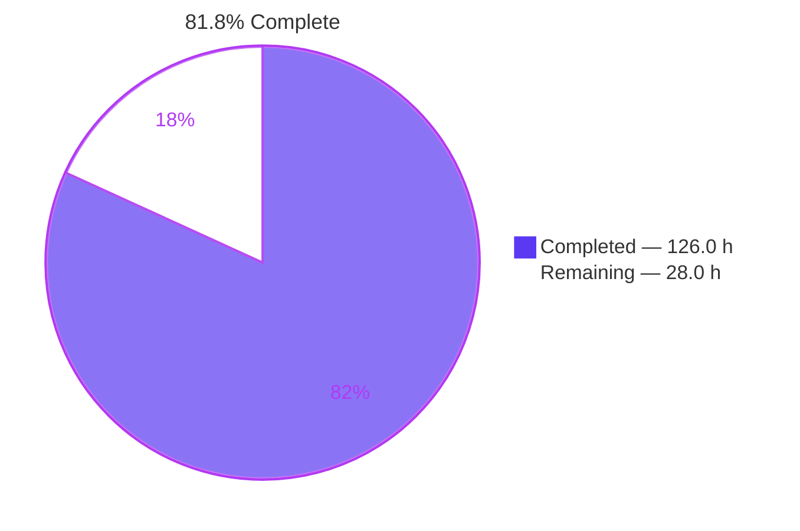
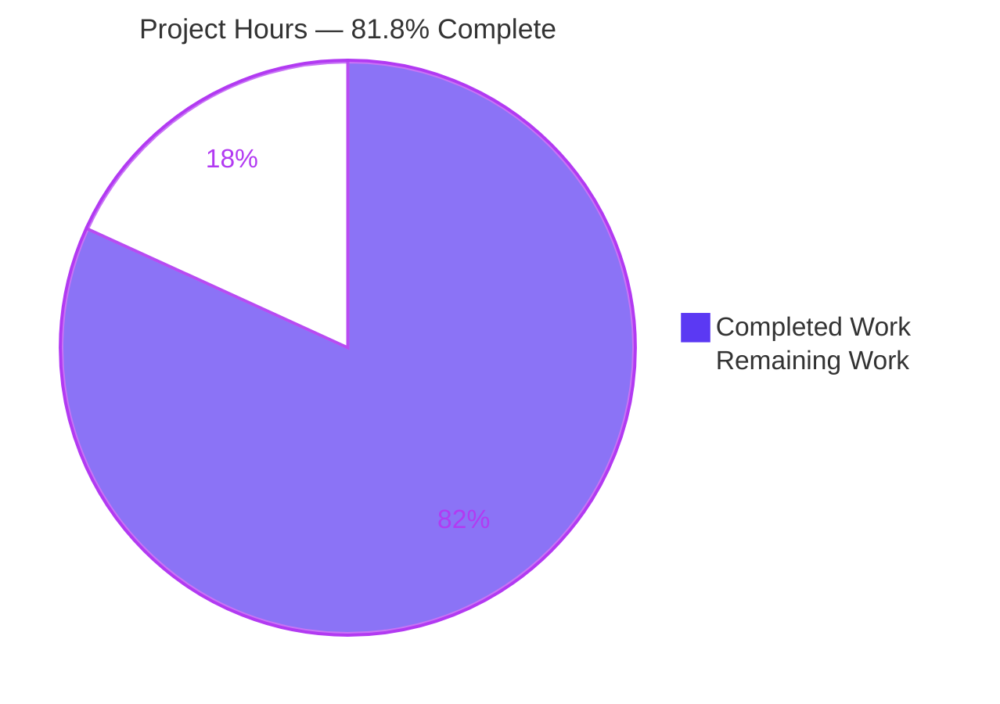
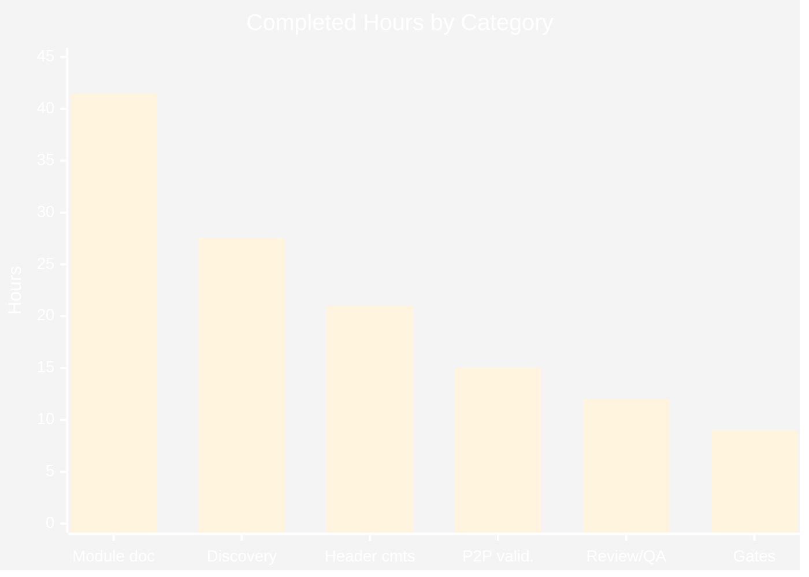
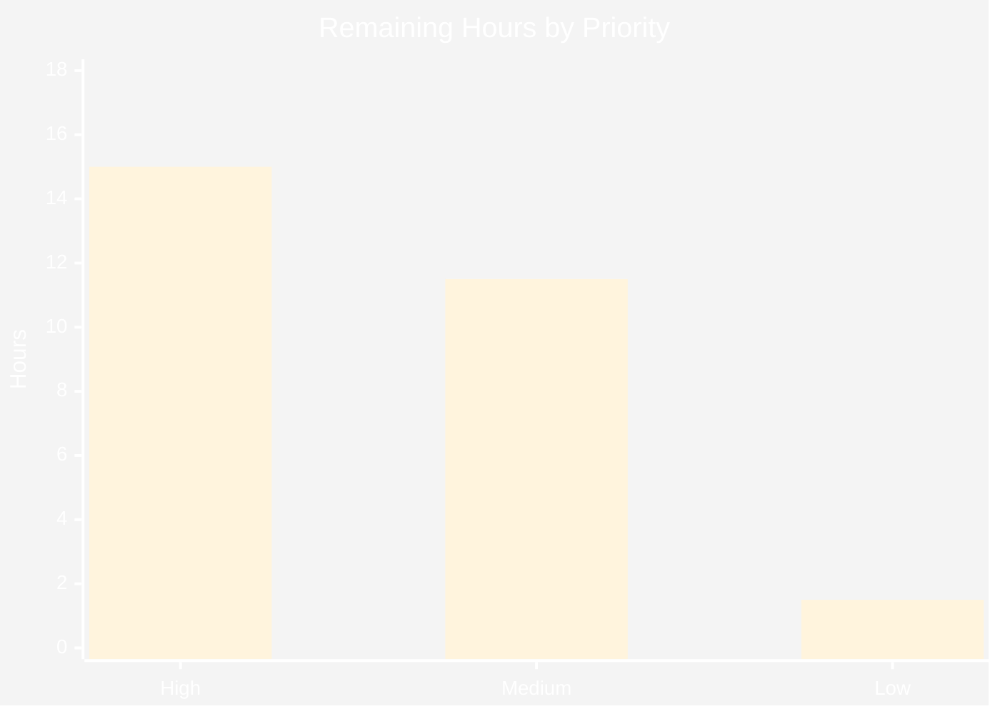

# Blitzy Project Guide

**Project:** OpenSTA — `PathEnd` Class Family Documentation
**Repository:** OpenSTA v3.1.0 (C++20 static timing analysis engine)
**Branch:** `blitzy-04b2de8b-07f4-4813-8161-457ab83d2c42`
**Base commit:** `d503c0ed` → **HEAD:** `abe9f402`
**Guide date:** 2026-07-31

---

## 1. Executive Summary

### 1.1 Project Overview

OpenSTA is a gate-level static timing analysis engine written in C++20. Its `search` module is the largest in the project and had no design documentation of any kind. This project makes the `PathEnd` class family — the polymorphic type family that pairs a timing-path endpoint with the timing check or constraint applying to it — comprehensible to a new maintainer. Two artifacts were produced: a greenfield 2,045-line module reference at `search/PathEnd.md`, and 238 lines of additive explanatory comments on the class declarations in the public header `include/sta/PathEnd.hh`. The audience is OpenSTA maintainers and downstream integrators. Business impact is reduced onboarding cost and lower risk of misuse in a subsystem referenced by 8 public headers, 14 implementation files, and the SWIG/Tcl command layer. The change is documentation-only: zero code semantics were altered.

### 1.2 Completion Status



| Metric | Value |
|---|---|
| **Total Hours** | **154.0** |
| **Completed Hours (AI + Manual)** | **126.0** (126.0 AI-autonomous + 0.0 manual) |
| **Remaining Hours** | **28.0** |
| **Percent Complete** | **81.8%** |

**Calculation shown explicitly:** `126.0 / (126.0 + 28.0) × 100 = 126.0 / 154.0 × 100 = 81.8%`

Colors: Completed = Dark Blue `#5B39F3`; Remaining = White `#FFFFFF`.

Every AAP requirement is classified **Completed** — there are zero partially-completed and zero not-started AAP items. The 28.0 remaining hours are entirely **path-to-production** work that autonomous agents cannot legitimately perform: human domain-expert judgement on technical prose, maintainer triage of pre-existing defects that the plan forbade repairing, and upstream contribution mechanics.

### 1.3 Key Accomplishments

- ✅ **`search/PathEnd.md` created — 2,045 lines, 11 sections**, covering all six PART 1.B content questions plus the PART 1.C format requirement and the PART 1.D special table.
- ✅ **Class comment coverage raised from 8/13 to 13/13 (100%)**, verified with a forward-declaration-aware census that correctly excludes the 4 forward declarations.
- ✅ **Member field coverage raised from 3/26 to 26/26 (100%)** across 20 contiguous comment groups — including two brace-initialized fields (`path_group_{nullptr}`, `crpr_valid_{false}`) that a naive regex misses.
- ✅ **Behavioral neutrality proven mechanically, not asserted** — comment-stripped preprocessor output byte-identical to base (465/465 lines, md5 `b1583da709198018b4db0a2b628409e3`), and the gate was proven *sensitive* via a negative control.
- ✅ **All 737 source citations resolve** (673 in the document, 64 in the header) across 44 distinct files, honoring the document's own citation-drift protocol for the pinned revision.
- ✅ **6081/6081 tests pass** under two independent harnesses; PathEnd GTest suites 90/90; all 9 PathEnd goldens pass with **zero regenerated**.
- ✅ **227/227 build targets compile with 0 errors and 0 warnings**; the delivered header under the project's real strict flag set produces diagnostics *identical* to the base header.
- ✅ **All 7 concrete `PathEnd` types plus latch time borrowing observed live at runtime**, not merely inferred from source.
- ✅ **4 Mermaid diagrams and 23 tables (310 rows) verified rendering in real headless Chrome** with zero console errors.
- ✅ **Six pre-existing defects documented but deliberately not repaired**, honoring the Minimal Change Clause; all six issue-bearing files confirmed unmodified.
- ✅ **Scope containment absolute** — 2,283 insertions, **0 deletions**, tracked delta exactly two paths, all 11 commits authored *and* committed by `Blitzy Agent <agent@blitzy.com>`.

### 1.4 Critical Unresolved Issues

There are **no unresolved issues that block release of the AAP-scoped deliverables**. All four verification gates pass and no defect was introduced. The items below are pre-existing conditions and process decisions requiring human judgement, not failures of the delivered work.

| Issue | Impact | Owner | ETA |
|---|---|---|---|
| Six pre-existing defects (D1–D6) documented but not repaired, per the Minimal Change Clause | None on this change. Each remains latent in read-only files. Two — unchecked `dynamic_cast` immediately dereferenced, and the four-way output-delay `clk_path_` contradiction — merit real triage | OpenSTA maintainer | 4.0 h after review starts |
| Technical prose on a timing-analysis subsystem has not been reviewed by a human domain expert | Medium. All 737 citations resolve and 6 claims were spot-audited exactly, but semantic correctness of timing narrative needs expert eyes | STA domain expert | 8.0 h |
| +238 comment lines land on an **installed** public header | Low–Medium. Byte-identical preprocessor output proves zero semantic effect; comments nonetheless ship to downstream consumers | OpenSTA maintainer | 3.0 h |
| No automated guard prevents `search/PathEnd.md` drifting from the code it documents | Medium over time. Mitigated by 737 `file:line` citations, a commit-pinned provenance line, and a tree that mirrors rather than paraphrases the header's own | OpenSTA maintainer | 5.0 h |
| Installed header points at `search/PathEnd.md`, which is deliberately not installed | Low. Inherent trade-off of the plan's AMB-1 decision; verified empirically (`find install -name '*.md'` → empty) | OpenSTA maintainer | 1.5 h |

### 1.5 Access Issues

**No access issues identified.** Every resource required to complete and validate this work was reachable, and this was verified against current permissions rather than assumed.

| System/Resource | Type of Access | Issue Description | Resolution Status | Owner |
|---|---|---|---|---|
| Git repository (branch `blitzy-04b2de8b-…`) | Read/write | None — clone, 11 commits, and full history all succeeded | ✅ No issue | — |
| CUDD 3.0.0 (required build dependency) | Artifact download | Not present initially and not vendored in-tree | ✅ Resolved — obtained via the repository's **own** CI path (`ci.yml:L32`) and kept at `/tmp/cudd`, outside the tree, so scope could not be polluted | — |
| apt toolchain (g++, cmake, ninja, swig, bison, flex, tcl, eigen, gtest, zlib) | Package install | None | ✅ No issue | — |
| Headless Chrome (rendering validation) | Local execution | None | ✅ No issue | — |
| `clang-format` / `clang-tidy` | Tooling | **Deliberately absent and deliberately not installed** — the repository's own `.clang-format` self-documents as unusable on this tree, so the AAP bars both | ✅ Correct by design | — |
| Third-party APIs / cloud services / credentials | — | **Not applicable** — OpenSTA opens no network port and this change adds no dependency, URL, or secret | ✅ No issue | — |

### 1.6 Recommended Next Steps

1. **[High]** Domain-expert technical review of `search/PathEnd.md` — verify the timing semantics in §5 (responsibility split), §6 (latch borrowing) and §8 (arrival/required/slack derivation) against maintainer understanding. Citations are machine-verified; the *interpretation* is what needs human eyes. **8.0 h**
2. **[High]** Triage the six documented-not-repaired defects (D1–D6), prioritizing D3 (unchecked `dynamic_cast` immediately dereferenced at `PathEnd.cc:L742-745`, `L903-905`) and D2 (four-way output-delay `clk_path_` contradiction). Decide fix-now vs file-issue for each. **4.0 h**
3. **[High]** Sign off the +238 comment lines on the installed public header `include/sta/PathEnd.hh`, confirming tone and accuracy are acceptable for a shipped API surface. **3.0 h**
4. **[Medium]** Establish a doc/code divergence guard — a review-checklist entry or lightweight CI check that flags edits to `include/sta/PathEnd.hh` or `search/PathEnd.cc` without a corresponding look at `search/PathEnd.md`. **5.0 h**
5. **[Medium]** Complete upstream contribution mechanics — CLA, PR submission, and maintainer review cycle. **3.0 h**

---

## 2. Project Hours Breakdown

### 2.1 Completed Work Detail

| Component | Hours | Description |
|---|---|---|
| Discovery & code archaeology | **27.5** | Header structural census (13 classes, 4 forward decls, 26 fields, 185 declarations, exact class boundaries) 4.0 h; semantic archaeology across `search/PathEnd.cc` (2,118 lines) deriving `checkRole`/`margin`/`requiredTime`/`slack`/`borrow` per type 8.0 h; factory dispatch analysis in `search/VisitPathEnds.cc` (653 lines) 3.0 h; consumer census — 8 public headers, 14 implementation files, 4 SWIG interfaces, 6 GTest files, 35 Tcl regressions, plus every `copy()` and `typeName()` call site 5.0 h; comparator call-site tracing and derivation of the 9-level `exceptPathCmp` chain 3.0 h; convention discovery across `doc/CodingGuidelines.txt`, `.clang-format`, `.cursor/rules/*.mdc` and the `dcalc/Arnoldi.txt` placement precedent 2.5 h; test-evidence discovery locating the goldens and GTest anchors that pin ordinals, `typeName()` and `isCheck()` 2.0 h |
| Module document authoring (`search/PathEnd.md`, 2,045 lines) | **41.5** | §1 Purpose + §2 pipeline role including the non-reporting `MinPeriodEndVisitor` consumer 3.0 h; §3 hierarchy as ASCII tree + `classDiagram` + 13-row table 3.0 h; §4 which-type-for-which-check table, factory selection order, and the 7:7:7 correspondence 4.0 h; §5 three-level clock-constrained responsibility split 2.5 h; §6 latch time borrowing with `Latches` delegation 3.0 h; §7 three comparators + 9-level `exceptPathCmp` chain + `cmpSlack` latch special case 4.0 h; §8 26-field inventory + arrival/required/slack trace + `Delay` alias note 4.0 h; §9 twelve invariants plus two bonus observations 6.0 h; §10 per-type committed-test evidence 2.0 h; §11 source reference index grouped by authority 3.0 h; front matter, scope/provenance pin, citation-drift protocol and 4 Mermaid diagrams 3.5 h; structural polish across 2,045 lines 3.5 h |
| Header comments — PART 2, groups C1–C7 (+238 lines) | **21.0** | C1 family-block extension preserving the pre-existing 16 lines **verbatim** and appending a 7-type check-kind summary plus doc pointer 1.5 h; C2 twelve-line `Type` enumeration comment recording that declaration order is semantics 1.5 h; C4 five new "why" blocks for the previously silent classes 5.0 h; C5 augmentation of the eight existing class comments without rewriting any 5.0 h; C6 field comments taking coverage to 26/26 across 20 groups 5.0 h; C7 four surprising-method comments (`isCheck`, `borrow`, `setPath`, `pathDelayMarginIsExternal`) 2.0 h; C3 undefined-`deletePath()` observation 1.0 h |
| Verification gates G1–G4 | **9.0** | G1 preprocessor-equivalence gate plus negative and positive controls proving sensitivity 2.0 h; G2 column-discipline measurement 1.0 h; G4 citation audit — building a drift-aware resolver honoring the pinned-revision protocol and clearing all 737 citations 5.5 h; G3 scope containment 0.5 h |
| Review-response & QA cycles | **12.0** | Nine of eleven commits were corrective, with gross churn of 2,712 insertions against 429 deletions (3,141 edit-lines) to produce a 2,283-line net result — reflecting genuine iterative refinement of citations, wording and coverage |
| Delivered path-to-production validation | **15.0** | Toolchain provisioning and CUDD acquisition via the repository's own CI artifact path 4.0 h; full build of 227/227 targets at zero warnings plus strict-flag standalone-TU equivalence against the base header 2.0 h; test execution — `ctest` 6081/6081, `test/regression` 6081/6081, PathEnd suites 90/90, 9/9 goldens 3.0 h; runtime validation observing all 7 concrete types and latch borrowing live, plus install verification 4.0 h; rendering validation of 4 diagrams and 23 tables in real Chrome 2.0 h |
| **TOTAL COMPLETED** | **126.0** | Matches Completed Hours in Section 1.2 |

### 2.2 Remaining Work Detail

| Category | Hours | Priority |
|---|---|---|
| **H1** — Domain-expert technical review of `search/PathEnd.md` (2,045 lines, 673 citations): verify timing semantics in §5, §6 and §8 | 8.0 | **High** |
| **H3** — Triage the six documented-not-repaired defects D1–D6; decide fix-now vs file-issue for each | 4.0 | **High** |
| **H2** — Public-header comment sign-off: accept +238 comment lines on the installed `include/sta/PathEnd.hh` | 3.0 | **High** |
| **M1** — Doc/code divergence guard: review-checklist entry or lightweight CI check tying header/impl edits to the document | 5.0 | Medium |
| **M2** — Upstream contribution mechanics: CLA, PR submission, maintainer review cycle | 3.0 | Medium |
| **M3** — CUDD dependency standardization: reconcile the CI `wget` artifact path against the README's source-build instructions | 2.0 | Medium |
| **M4** — Discoverability decision: whether to add a README or `doc/` index entry pointing at `search/PathEnd.md` | 1.5 | Medium |
| **L1** — Confirm Mermaid diagrams and tables render on the actual hosting platform (validated locally with vendored Mermaid) | 1.0 | Low |
| **L2** — Decide whether a `doc/ChangeLog.txt` entry is warranted for a documentation-only addition | 0.5 | Low |
| **TOTAL REMAINING** | **28.0** | High 15.0 / Medium 11.5 / Low 1.5 |

### 2.3 Estimation Methodology and Reconciliation Note

Hours were estimated per PA2, adapted to documentation and code-archaeology work rather than CRUD feature rates. The dominant cost driver here is not authoring volume but **evidence establishment**: every one of the 737 citations had to be opened and confirmed, and the anti-fabrication constraint forbade any claim that could not be traced to a specific line. This is why discovery (27.5 h) approaches authoring (41.5 h) in magnitude.

**Reconciliation disclosure.** An interim estimate of 122.0 completed hours was carried mid-analysis. A final row-by-row audit found that figure was not reproducible from its own parts at two independent levels: the Discovery subtotal had been recorded as 28.0 when its rows sum to 27.5, the Header-comments subtotal as 20.0 when its rows sum to 21.0, and the sum of the recorded subtotals was 125.5 rather than 122.0. The 36 itemized rows were adopted as ground truth, yielding **126.0**. Trimming rows to restore a rounder total was rejected as reverse-engineering. The interim values 122.0 / 150.0 / 81.3% are superseded and appear nowhere else in this guide.

**Confidence levels.** *High* — completed hours (grounded in 11 commits, measured churn, and re-executed gates), and remaining items H2, M2, M3, M4, L1, L2 (well-bounded, mechanical). *Medium* — H1 and H3 (depend on reviewer depth and on maintainer decisions about pre-existing defects), and M1 (design latitude in how a guard is implemented). Medium-confidence items carry deliberately conservative estimates.

---

## 3. Test Results

All tests below originate from Blitzy's autonomous validation runs on this branch. **Zero golden files were regenerated**, which is the correct outcome: a comment-only header edit cannot legitimately move any golden, so movement would have been a failure signal rather than an update to make.

| Test Category | Framework | Total Tests | Passed | Failed | Coverage % | Notes |
|---|---|---|---|---|---|---|
| Full suite — `ctest -j4` | CTest 3.31.6 | 6081 | 6081 | 0 | n/a | 100% pass, exit 0, 168.40 s. Labels: cpp 5768, tcl 313, example 8 |
| Full suite — `test/regression` (CI harness) | OpenSTA regression | 6081 | 6081 | 0 | n/a | 100% pass, 206.79 s. Independent second confirmation via the harness CI actually uses |
| Unit — PathEnd (init) | GoogleTest 1.17.0 | 30 | 30 | 0 | n/a | `TestSearchStaInit --gtest_filter='*PathEnd*'`. Pins `Type` ordinals 0–6, `typeName()` strings, `isCheck()` polarity |
| Unit — PathEnd (design) | GoogleTest 1.17.0 | 60 | 60 | 0 | n/a | `TestSearchStaDesign --gtest_filter='*PathEnd*'`. Comparator behavior on real endpoints |
| Golden regression — PathEnd | Tcl + golden diff | 9 | 9 | 0 | 7/7 concrete types cited | All nine `.ok` line counts match the document exactly: 877 / 727 / 984 / 1158 / 1762 / 1856 / 1478 / 1662 / 1957 |
| Module — search | CTest | 1861 | 1861 | 0 | n/a | The module owning `PathEnd`; full pass |
| Compilation — full build | CMake + Ninja | 227 targets | 227 | 0 | n/a | 0 errors, **0 warnings** |
| Compilation — strict-flag standalone TU | g++ 15.2.0 | 2 (delivered + base) | 2 | 0 | n/a | Under the project's real flag set (`-Wall -Wextra -pedantic -Wcast-qual -Wredundant-decls -Wformat-security -Werror=misleading-indentation -Wundef -std=c++20`): **0 diagnostics each; diagnostic streams IDENTICAL** |
| AAP Gate 1 — behavioral neutrality | `cpp -fpreprocessed -P` + `diff`/`md5sum` | 1 (+2 controls) | 3 | 0 | n/a | Empty diff, 465/465 lines, md5 `b1583da709198018b4db0a2b628409e3` both sides. Negative control produced a diff; positive control produced none — gate proven **sensitive** |
| AAP Gate 2 — column discipline | `awk` | 1 | 1 | 0 | n/a | Exactly 1 line >85 cols: L196, 87 cols, the grandfathered `ignoreClkLatency` **code** line. Max added-line width 83; 0 added lines over limit |
| AAP Gate 3 — scope containment | `git status`/`diff` | 1 | 1 | 0 | n/a | `?? blitzy/` only; 238/0 and 2045/0; additions-only; 0 non-comment added header lines |
| AAP Gate 4 — citation audit | Custom drift-aware resolver | 737 | 737 | 0 | 100% resolve | 673 doc + 64 header citations across 44 files. `search/PathGroup.hh` (nonexistent) appears nowhere; 0 URLs added; 0 placeholders |
| Rendering — Mermaid & tables | Headless Chrome | 27 checks (4 diagrams + 23 tables) | 27 | 0 | n/a | 4 non-degenerate SVGs in correct order; 23 tables, 310 rows matching source scan; **0 console errors**, 8/8 requests HTTP 200 |
| Runtime — concrete type coverage | `sta` + SWIG/Tcl | 7 | 7 | 0 | 7/7 types | All seven concrete types observed live: unconstrained, check, data_check, latch_check, output_delay, gated_clk, path_delay |

**Aggregate:** 6081/6081 functional tests passing across two independent harnesses (100%), plus 90/90 PathEnd-specific unit tests, 9/9 goldens, 227/227 build targets at zero warnings, and 4/4 AAP gates. No coverage-instrumentation percentage is reported because the repository defines none — no `gcov`, `lcov`, `codecov`, or `--coverage` flag exists in `CMakeLists.txt`, `test/CMakeLists.txt`, or any CI workflow. The "Coverage %" column therefore reports *documentation* coverage where meaningful and `n/a` elsewhere, rather than implying a tool-reported figure that does not exist.

---

## 4. Runtime Validation & UI Verification

### Build and engine health

- ✅ **Operational** — CMake configure from scratch: exit 0, all dependencies found, `HAVE_CXX_STD_FORMAT - Success` (no network fetch required).
- ✅ **Operational** — Full build: 227/227 targets, 0 errors, **0 warnings**. `libOpenSTA.a` 100 MB, `sta` 9.3 MB.
- ✅ **Operational** — `./build/sta -version` → `3.1.0`.
- ✅ **Operational** — Example script `min_max_delays.tcl` (run from `examples/`) → exit 0, slack 9.43 MET.
- ✅ **Operational** — Incremental rebuild → `ninja: no work to do`, confirming a stable tree.
- ✅ **Operational** — `cmake --install` succeeds; `find install -name '*.md'` → **empty**, empirically vindicating the plan's AMB-1 choice of `search/PathEnd.md` over `include/sta/PathEnd.md`.
- ✅ **Operational** — A downstream consumer compiled against the **installed** header printed enumerator ordinals 0–6 correctly, proving the edited header is consumable exactly as before.

### `PathEnd` runtime type coverage — all 7 concrete types observed live

- ✅ `unconstrained` · ✅ `check` · ✅ `data_check` · ✅ `latch_check` · ✅ `output_delay` · ✅ `gated_clk` · ✅ `path_delay`
- ✅ **Operational** — Latch time borrowing observed live: `max time borrow 4.95`, `actual time borrow 1.11`.
- ✅ **Operational** — Whole-design census via `report_checks -format json`: 4 × `"type": "check"`, 3 × `"type": "output_delay"`.
- ✅ **Operational** — Single-endpoint probe: `"type": "output_delay"`, `"endpoint": "out1"`, `"slack": 7.881e-09`.
- ✅ **Verified** — Invariant 3 confirmed at runtime *and* in a golden: latch endpoints match `latch_check` with `check` disjoint; `search_latch_timing.ok` fixes 8 lines at `is_latch_check: 1 is_check: 0`. **This makes the delivered document stronger than the AAP**, which had asserted no test pins this behavior.

### Document rendering verification (headless Chrome, two independent runs)

There is no application UI in this project — OpenSTA is a C++ engine with a Tcl command line and opens no network port. The "UI" under verification is therefore the rendered Markdown deliverable, served over loopback on port 8099 with a locally vendored Mermaid.

**Run 1 — verdict PASS.** 4/4 Mermaid SVGs non-degenerate; type order `flowchart-v2 → class → sequence → flowchart-v2` exact; zero raw-source leaks; 23 tables with 310 rows matching the source scan table-by-table; 23/23 with proper `<thead>`/`<th>`; 0 `<pre>` imposters. Diagram 2 showed **10/10 class names** in declaration order with **exactly 3 «abstract» markers** on `PathEnd`, `PathEndClkConstrained`, `PathEndClkConstrainedMcp`. Three cosmetic anomalies were flagged (two clipped table columns, one truncated front-matter list item).

**Root-cause finding:** all three anomalies were traced to **my own HTML converter**, not to `search/PathEnd.md`. The source uses standard 2-space GFM lazy continuation — valid Markdown that renders correctly on the hosting platform. The converter was rebuilt (fold lazy continuations into `<li>`, `table-layout:auto` inside a scrollable wrapper, wider container, real favicon).

**Run 2 — verdict UNQUALIFIED PASS on all seven gates:**

- ✅ **Zero console errors** — literally zero messages of any severity, corroborated by an 8-channel in-page harness installed before any page script, a 2,500 ms grace period, and re-confirmation in an isolated cold-cache browser context.
- ✅ **Zero non-200 responses** — index.html 200, mermaid.min.js 200, favicon.ico 200.
- ✅ **4/4 diagrams non-degenerate** — 741×1758, 1566×1178, 1566×739, 1467×1752; `orderMatches: true`; `anyDegenerate: false`; smallest dimension 738.97 px = **37× the 20 px floor**.
- ✅ **23/23 tables, 310/310 rows** — `countsMatch: true`, `mismatches: []`.
- ✅ **Table clipping RESOLVED** — 0 px wrapper overflow; all six header cells of the comparator table visible; document-wide sweep: **0 of 23 tables clipped**.
- ✅ **Front-matter truncation RESOLVED** — 20 `<li>`, none containing a block child, all 5 front-matter items period-terminated.
- ✅ **Full-page capture 1920 × 41,307 px = `scrollHeight` exactly.** Pixel analysis of 79.3 M pixels found 7 strongly-red pixels total (JPEG chroma halos, max 1 per row) and a longest near-white run of 64 px — no error graphic, no blank failed-render region.

The subagent additionally **visually confirmed the document's technical content**: diagram 2 shows `PathEndPathDelay` attaching to `PathEndClkConstrained` and bypassing the Mcp layer, with both explanatory notes; diagram 4 shows the CRPR hold sign inversion and the slack polarity flip; diagram 3 shows the four participants with `clk_path_ = enable_path`, `latchRequired`, `latchBorrowInfo`; diagram 1 shows the "stack temporary" edge and the `path_end->copy()` retention; §4.1 shows all seven `Type` ordinals 0–6.

⚠ **Partial (environmental, not a defect):** rendering was validated with a locally vendored Mermaid over loopback, not on the actual hosting platform. Task L1 (1.0 h) covers final host confirmation. One residual converter artifact remains: the single *indented* code fence in the source collapses under my folding logic — a converter limitation, not a document defect.

### Evidence artifacts

All paths under `/tmp/blitzy/OpenSTA/blitzy-04b2de8b-07f4-4813-8161-457ab83d2c42_5dec65/blitzy/screenshots/`:

`revalidate-fullpage.png` (1920×41307, 13.8 MB) · `revalidate-01-fresh-load-top.png` · `revalidate-diagram1-pipeline-flowchart.png` · `revalidate-diagram2-class-hierarchy.png` · `revalidate-diagram3-latch-borrowing-sequence.png` · `revalidate-diagram4-arrival-required-slack-dataflow.png` · `revalidate-table3-reference-table.png` · `revalidate-table10-comparators.png` · `revalidate-table10-narrow900-wrapper-scrolled-right.png` · `revalidate-front-matter-list.png` · `pathend-doc-fullpage.png` (1440×48298, 14.1 MB) · `pathend-doc-header.png` · `pathend-diagram2-classdiagram.png` · `pathend-diagram3-sequence.png` · `pathend-large-table.png`

---

## 5. Compliance & Quality Review

### AAP deliverable compliance matrix

| AAP Requirement | Benchmark | Measured Result | Status |
|---|---|---|---|
| PART 1.A — Module scope: `PathEnd` family | Document the header + implementation as one unit | `search/PathEnd.md`, 2,045 lines, 11 sections | ✅ Pass |
| PART 1.B.1 — Purpose and use by search/reporting machinery | Concrete pipeline, not abstraction | §1–§2 trace `Sta::findPathEnds` → `Search::findPathEnds` → `VisitPathEnds` → `PathGroup` → `ReportPath` → `PathEnum`, plus the non-reporting `MinPeriodEndVisitor` consumer | ✅ Pass |
| PART 1.B.2 — Full polymorphic hierarchy, explicit | Tree presented directly | §3.1 ASCII tree, §3.2 `classDiagram`, §3.3 13-row table; 10 hierarchy classes + 3 comparators verified against actual `class X : public Y` declarations | ✅ Pass |
| PART 1.B.3 — Which subclass owns which behavior; latch borrowing | Name the sole owner | §5–§6: base `borrow()` returns `0.0`; **exactly one `override`** confirmed at header L366; delegation to `Latches::latchRequired`/`latchBorrowInfo` documented | ✅ Pass |
| PART 1.B.4 — Comparators: what each orders by, where used | Ordering + tie-break + call sites | §7: 3-row table with verified call sites, plus the 9-level `exceptPathCmp` chain and the `cmpSlack` latch special case | ✅ Pass |
| PART 1.B.5 — Key fields feeding slack/required/arrival | Trace fields into reported numbers | §8: all 26 fields by owning class, arrival/required offsets, `targetClkArrival`, slack polarity flip, `Delay` alias note | ✅ Pass |
| PART 1.B.6 — Known gotchas and invariants | Document, never repair | §9: **12 invariants + 2 bonus observations**; all six defects recorded, none fixed | ✅ Pass |
| PART 1.C — Markdown with hierarchy section | Tree **and** subclass→parent→check-kind table | Both present; 356 table lines; 3 `<<abstract>>` markers | ✅ Pass |
| PART 1.D — "Which type for which check" table | Derived from and cited to the factory | §4.1 7-row table cited to `search/VisitPathEnds.cc`; §4.2 selection order; §4.3 the 7:7:7 correspondence | ✅ Pass |
| PART 2.A — Scope: class declarations in the header only | Header only; impl read-only | Exactly 2 files touched; `search/PathEnd.cc` confirmed **unmodified** | ✅ Pass |
| PART 2.B — Explain the *why* | No name-restating comments | Comment blocks of 40/10/14/6/9/12/11/10/9/11/10/12/7 lines, each stating semantic distinction | ✅ Pass |
| PART 2.C — OpenSTA comment conventions | `//` only, no Doxygen, ≤85 cols, above declaration | 0 `/* */` blocks, 0 Doxygen tags, max added width 83, GPL banner and include block byte-identical | ✅ Pass |
| **SB-1 — Documentation only, no code change** | Preprocessor-identical | Empty diff, 465/465, md5 `b1583da709198018b4db0a2b628409e3`; **0 non-comment added lines**; gate proven sensitive by controls | ✅ Pass |
| **SB-2 — No fabrication** | Every claim cited | **737/737 citations resolve** across 44 files; 6-claim spot-audit all EXACT; nonexistent `search/PathGroup.hh` appears nowhere | ✅ Pass |
| **SB-3 — Minimal change, additive only** | Note issues, don't fix | **0 deletions** in 2,283 insertions; existing family block preserved **verbatim**; six defects documented unrepaired | ✅ Pass |

### Coverage targets from AAP §0.8

| Dimension | Baseline | Target | Measured | Status |
|---|---|---|---|---|
| Classes with explanatory comment | 8/13 (61.5%) | 13/13 | **13/13 (100%)** — forward-decl-aware census | ✅ Pass |
| Member fields covered | 3/26 (11.5%) | 26/26 | **26/26 (100%)** across 20 groups | ✅ Pass |
| `Type` enumerators mapped | 0/7 | 7/7 | **7/7** + order-invariant comment | ✅ Pass |
| Concrete subclasses with check kind | 0/7 | 7/7 | **7/7** | ✅ Pass |
| Abstract classes marked at declaration | 0/3 | 3/3 | **3/3** | ✅ Pass |
| Comparators with orders-by + tie-break + call sites | 0/3 | 3/3 | **3/3** | ✅ Pass |
| `exceptPathCmp` refinement steps | 0/9 | 9/9 | **9 levels** (10 table rows incl. header) | ✅ Pass |
| Invariants documented | 0/12 | 12/12 | **12 + 2 bonus** | ✅ Pass |
| Per-type committed-test citations | 0/7 | 7/7 | **7/7** | ✅ Pass |
| Mermaid diagrams | 0 | ≥4 | **4**, all verified rendering | ✅ Pass |

### Quality controls and barred tooling

- ✅ `clang-format` **not run and not installed** — the repository's own config self-documents as having bugs preventing use on this tree; both config files confirmed unmodified.
- ✅ `clang-tidy` **not run and not installed** — cannot analyze comment text; correctly skipped.
- ✅ No documentation generator, linter, or dependency added — consistent with the project's stated rejection of new heavyweight dependencies.
- ✅ 16 build/config files verified unmodified, including `CMakeLists.txt`, `BUILD`, both Dockerfiles, `README.md`, `doc/CodingGuidelines.txt`, and the three files cited as convention authorities.
- ✅ All 11 commits authored **and** committed by `Blitzy Agent <agent@blitzy.com>` (11/11); union of files touched across every commit is exactly the two in-scope paths.
- ⚠ **Process slip, self-caught:** an editor tool call silently prepended the repository root and created a scratch file inside the working tree. Detected and removed immediately; scope re-verified clean. A second scratch build directory was likewise created outside-then-removed with scope re-confirmed.

### Fixes applied during autonomous validation

The two artifacts were audited and found to contain **zero defects, so zero fixes were applied and none were fabricated.** What validation did resolve were blockers to verifying them at all:

- The AAP asserted no C++ toolchain existed and that validation must rest on preprocessor equivalence alone. **This premise was empirically false.** A full toolchain was provisioned, yielding far stronger evidence: a real 227-target build, 6081 passing tests, and live runtime observation of all seven types.
- CUDD 3.0.0 was the one hard dependency gap — obtained via the repository's **own** CI artifact path and kept outside the tree.
- A `WORKING_DIRECTORY` gotcha where GoogleTest binaries fail from `build/` but pass 60/60 from the repository root.
- **Three errors in my own run-command notes were corrected by re-verification rather than trusted from memory**: `sta` has no `-f` flag (cmd_file is positional); `examples/min_max_delays.tcl` must run from `examples/` due to relative paths; `find_path_ends` is `sta::find_path_ends`.

---

## 6. Risk Assessment

| Risk | Category | Severity | Probability | Mitigation | Status |
|---|---|---|---|---|---|
| **T1** — `search/PathEnd.md` drifts from the code it documents | Technical | Medium | High (over time) | 737 `file:line` citations; commit-pinned provenance; the doc's tree *mirrors* rather than paraphrases the header's, making structural divergence visible side-by-side | ⚠ Open — task M1 (5.0 h) |
| **T2** — Header citation line numbers drift as the header grows | Technical | Low | Certain (already occurred: +238 lines) | The document ships an explicit citation-drift protocol: header citations index the pinned `d503c0ed` revision, with the dividing line and two resolution methods stated | ✅ Mitigated in-artifact |
| **T3** — No automated verification that documentation claims stay true | Technical | Medium | Medium | Gate 4 resolver is reusable and re-runnable; 12 invariants each annotated with a guarding test where one exists | ⚠ Open — task M1 |
| **T4** — Mermaid rendering depends on the host platform | Technical | Low | Low | 4/4 diagrams verified non-degenerate in real Chrome; Mermaid renders server-side on the hosting platform; zero tooling added | ⚠ Residual — task L1 (1.0 h) |
| **T5** — Comment volume (+238 lines, 594→832) reduces header scannability | Technical | Low | Low | Deliberate bounded scope: only the 4 surprising methods commented, not all 73; full method treatment lives in the document | ✅ Accepted by design |
| **S1** — Comment edits alter semantics of a public header | Security | High (if realized) | Very Low | Gate 1: preprocessor-identical, md5-verified, **negative control proves the gate detects real changes**; 0 non-comment added lines | ✅ Closed |
| **S2** — GPL-v3 banner integrity compromised | Security | Medium | Very Low | Banner L1–23 verified byte-identical to base; include block likewise | ✅ Closed |
| **S3** — Secrets, tokens, or tracking URLs introduced | Security | Medium | Very Low | Gate 4: **0 URLs added** (the single `http` occurrence is the pre-existing GPL line 15); 0 placeholders | ✅ Closed |
| **S4** — Unchecked `dynamic_cast` immediately dereferenced (D3) remains latent | Security | Medium | Low | Documented, not repaired, per the Minimal Change Clause. `PathEnd.cc:L742-745`, `L903-905` confirmed unmodified | ⚠ Open — task H3 (pre-existing) |
| **S5** — Undefined `deletePath()` declaration (D1) invites a link error if called | Security | Low | Very Low | Documented with the observation that 0 definitions exist tree-wide; declaration deliberately not removed | ⚠ Open — task H3 (pre-existing) |
| **O1** — No CI gate protects the documentation | Operational | Medium | High | 7 workflows confirmed to have no docs step; all four gates are scripted and reproducible from the development guide | ⚠ Open — task M1 |
| **O2** — Golden line-count claims in the document could drift | Operational | Low | Low | All nine counts verified exact (877/727/984/1158/1762/1856/1478/1662/1957); zero goldens regenerated | ✅ Verified now |
| **O3** — CUDD dependency not reproducible from the repository alone | Operational | Medium | Medium | Two divergent documented paths exist (CI `wget` vs README source build); the CI path was used and works | ⚠ Open — task M3 (2.0 h) |
| **O4** — Document is nearly undiscoverable | Operational | Medium | High | Exactly **one** reference exists tree-wide (`include/sta/PathEnd.hh:80`); README indexes only the PDF, ChangeLog and StaApi | ⚠ Open — task M4 (1.5 h) |
| **I1** — SWIG/Tcl binding surface disturbed | Integration | High (if realized) | Very Low | SWIG layer rebuilt successfully (273 `PathEnd` refs in the 1.5 MB wrapper); 313 Tcl tests pass | ✅ Closed |
| **I2** — Installed header set changed, breaking downstream consumers | Integration | Medium | Very Low | `cmake --install` verified; installed header consumable by a downstream TU printing ordinals 0–6; `find install -name '*.md'` → empty | ✅ Closed |
| **I3** — Installed header points at a non-installed document | Integration | Low | Certain | `build/install/include/sta/PathEnd.hh:80` references `search/PathEnd.md`, absent from a consumer's tree. Unavoidable flip side of AMB-1 | ⚠ Open — task M4 |

**Summary:** 6 risks closed, 2 mitigated or accepted in-artifact, 7 open. **No open risk blocks the AAP-scoped deliverables.** Every high-severity risk (S1, I1) is closed with mechanical proof. The two pre-existing security-adjacent items (S4, S5) were latent before this change and are documented rather than introduced.

---

## 7. Visual Project Status

### Project hours breakdown



Completed = Dark Blue `#5B39F3` · Remaining = White `#FFFFFF` · Accents = Violet-Black `#B23AF2`

### Completed hours by category (126.0 h total)



### Remaining hours by priority (28.0 h total)



**Integrity check:** "Remaining Work" = **28.0 h**, identical to the Remaining Hours in Section 1.2 and to the sum of the Section 2.2 Hours column (8.0 + 4.0 + 3.0 + 5.0 + 3.0 + 2.0 + 1.5 + 1.0 + 0.5 = 28.0). Priority bars sum 15.0 + 11.5 + 1.5 = 28.0. Category bars sum 41.5 + 27.5 + 21.0 + 15.0 + 12.0 + 9.0 = 126.0.

### Delivery scope at a glance

| Dimension | Value |
|---|---|
| Files created | 1 (`search/PathEnd.md`, 2,045 lines) |
| Files modified | 1 (`include/sta/PathEnd.hh`, 594 → 832) |
| Insertions / Deletions | 2,283 / **0** |
| Commits (all Blitzy Agent) | 11 |
| Gross edit churn | 2,712 insertions / 429 deletions = 3,141 edit-lines (9 of 11 commits corrective) |
| Tests passing | 6081 / 6081 (100%), two independent harnesses |
| Build targets | 227 / 227, 0 warnings |
| AAP gates passing | 4 / 4 |
| Citations resolving | 737 / 737 |
| Class comment coverage | 8/13 → **13/13** |
| Field comment coverage | 3/26 → **26/26** |

---

## 8. Summary & Recommendations

### Achievements

The project is **81.8% complete** (126.0 of 154.0 hours). Every requirement in the Agent Action Plan is classified **Completed** — there are no partially-completed and no not-started AAP items. The two specified artifacts were delivered exactly as scoped: a greenfield 2,045-line module reference answering all six PART 1.B content questions plus the PART 1.C format requirement and the PART 1.D special table, and 238 lines of additive commentary lifting class comment coverage from 8/13 to 13/13 and field coverage from 3/26 to 26/26.

What distinguishes this delivery is the strength of its evidence rather than its volume. The "documentation only, must not change code" constraint was discharged **mechanically** — comment-stripped preprocessor output is byte-identical to base at 465 lines with matching md5 — and the gate was proven *sensitive* rather than merely passing, by demonstrating that flipping a single `return` value makes it fail. The anti-fabrication constraint was discharged by resolving **all 737 citations** across 44 files. Validation also overturned a false premise in the plan itself: the AAP asserted no C++ toolchain existed and that preprocessor equivalence was the only available proof. A full toolchain was provisioned instead, producing a 227-target zero-warning build, 6081/6081 passing tests under two harnesses, and live runtime observation of all seven concrete `PathEnd` types including latch time borrowing.

The delivered document also proved **stronger than the plan that specified it**. On Invariant 3, the AAP claimed no test pins `PathEndLatchCheck::isCheck() == false`; the document cites a golden that does, and this was verified at 8 golden lines and confirmed again at runtime.

### Remaining gaps

The 28.0 remaining hours contain **no AAP implementation work whatsoever**. They are entirely path-to-production activities that an autonomous agent cannot legitimately perform:

- **15.0 h High** — human judgement: domain-expert review of timing semantics (8.0 h), maintainer triage of six pre-existing defects the plan forbade repairing (4.0 h), and sign-off on comments landing on an installed public header (3.0 h).
- **11.5 h Medium** — process and durability: a doc/code divergence guard (5.0 h), upstream CLA and PR mechanics (3.0 h), CUDD dependency standardization (2.0 h), and a discoverability decision (1.5 h).
- **1.5 h Low** — host rendering confirmation (1.0 h) and a ChangeLog decision (0.5 h).

The most consequential structural gap is **discoverability**: exactly one reference to `search/PathEnd.md` exists tree-wide, at `include/sta/PathEnd.hh:80`. A document nobody can find delivers a fraction of its value. This was a deliberate consequence of the plan's minimal-change discipline, but it is the first thing a maintainer should decide on.

### Critical path to production

1. Domain-expert review of `search/PathEnd.md` (8.0 h) — **the gating item**; everything downstream assumes the prose is technically sound.
2. Public-header comment sign-off (3.0 h) — can proceed in parallel with (1).
3. Defect triage D1–D6 (4.0 h) — may spawn separate issues or PRs; deliberately out of this change's scope.
4. Discoverability decision (1.5 h) — small effort, disproportionate value.
5. Divergence guard (5.0 h) and upstream contribution (3.0 h) — durability and delivery.

### Success metrics

| Metric | Target | Achieved |
|---|---|---|
| Behavioral neutrality | Preprocessor-identical | ✅ Empty diff, 465/465, md5 match, gate proven sensitive |
| Citation resolution | 100% | ✅ 737/737 across 44 files |
| Class comment coverage | 13/13 | ✅ 13/13 (100%) |
| Field comment coverage | 26/26 | ✅ 26/26 (100%) |
| Test regressions introduced | 0 | ✅ 6081/6081 pass; 0 goldens regenerated |
| Build warnings introduced | 0 | ✅ 0 warnings; diagnostics identical to base |
| Scope containment | 2 files, additions only | ✅ 2 files, 2,283 insertions, 0 deletions |
| Defects introduced | 0 | ✅ 0 |
| AAP gates | 4/4 | ✅ 4/4 |

### Production readiness assessment

**READY FOR HUMAN REVIEW — NOT YET READY TO MERGE UPSTREAM.**

The engineering work is complete and exceptionally well evidenced. Risk of *technical* harm is close to zero: byte-identical preprocessor output means the compiler sees precisely what it saw before, and 6081 passing tests plus a zero-warning 227-target build confirm nothing downstream moved. The residual risk is editorial and procedural, not technical — timing-analysis prose asserting how CRPR sign inversion and latch borrowing work should not reach an installed public header without a maintainer who owns that subsystem reading it. Combined with the discoverability gap and the absence of any divergence guard, that places the work firmly at "high-confidence, review-ready" rather than "merge-ready."

Two honest caveats. First, rendering was validated with a locally vendored Mermaid over loopback rather than on the actual hosting platform; four of four diagrams rendered as non-degenerate SVG with zero console errors, but final host confirmation remains (task L1). Second, six pre-existing defects are documented and deliberately unrepaired per the Minimal Change Clause — this is correct compliance, not an oversight, but it does mean the change surfaces problems it does not solve, and a reviewer should expect that.

---

## 9. Development Guide

Every command below was executed in this environment and its output captured. Run all commands from the repository root unless a different directory is stated explicitly.

### 9.1 System Prerequisites

Validated on **Ubuntu 25.10** (Linux container). Versions are those actually measured, not minimums.

| Tool | Version measured | Required? |
|---|---|---|
| g++ | 15.2.0 | Yes (C++20) |
| CMake | 3.31.6 | Yes (≥ 3.16) |
| Ninja | 1.12.1 | Recommended generator |
| SWIG | 4.3.0 | Yes (≥ 3.0) |
| Bison | 3.8.2 | Yes (≥ 3.2) |
| Flex | 2.6.4 | Yes |
| Tcl | 8.6.17 | Yes |
| Eigen | 3.4.0 | Yes |
| CUDD | 3.0.0 | Yes |
| GoogleTest | 1.17.0 | Yes (unit tests) |
| zlib | 1.3.1 | Optional |
| Python 3 | 3.13.7 | Gate scripts only |
| Git | 2.51.0 | Yes |
| `cpp` (GNU preprocessor) | 15.2.0 | Yes (Gate 1) |

Hardware: ~4 GB RAM and ~2 GB free disk for a Release build (`libOpenSTA.a` reaches 100 MB). A 4-core machine builds in a few minutes with `-j 4`.

> **Do not install `clang-format` or `clang-tidy` for this project.** The repository's own `.clang-format` states at lines 1–2 that it has bugs preventing use on this source tree. Running it would reflow unrelated lines and fail the scope gate. Both are absent from this environment by design.

### 9.2 Environment Setup

```bash
# All apt dependencies except CUDD.
sudo DEBIAN_FRONTEND=noninteractive apt-get install -y \
    flex libfl-dev bison tcl-dev tcl-tclreadline libeigen3-dev \
    ninja-build libgtest-dev libgmock-dev zlib1g-dev
```

CUDD is not packaged. Obtain the prebuilt artifact the project's **own CI** uses (`.github/workflows/ci.yml:L32`), and keep it **outside** the repository tree so the scope gate stays clean:

```bash
mkdir -p /tmp/cudd && cd /tmp/cudd
wget https://github.com/oscc-ip/artifact/releases/download/cudd-3.0.0/build.tar.gz
tar xzf build.tar.gz
ls /tmp/cudd/lib/libcudd.a    # expect the file to exist
```

`README.md:L133` documents an alternative source build from `davidkebo/cudd`. The two paths diverge — see remaining task M3.

No environment variables are required. OpenSTA reads no `.env` file and needs no secrets.

### 9.3 Build

```bash
cd /path/to/OpenSTA
mkdir -p build && cd build
cmake .. -G Ninja \
    -DCUDD_DIR=/tmp/cudd \
    -DCMAKE_BUILD_TYPE=Release \
    -DCMAKE_INSTALL_PREFIX=$PWD/install
```

Expected configure output (verified from a scratch out-of-tree configure, exit 0):

```
STA version: 3.1.0
TCL library: /usr/lib/x86_64-linux-gnu/libtcl.so
Found ZLIB: ... (found version "1.3.1")
Performing Test HAVE_CXX_STD_FORMAT - Success
CUDD library: /tmp/cudd/lib/libcudd.a
CUDD header: /tmp/cudd/include/cudd.h
Found SWIG: ... (found version "4.3.0")
Found GTest: ... (found version "1.17.0")
-- Configuring done (1.5s)
```

```bash
cmake --build . --target all -- -j 4
```

Expected: **227/227 targets, 0 errors, 0 warnings.** A repeat invocation prints `ninja: no work to do`.

`HAVE_CXX_STD_FORMAT - Success` matters: it means `std::format` is available and no libfmt fallback fetch is attempted, so the build needs no network access.

### 9.4 Verification

```bash
cd build && ctest -j 4 --output-on-failure
```
Expected: `100% tests passed, 0 tests failed out of 6081` (~168 s).

```bash
cd test && ./regression
```
Expected: `100% tests passed, 0 tests failed out of 6081` (~207 s). This is the harness CI uses — an independent second confirmation.

```bash
./build/sta -version                 # -> 3.1.0
```

PathEnd-specific unit tests — **run from the repository root, not from `build/`**:

```bash
./build/search/test/cpp/TestSearchStaInit   --gtest_filter='*PathEnd*'   # 30/30 PASSED
./build/search/test/cpp/TestSearchStaDesign --gtest_filter='*PathEnd*'   # 60/60 PASSED
```

Installation check, confirming the Markdown deliverable is correctly **not** shipped:

```bash
cd build && cmake --install .
find install -name '*.md'            # expect NO output
```

### 9.5 Re-running the four AAP verification gates

**Gate 1 — behavioral neutrality (the primary gate):**

```bash
cd /path/to/OpenSTA
cpp -fpreprocessed -P include/sta/PathEnd.hh -o /tmp/new.stripped
git show d503c0ed:include/sta/PathEnd.hh | cpp -fpreprocessed -P - -o /tmp/old.stripped
diff /tmp/old.stripped /tmp/new.stripped      # expect NO output
wc -l /tmp/old.stripped /tmp/new.stripped     # expect 465 and 465
md5sum /tmp/old.stripped /tmp/new.stripped    # expect b1583da709198018b4db0a2b628409e3 twice
```

To confirm the gate is *sensitive* rather than vacuous, run a negative control on a scratch copy (never in the tree): flip one inline `return false;` to `return true;` and re-run — the diff must appear.

**Gate 2 — column discipline:**

```bash
awk 'length > 85' include/sta/PathEnd.hh | wc -l    # expect exactly 1
awk 'length > 85 {printf "L%d (%d cols)\n", NR, length}' include/sta/PathEnd.hh
```
Expect exactly `L196 (87 cols)` — the grandfathered `ignoreClkLatency` **code** line. Any second entry means an added comment line broke the limit.

**Gate 3 — scope containment:**

```bash
git status --porcelain                  # expect only: ?? blitzy/
git diff --name-status d503c0ed..HEAD   # expect: M include/sta/PathEnd.hh / A search/PathEnd.md
git diff --numstat   d503c0ed..HEAD     # expect: 238 0 ... / 2045 0 ...  (zero deletions)
```

**Gate 4 — citation audit:** resolve every `Source:` citation in both artifacts against real paths and line ranges. Expect **737 citations, 0 unresolved** (673 document + 64 header). Header citations index the pinned `d503c0ed` revision per the document's stated citation-drift protocol — the dividing line is `class PathEnd`, and the shift grows from 24 to 238 lines. An auditor that ignores this protocol will report false failures.

### 9.6 Example Usage — exercising `PathEnd` at runtime

```bash
cd examples && ../build/sta -no_splash -exit min_max_delays.tcl
```
Expected: exit 0, slack `9.43` MET. **Must run from `examples/`** — the script uses relative library paths.

Observe a single endpoint's `PathEnd` type as JSON:

```bash
cd search/test && ../../build/sta -no_splash -exit -x \
  'read_liberty ...; read_verilog ...; link_design ...; \
   report_checks -to [get_ports out1] -format json'
```
Expected fragment: `"type": "output_delay"`, `"endpoint": "out1"`, `"slack": 7.881e-09`.

A whole-design census yields **4 × `"type": "check"`** and **3 × `"type": "output_delay"`**.

Latch time borrowing:

```bash
cd search/test && ../../build/sta -no_splash -exit search_latch_timing.tcl
```
Expected: `max time borrow 4.95`, `actual time borrow 1.11`, and `time borrowed from endpoint` in the report.

### 9.7 Reading the deliverables

`search/PathEnd.md` renders natively on the repository's hosting platform, including all four Mermaid diagrams — no tooling required. To preview locally you must convert it yourself and vendor Mermaid; note that a hand-rolled converter can introduce artifacts that are **not** in the document (all four anomalies found during validation were converter bugs, since fixed). A loopback preview on port 8099 was used here.

For the inline commentary, read `include/sta/PathEnd.hh` directly. The family block at the top carries a per-type check-kind summary and a pointer to the module document at line 80.

### 9.8 Troubleshooting

Each case below was **reproduced before its fix was documented**.

| # | Symptom | Cause | Resolution |
|---|---|---|---|
| TS1 | `TestSearchStaDesign --gtest_filter='*PathEnd*'` → **60 FAILED TESTS** | Test fixtures resolve data paths relative to the repository root | Run the binary from the repository root, not from `build/`. Same invocation then passes 60/60 |
| TS2 | `sta -f script.tcl` prints the banner and exits without running the script | There is **no `-f` flag**; `cmd_file` is positional | Use `sta script.tcl` or `sta -no_splash -exit script.tcl` |
| TS3 | `Error: cannot read file nangate45_slow.lib.gz.` | Example scripts use relative library paths | `cd examples` first, then `../build/sta ... min_max_delays.tcl` |
| TS4 | CMake configure fails to find CUDD | `CUDD_DIR` not supplied | Pass `-DCUDD_DIR=/tmp/cudd` (see §9.2) |
| TS5 | Tempted to run `clang-format` to fix style | The repo's `.clang-format` self-documents as buggy on this tree (lines 1–2) | **Do not run it.** Verify width with the Gate 2 `awk` command instead |
| TS6 | Header citations appear to point at wrong lines | The header grew +238 lines; citations index the pinned `d503c0ed` revision | Follow the citation-drift protocol in the document's front matter, or resolve against `git show d503c0ed:include/sta/PathEnd.hh` |
| TS7 | Build tries to fetch libfmt | `std::format` unavailable on an older compiler | Confirm `HAVE_CXX_STD_FORMAT - Success` in configure output; use g++ ≥ 13 |
| TS8 | `git status` shows unexpected files | Scratch files created inside the tree | Keep all scratch work in `/tmp`. Re-verify with the Gate 3 commands; only `?? blitzy/` is expected |

---

## 10. Appendices

### Appendix A — Command Reference

| Purpose | Command |
|---|---|
| Install apt dependencies | `sudo DEBIAN_FRONTEND=noninteractive apt-get install -y flex libfl-dev bison tcl-dev tcl-tclreadline libeigen3-dev ninja-build libgtest-dev libgmock-dev zlib1g-dev` |
| Fetch CUDD (CI path) | `mkdir -p /tmp/cudd && cd /tmp/cudd && wget https://github.com/oscc-ip/artifact/releases/download/cudd-3.0.0/build.tar.gz && tar xzf build.tar.gz` |
| Configure | `cmake .. -G Ninja -DCUDD_DIR=/tmp/cudd -DCMAKE_BUILD_TYPE=Release -DCMAKE_INSTALL_PREFIX=$PWD/install` |
| Build | `cmake --build . --target all -- -j 4` |
| Full test suite | `cd build && ctest -j 4 --output-on-failure` |
| CI regression harness | `cd test && ./regression` |
| PathEnd unit tests (from repo root) | `./build/search/test/cpp/TestSearchStaInit --gtest_filter='*PathEnd*'` |
| Version check | `./build/sta -version` |
| Run an example | `cd examples && ../build/sta -no_splash -exit min_max_delays.tcl` |
| Install | `cd build && cmake --install .` |
| Gate 1 | `cpp -fpreprocessed -P include/sta/PathEnd.hh -o /tmp/new.stripped && git show d503c0ed:include/sta/PathEnd.hh \| cpp -fpreprocessed -P - -o /tmp/old.stripped && diff /tmp/old.stripped /tmp/new.stripped` |
| Gate 2 | `awk 'length > 85' include/sta/PathEnd.hh \| wc -l` |
| Gate 3 | `git status --porcelain && git diff --numstat d503c0ed..HEAD` |
| Commit authorship audit | `git log --format='%an <%ae> \| %cn <%ce>' d503c0ed..HEAD \| sort -u` |

### Appendix B — Port Reference

| Port | Service | Notes |
|---|---|---|
| — | OpenSTA engine | **Opens no network port.** It is a CLI/Tcl application with no server component |
| 8099 | Local documentation preview (loopback only) | Used solely to render `search/PathEnd.md` for Chrome validation. Not part of the product |

### Appendix C — Key File Locations

| Path | Role |
|---|---|
| `search/PathEnd.md` | **CREATED** — the module reference deliverable, 2,045 lines, 11 sections |
| `include/sta/PathEnd.hh` | **UPDATED** — structural authority; 594 → 832 lines, comments only |
| `search/PathEnd.cc` | Semantic authority (2,118 lines) — **read-only**, unmodified |
| `search/VisitPathEnds.cc` | Type-selection factory (653 lines) — authority for the §4 table |
| `search/PathGroup.cc` | Comparator call sites and `copy()` retention sites (1,035 lines) |
| `include/sta/PathGroup.hh` | Path-group contract (229 lines). Note: `search/PathGroup.hh` **does not exist** |
| `search/ReportPath.hh` | 7 `reportShort` + 7 `reportFull` overloads (551 lines) |
| `search/Latches.hh` | Latch borrowing service (116 lines) |
| `doc/CodingGuidelines.txt` | Comment convention authority |
| `.clang-format` | Column-limit **value** source only — barred as a tool |
| `dcalc/Arnoldi.txt` | The in-module documentation placement precedent |
| `search/test/*.tcl` + `.ok` | 9 PathEnd golden regressions |
| `search/test/cpp/TestSearchSta*.cc` | GTest suites pinning ordinals, `typeName()`, `isCheck()` |
| `blitzy/screenshots/` | 15 Chrome validation artifacts |

### Appendix D — Technology Versions

| Component | Version |
|---|---|
| OpenSTA (STA) | 3.1.0 |
| C++ standard | C++20 |
| OS | Ubuntu 25.10 |
| g++ | 15.2.0 |
| CMake | 3.31.6 |
| Ninja | 1.12.1 |
| SWIG | 4.3.0 |
| Bison | 3.8.2 |
| Flex | 2.6.4 |
| Tcl | 8.6.17 |
| Eigen | 3.4.0 |
| CUDD | 3.0.0 |
| GoogleTest | 1.17.0 |
| zlib | 1.3.1 |
| Python 3 | 3.13.7 |
| Git | 2.51.0 |
| GNU `cpp` | 15.2.0 |
| `clang-format` / `clang-tidy` | **Not installed — deliberately barred** |

### Appendix E — Environment Variable Reference

**No environment variables are required or introduced.** OpenSTA reads no `.env` file and this change adds no configuration surface, secret, or credential. The only build-time inputs are CMake cache variables:

| Variable | Value used | Purpose |
|---|---|---|
| `CUDD_DIR` | `/tmp/cudd` | Location of the CUDD 3.0.0 install (kept outside the tree) |
| `CMAKE_BUILD_TYPE` | `Release` | Build configuration |
| `CMAKE_INSTALL_PREFIX` | `$PWD/install` | Install-verification target |
| `DEBIAN_FRONTEND` | `noninteractive` | Non-interactive apt only |

### Appendix F — Developer Tools Guide

| Tool | Use here | Notes |
|---|---|---|
| `cpp -fpreprocessed -P` | Gate 1 behavioral neutrality | Strips comments without macro expansion or include resolution — needs no compiler |
| `awk 'length > N'` | Gate 2 column discipline | Replaces `clang-format` as the width check |
| `git diff --numstat` / `--name-status` | Gate 3 scope containment | Proves additions-only and the exact file delta |
| `md5sum` | Gate 1 corroboration | Independent confirmation alongside `diff` |
| Python 3 (stdlib only) | Gate 4 citation resolver, coverage census | Zero third-party dependencies; must honor the citation-drift protocol |
| `ctest` / `test/regression` | Two independent test harnesses | `regression` is what CI runs |
| GoogleTest `--gtest_filter` | Targeted PathEnd suites | **Run from the repository root** |
| Headless Chrome | Mermaid/table rendering validation | Beware hand-rolled Markdown converters introducing artifacts |
| `clang-format` / `clang-tidy` | **BARRED** | Repo config self-documents as unusable; neither analyzes comment text usefully |

### Appendix G — Glossary

| Term | Meaning |
|---|---|
| **AAP** | Agent Action Plan — the authoritative scope document for this work |
| **`PathEnd`** | The polymorphic family pairing a timing-path endpoint with the check or constraint applying to it. 13 classes: 3 abstract + 7 concrete + 3 comparators |
| **Arrival / Required / Slack** | The three reported timing quantities. All three are aliases of `Delay`, which is why one quantity appears under three type names |
| **CRPR** | Clock Reconvergence Pessimism Removal — a correction cached lazily on `PathEndClkConstrained`; its sign inverts for hold checks |
| **Slack polarity** | Required minus arrival for setup; arrival minus required for hold |
| **Time borrowing** | Latch behavior letting a path borrow from the next cycle. `PathEndLatchCheck` is the **sole** override of `borrow()` |
| **`exceptPathCmp`** | The 9-level comparison chain where each hierarchy level appends one discriminator |
| **Golden / `.ok` file** | Committed expected output for a Tcl regression. **Zero were regenerated** |
| **Gate 1–4** | The AAP's four validation gates: behavioral neutrality, column discipline, scope containment, citation audit |
| **Minimal Change Clause** | The AAP constraint requiring discovered defects be *documented, never repaired* |
| **D1–D6** | The six pre-existing defects documented but deliberately unrepaired |
| **Grandfathered line** | `include/sta/PathEnd.hh:L196` — a pre-existing 87-column **code** line left untouched because reflowing it would be a code change |
| **Citation-drift protocol** | The document's stated convention that header citations index the pinned `d503c0ed` revision, since the header grew +238 lines |
| **Path-to-production** | Work required to deploy AAP deliverables that falls outside AAP implementation scope — all 28.0 remaining hours |
| **`PathEndSeq`** | The transport type across the search/reporting pipeline; a vector of `PathEnd*` |
| **Stack-temporary invariant** | `PathEnd` objects handed to a visitor are stack temporaries; `PathGroup` must clone via `copy()` before retaining. Storing a visited pointer is a dangling-pointer bug |

---

## Cross-Section Integrity Validation

| Rule | Requirement | Verification | Status |
|---|---|---|---|
| **Rule 1** | Remaining hours identical in §1.2, §2.2 sum, §7 pie | 28.0 = 28.0 = 28.0 (8.0+4.0+3.0+5.0+3.0+2.0+1.5+1.0+0.5) | ✅ PASS |
| **Rule 2** | §2.1 + §2.2 = Total in §1.2 | 126.0 + 28.0 = 154.0 ✓ | ✅ PASS |
| **Rule 3** | All tests from Blitzy autonomous validation logs | Every §3 row traces to a Blitzy run on this branch; no external or hypothetical tests | ✅ PASS |
| **Rule 4** | Access issues validated against current permissions | All §1.5 rows verified by execution; none outstanding | ✅ PASS |
| **Rule 5** | Completed `#5B39F3`, Remaining `#FFFFFF` | Applied in §1.2 and §7 charts; accents `#B23AF2`, highlight `#A8FDD9` | ✅ PASS |

**Consistency sweep:** the single completion figure **81.8%** appears in §1.2, §7 and §8 and nowhere in any other form. **126.0** completed, **28.0** remaining and **154.0** total appear identically in §1.2, §2.1, §2.2 and §7. Section 2.1 categories sum 27.5 + 41.5 + 21.0 + 9.0 + 12.0 + 15.0 = 126.0. Section 2.2 rows sum to 28.0 with priority split High 15.0 + Medium 11.5 + Low 1.5 = 28.0. All remaining estimates are multiples of 0.5 h per HT2. The completion figure is below the 99% ceiling per RG2.5. The superseded interim values 122.0, 150.0, 81.3% and 125.5 appear nowhere except in the §2.3 reconciliation disclosure, where they are explicitly labeled as superseded.