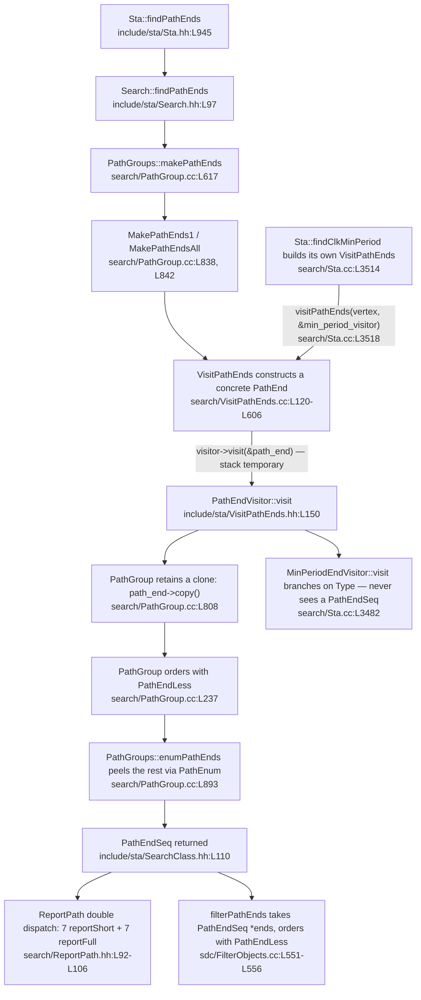
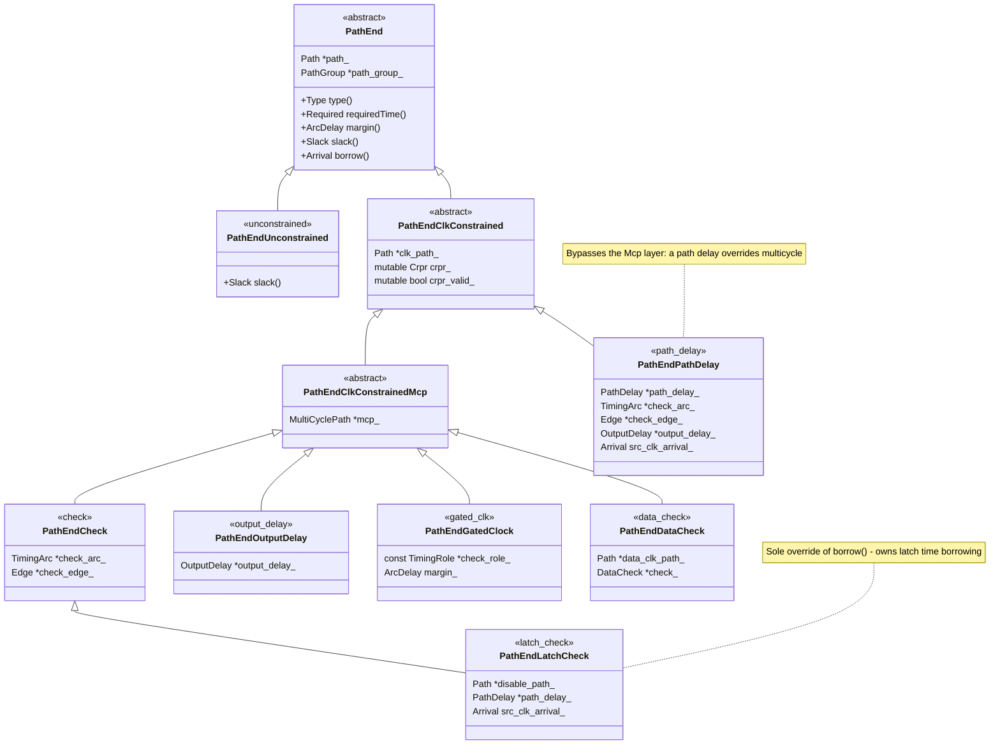
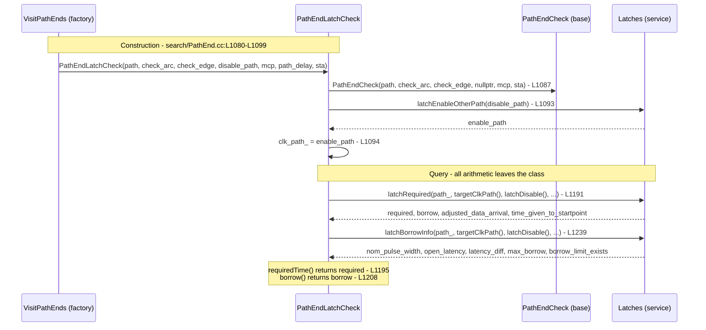
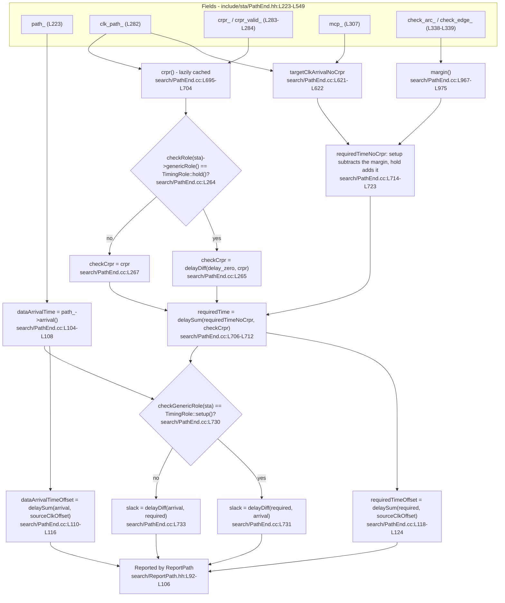

# PathEnd — Timing Path Endpoints and Their Constraints

**Scope.** This document describes the `PathEnd` class family: `include/sta/PathEnd.hh` (594 lines,
the *structural* authority — it declares every class, field, and signature) and `search/PathEnd.cc`
(2,118 lines, the *semantic* authority — it defines what every method actually computes). Where a
fact belongs to neither file, this document names the file that does own it and cites that file
instead: `search/VisitPathEnds.cc` decides which concrete type is built for which situation, and
`search/PathGroup.cc`, `sdc/FilterObjects.cc`, and `search/Sta.cc` are where the family's helpers
are actually used.

**Provenance.** Every statement here was verified against this repository at commit `d503c0ed`
(`d503c0ede5336c899dc09ff6ca9000a11bacbc3c`) on a clean working tree. Every factual claim carries an
inline `Source: <path>:L<line>` citation, and every count was derived mechanically with `grep`/`awk`
rather than by eye. Section 11 indexes every citation by authority so the claims can be re-checked
without re-reading the prose.

**Reading order.** Sections 1 through 4 answer "what is this and which type handles my check"; a
reader who needs only that can stop at section 4. Sections 5 through 8 are the internals. Section 9
records the invariants and the rough edges. Sections 10 and 11 are evidence.

**Five disclosures, made up front.**

- **This is documentation only.** It describes the `PathEnd` family as it stands and prescribes
  nothing. Where a statement could be read as advice, it is not: every item in section 9 is an
  observation about existing code. The only new file this work adds to the repository is this one, and
  the only other change is the comment-only header update disclosed in the next bullet.
- **No code, behavior, or signature changed.** No test, golden, build, or CI file was touched, and
  `search/PathEnd.cc` — along with every other authority, consumer, and convention file cited below —
  was read and never edited. There is exactly one exception to "read only": the companion header
  `include/sta/PathEnd.hh` received a **purely additive, comment-only** documentation update in the
  same milestone as this file. Its comment-stripped preprocessor output is byte-identical to the pinned
  revision, so no declaration, signature, enumerator order, include, or preprocessor directive changed
  there either. Two consequences worth stating: every `include/sta/PathEnd.hh` line number cited in
  this document refers to the pinned revision named above, before those comment lines were inserted;
  and nothing here is compiled, linked, installed, or executed — the build evidence for that is under
  "Notes on form" below.
- **No external source is cited anywhere in this document.** Every claim resolves to a location in
  this repository, and every convention resolves to a repository authority — `doc/CodingGuidelines.txt`
  for comment style, `.clang-format` as a value source only, `.cursor/rules/*.mdc`, `dcalc/Arnoldi.txt`
  for placement and form, and `README.md` for policy. No external publication, article, or
  best-practice claim is quoted, paraphrased, or attributed.
- **No dependency, generator, linter, or build step was added — and the diagrams use Mermaid, which
  has no precedent in this repository.** A repository-wide search for `mermaid` (excluding `.git`)
  returns zero occurrences. It is used here because it needs no tooling: the diagrams are plain text
  inside fenced blocks, rendered by the repository host, so they add no dependency, no generator, and
  no build step. That matters, because the project states: "Contributions that add dependencies on
  external libraries like boost, abseil and Intel TBB will not be accepted." *Source:
  `README.md`:L288-L289.* No documentation generator exists in this repository to target either —
  `Doxyfile`, `mkdocs.yml`, `conf.py`, `docusaurus.config.js`, `.readthedocs.yml`, `typedoc.json`,
  `book.toml`, and `package.json` were each searched for and are all absent, so none of those names
  is a citation.
- **Defects found while reading are recorded, not repaired.** Four of them are: a declaration with no
  definition (section 9, invariant 4), a three-way disagreement about whether an output delay has a
  target clock path (invariant 5), casts made without a null test (invariant 6), and a field that is
  written and never read (observation 14). Each is written down with its evidence and left exactly as
  it is: `search/PathEnd.cc` is not edited at all, and the header change described above adds comments
  only, so nothing that carries a defect is repaired.

**Bounded scope, stated plainly: per-method documentation is deliberately not attempted.** The base
class alone declares **73** distinct member-function names — 69 in its public run at
`include/sta/PathEnd.hh`:L71-L201 and 5 in its protected run at `include/sta/PathEnd.hh`:L205-L221,
of which `ignoreClkLatency` appears in both (`include/sta/PathEnd.hh`:L151, L218), so the union is 73
— and the nine subclasses add **12, 22, 5, 14, 20, 15, 9, 14, and 21** in header declaration order,
which is the row order of the table in section 3.3: `PathEndUnconstrained`, `PathEndClkConstrained`,
`PathEndClkConstrainedMcp`, `PathEndCheck`, `PathEndLatchCheck`, `PathEndOutputDelay`,
`PathEndGatedClock`, `PathEndDataCheck`, `PathEndPathDelay`. Each of the three comparators adds
exactly one, `operator()`. Those counts were derived mechanically — the distinct member-function names
declared inside each class's line extent (section 3.3), with constructors and destructors excluded and
overloads collapsed to one name. The per-class counts sum to 208, a figure in which a name recurs once
per class that overrides it. Walking that many entries one at a time would duplicate the header and
bloat this file. Instead, sections 5, 6, and 8 trace the *complete computation chains* — required time,
arrival, slack, margin, borrowing — and the header remains the per-signature reference. This is a
bounded scope decision, stated plainly rather than presented as full coverage.

**Notes on form.** This file carries no license banner and is registered nowhere, matching the only
precedent in this repository for a module-local maintainer design note: `dcalc/Arnoldi.txt`, which
begins immediately with technical prose. It has no build impact: the root `CMakeLists.txt` lists
search sources individually (`search/PathEnd.cc` at `CMakeLists.txt`:L195) and greps for `.md`,
`documentation`, and `doxygen` return nothing; `BUILD` globs only `"search/*.cc"` and
`"search/*.hh"` (*Source: `BUILD`:L325-L326*); and the install rules cover only the binary, the
library, and the header directory (*Source: `CMakeLists.txt`:L657, `CMakeLists.txt`:L660,
`CMakeLists.txt`:L663-L664*).

---

## 1. Purpose

A `PathEnd` binds one `Path` — a timing path arriving at some endpoint — to the check or constraint
that constrains it, and exposes the arrival time, required time, margin, and slack that follow from
that pairing. The header states the family's remit in its own words:

```cpp
// PathEnds represent search endpoints that are either unconstrained
// or constrained by a timing check, output delay, data check,
// or path delay.
```

*Source: `include/sta/PathEnd.hh`:L43-L45.*

The reason the family is polymorphic rather than a single struct with a discriminant is that each
kind of constraint answers the same four questions differently. Every concrete type must supply four
pure virtual members, so the compiler enforces that nothing is left to a default:

```cpp
  virtual Required requiredTime(const StaState *sta) const = 0;
  virtual ArcDelay margin(const StaState *sta) const = 0;
  virtual Slack slack(const StaState *sta) const = 0;
```

*Source: `include/sta/PathEnd.hh`:L104, `include/sta/PathEnd.hh`:L107, `include/sta/PathEnd.hh`:L109;
`sourceClkOffset` is likewise pure virtual at `include/sta/PathEnd.hh`:L115.*

Two further pure virtual members make the type self-describing and self-reporting:
`virtual Type type() const = 0;` and `virtual const char *typeName() const = 0;`
(*Source: `include/sta/PathEnd.hh`:L97-L98*), plus the reporting pair
`virtual void reportShort(const ReportPath *report) const = 0;` and its `reportFull` counterpart
(*Source: `include/sta/PathEnd.hh`:L83-L84*), and `virtual PathEnd *copy() const = 0;`
(*Source: `include/sta/PathEnd.hh`:L71*) — that last one exists for the lifetime reason set out in
section 9, invariant 1.

The family is public API, not an internal detail. Nine headers under `include/sta` mention `PathEnd`
(`FilterObjects.hh`, `Mode.hh`, `PathEnd.hh`, `PathGroup.hh`, `Property.hh`, `Search.hh`,
`SearchClass.hh`, `Sta.hh`, `VisitPathEnds.hh`), and repository-wide the name appears in 11 `.hh`
files, 21 `.cc` files, 4 SWIG interface files, and 29 `.tcl` files — 28 regression scripts under
`search/test/` plus the command-layer script `tcl/Property.tcl`, which dispatches on the object type
name `"PathEnd"` to reach `path_end_property` (*Source: `tcl/Property.tcl`:L74-L75*). That command in
turn forwards to the accessor `Properties::getProperty(PathEnd *end, std::string_view property)`
(declared *Source: `include/sta/Property.hh`:L89*, defined *Source: `search/Property.cc`:L1200-L1228*),
which answers seven property names — `startpoint`, `startpoint_clock`, `endpoint`, `endpoint_clock`,
`endpoint_clock_pin`, `slack`, and `points` — and throws `PropertyUnknown` for anything else
(*Source: `search/Property.cc`:L1227*).

It also crosses the SWIG boundary into the Tcl command layer, and the shape of that crossing is worth
seeing, because it has two halves rather than one. The interface declares a minimal `class PathEnd`
whose only two members are a private constructor and a private destructor
(*Source: `search/Search.i`:L68-L73*), so the Tcl layer can name the type without being able to
construct or destroy one.

**The free-function half.** Five functions across those interface files take or return the type: the
producer `find_path_ends` (*Source: `search/Search.i`:L353-L356*), the single-end reporter
`report_path_end` (*Source: `search/Search.i`:L390-L394*), the whole-sequence reporter
`report_path_ends`, which reports a `PathEndSeq *` and then deletes the sequence
(*Source: `search/Search.i`:L462-L467*), the property accessor `path_end_property`
(*Source: `search/Property.i`:L124-L126*), and the filter `filter_path_ends`, which both takes and
returns a `PathEndSeq` (*Source: `sdc/Sdc.i`:L1566-L1572*).

**The object-method half.** Under its own "Object Methods" banner (*Source:
`search/Search.i`:L1120-L1123*) the interface grafts 23 methods onto the Tcl object with a
`%extend PathEnd` block (*Source: `search/Search.i`:L1125-L1193*): the seven leaf predicates
(*Source: `search/Search.i`:L1126-L1132*), four path and pin accessors
(*Source: `search/Search.i`:L1133-L1137*), seven `float` accessors that convert a `Delay` through
`delayAsFloat` — `slack`, `margin`, `data_required_time`, `data_arrival_time`, `target_clk_delay`,
`source_clk_latency`, and `clk_skew` (*Source: `search/Search.i`:L1139-L1186*) — and five role and
clock accessors (*Source: `search/Search.i`:L1188-L1192*). This block is what makes
`[$pe is_latch_check]` and `[$pe is_check]` legal Tcl, which is the mechanism behind the golden-file
evidence for section 9, invariant 3.

**The marshalling.** The typemaps live in `tcl/StaTclTypes.i`, which includes the header directly
(*Source: `tcl/StaTclTypes.i`:L43*). Three of them concern this family: `%typemap(out) PathEnd*`
(*Source: `tcl/StaTclTypes.i`:L1114-L1117*), the pointer pair `%typemap(in) PathEndSeq*` and
`%typemap(out) PathEndSeq*` (*Source: `tcl/StaTclTypes.i`:L1119-L1135*), and
`%typemap(out) PathEndSeq` for a sequence returned by value
(*Source: `tcl/StaTclTypes.i`:L1137-L1139*). The last one is the one that actually marshals the two
functions named above whose return type is a bare `PathEndSeq` — `find_path_ends`
(*Source: `search/Search.i`:L353*) and `filter_path_ends` (*Source: `sdc/Sdc.i`:L1566*) — so the
pointer typemap and the value typemap are both live rather than one superseding the other. The
pointer form states the ownership rule in its own words — "Delete the PathEndSeq, not the ends."
(*Source: `tcl/StaTclTypes.i`:L1132*) — the same distinction section 9, invariant 1 draws between the
transient sequence and the ends inside it, which belong to path grouping.

That public status is also why the project's own guidance puts the explanatory comments in the header:
"Place comments describing public functions and classes in header files rather than code files because
a consumer is more likely to have access to the header and that is the first place they will look."
*Source: `doc/CodingGuidelines.txt`:L33-L35.*

---

## 2. Role in the Search and Reporting Machinery

`PathEnd` objects are produced, retained, ordered, and then formatted. The pipeline below was traced
call by call; each hop is cited.

**Entry.** The public facade declares the entry point:

```cpp
  PathEndSeq findPathEnds(ExceptionFrom *from,
                          ExceptionThruSeq *thrus,
                          ExceptionTo *to,
```

*Source: `include/sta/Sta.hh`:L945-L947.* Its definition forwards straight to the search engine
(*Source: `search/Sta.cc`:L2718, forwarding at `search/Sta.cc`:L2741*).

**Production.** `Search::findPathEnds` is declared at `include/sta/Search.hh`:L97 and defined at
`search/Search.cc`:L473-L519. Per mode it obtains a `PathGroups` from `mode->makePathGroups(...)`
(*Source: `search/Search.cc`:L504*) and then calls `path_groups->makePathEnds(...)`
(*Source: `search/Search.cc`:L513*), returning the accumulated sequence at
`search/Search.cc`:L518.

**Grouping and the hand-off to the factory.** `PathGroups::makePathEnds`
(*Source: `search/PathGroup.cc`:L617*) delegates to `PathGroups::makeGroupPathEnds`
(*Source: `search/PathGroup.cc`:L829*), which picks one of two visitors: `MakePathEnds1` when only
one path per endpoint is wanted (*Source: `search/PathGroup.cc`:L838*), otherwise `MakePathEndsAll`
(*Source: `search/PathGroup.cc`:L842*). The visitor that actually walks the graph holds a
`VisitPathEnds` member (*Source: `search/PathGroup.cc`:L962*) and drives it:

```cpp
  visit_path_ends_.visitPathEnds(vertex, scenes_, min_max_,
                                 true, path_end_visitor_);
```

*Source: `search/PathGroup.cc`:L1004-L1005.*

**Construction.** `VisitPathEnds` is the factory. It constructs the appropriate concrete subclass at
each endpoint and hands the visitor a pointer to it; the eleven construction sites span
`search/VisitPathEnds.cc`:L120-L606 and are tabulated in section 4.2.

**Retention and ordering.** A visited `PathEnd` is a stack temporary, so `PathGroup` clones it before
keeping it — `group->insert(path_end->copy());` *Source: `search/PathGroup.cc`:L808.* `PathGroup`
then orders what it kept with the comparators of section 7 (*Source: `search/PathGroup.cc`:L237*),
assigns each retained end to its reporting bucket via `path_end->setPathGroup(this)`
(*Source: `search/PathGroup.cc`:L182*), and drops the surplus in `PathGroup::prune`
(*Source: `search/PathGroup.cc`:L188-L207*, with the deletion at `search/PathGroup.cc`:L204).

**Where that retention contract is declared.** The implementation just cited is in `search/`, but the
declarations are under `include/sta` — a split worth stating explicitly, because there is no
`PathGroup` header in `search/`. `class PathGroup` is introduced by its own comment, "A collection of
PathEnds grouped and sorted for reporting." (*Source: `include/sta/PathGroup.hh`:L49-L50*), and it
declares `pathEnds()`, which hands back the retained `PathEndSeq` by value
(*Source: `include/sta/PathGroup.hh`:L73*), `insert`
(*Source: `include/sta/PathGroup.hh`:L74*), `pushEnds`
(*Source: `include/sta/PathGroup.hh`:L76*), the retention predicate `saveable` under the comment
"Predicate to determine if a PathEnd is worth saving."
(*Source: `include/sta/PathGroup.hh`:L77-L78*), `prune`
(*Source: `include/sta/PathGroup.hh`:L97*), and the retained vector itself,
`PathEndSeq path_ends_;` (*Source: `include/sta/PathGroup.hh`:L107*). `class PathGroups`
(*Source: `include/sta/PathGroup.hh`:L116*) declares `makePathEnds` directly beneath the ownership
comment "The PathEnds in the vector are owned by the PathGroups."
(*Source: `include/sta/PathGroup.hh`:L136-L137*) — which is where the ownership half of section 9,
invariant 1 is written down in the codebase's own words.

**Enumeration.** Because grouping keeps only the worst end per CRPR tag, a separate enumerator
recovers the rest. `PathGroups::enumPathEnds` (*Source: `search/PathGroup.cc`:L883-L910*) builds a
`PathEnum` (*Source: `search/PathGroup.cc`:L893-L894*), inserts the saveable ends
(*Source: `search/PathGroup.cc`:L898*), clears the group (*Source: `search/PathGroup.cc`:L900*), and
re-inserts the peeled results (*Source: `search/PathGroup.cc`:L903-L906*). `PathEnum` is itself an
iterator over the family — `class PathEnum : public Iterator<PathEnd*>, StaState` *Source:
`search/PathEnum.hh`:L61* — introduced by its own comment, "Iterator to enumerate sucessively slower
paths." (*Source: `search/PathEnum.hh`:L60*; the spelling is the repository's). Its two family-facing
members are `insert`, whose own comment states the ordering it assumes — "Insert path ends that are
enumerated in slack/arrival order." (*Source: `search/PathEnum.hh`:L70-L71*) — and the `Iterator`
override `PathEnd *next()` (*Source: `search/PathEnum.hh`:L74*), which is what hands the peeled ends
back.

**Formatting.** `ReportPath` formats an end by double dispatch: each concrete type's `reportShort`
and `reportFull` call back into a type-specific overload, seven of each, declared at
`search/ReportPath.hh`:L92-L98 and `search/ReportPath.hh`:L100-L106. `PathEndCheck::reportShort`
shows the shape of the callback:

```cpp
PathEndCheck::reportShort(const ReportPath *report) const
{
  report->reportShort(this);
```

*Source: `search/PathEnd.cc`:L956-L958*, the whole body of that member being
`search/PathEnd.cc`:L955-L959.

**Transport type.** Everything above moves the ends around as
`using PathEndSeq = std::vector<PathEnd*>;` *Source: `include/sta/SearchClass.hh`:L110.* That alias is
declared in the same header as the family's forward declaration, `class PathEnd;`
(*Source: `include/sta/SearchClass.hh`:L46*), so a translation unit can traffic in the sequence without
including `include/sta/PathEnd.hh` at all — which is a large part of why the type appears in so many
files.

### 2.1 The consumers that are not reporting

Reporting is not the only consumer, and this matters for section 9's claim that the `Type`
enumeration's order is load-bearing. `MinPeriodEndVisitor::visit`
(*Source: `search/Sta.cc`:L3474-L3495*) reads `path()`, `sourceClkEdge()`, `targetClkEdge()`,
`type()`, `multiCyclePath()`, and `slack()`, and branches on the type:

```cpp
  if ((end_type == PathEnd::Type::check || end_type == PathEnd::Type::output_delay)
      && path->minMax(sta_) == MinMax::max() && src_edge->clock() == clk_
```

*Source: `search/Sta.cc`:L3482-L3483.* So `Type` drives dispatch outside the reporting path as well.

**It is driven by its own traversal, not by the returned sequence.** `Sta::findClkMinPeriod`
(*Source: `search/Sta.cc`:L3508-L3521*) constructs a local `VisitPathEnds visit_ends(this);`
(*Source: `search/Sta.cc`:L3514*) and, per endpoint, calls the unfiltered two-argument overload
declared under the comment "All scenes, unfiltered." (*Source:
`include/sta/VisitPathEnds.hh`:L41-L43*) — `visit_ends.visitPathEnds(vertex, &min_period_visitor);`
*Source: `search/Sta.cc`:L3518.* So this visitor is handed the same stack temporary the factory just
built, and it **never receives a `PathEndSeq`**; neither `Sta::findPathEnds` nor `PathGroup` is on
its path at all. The reporting route instead uses the five-argument overload
(*Source: `include/sta/VisitPathEnds.hh`:L44-L48*) from `search/PathGroup.cc`:L1004-L1005.

**`MinPeriodEndVisitor` is one of five non-reporting visitors, not the only one, and the full census
matters because it sets the family's blast radius.** A repository-wide search for classes deriving
from `PathEndVisitor`, excluding tests, returns seven production implementations. Two of them exist to
serve reporting; the other five serve the engine, model extraction, or a query instead:

| Visitor | Declared | What it does with a `PathEnd` | Driven from |
|---|---|---|---|
| `MakePathEnds1` | `search/PathGroup.cc`:L645 | Retains a clone of the worst end in each path group, for reporting | `search/PathGroup.cc`:L1004 |
| `MakePathEndsAll` | `search/PathGroup.cc`:L719 | Retains clones for reporting, one per CRPR tag, so `PathEnum` can peel the rest | `search/PathGroup.cc`:L1004 |
| `FindEndRequiredVisitor` | `search/Search.cc`:L3297 | Reads `requiredTime()` and feeds `RequiredCmp::requiredSet`, seeding required-time back-propagation (*Source: `search/Search.cc`:L3341-L3350*) | `search/Search.cc`:L3360, L3372, L3483 |
| `FindEndSlackVisitor` | `search/Search.cc`:L3924 | Reads `slack()` and keeps the smallest per path analysis point, which is how endpoint slacks reach the worst-slack computation (*Source: `search/Search.cc`:L3952-L3961*) | `search/Search.cc`:L3976 |
| `EndpointPathEndVisitor` | `search/Sta.cc`:L3249 | Reads `minMax()` and `slack()`, filtered by path-group name via `PathGroups::pathGroupNames` (*Source: `search/Sta.cc`:L3283-L3295*) | `search/Sta.cc`:L3308 |
| `MinPeriodEndVisitor` | `search/Sta.cc`:L3439 | Branches on `type()` for minimum-period analysis (*Source: `search/Sta.cc`:L3474-L3495*) | `search/Sta.cc`:L3518 |
| `MakeEndTimingArcs` | `search/MakeTimingModel.cc`:L241 | Reads `targetClkEdge()`, `minMax()`, `targetClkDelay()`, `margin()`, and `typeName()` to build extracted timing-model margins (*Source: `search/MakeTimingModel.cc`:L275-L295*) | `search/MakeTimingModel.cc`:L353 |

One qualification belongs on that split. `MakeEndTimingArcs` is a model-extraction visitor, but it is
not unconditionally silent: when the `make_timing_model` debug level reaches 3 it calls
`sta_->reportPathEnd(path_end)` (*Source: `search/MakeTimingModel.cc`:L296-L297*), which is the only
place any of the five reaches the reporting facade. Checked method by method over their full class
bodies, the other four — `FindEndRequiredVisitor`, `FindEndSlackVisitor`, `EndpointPathEndVisitor`, and
`MinPeriodEndVisitor` — contain no call to a `report`-prefixed member at all.

Two consequences are worth stating plainly. First, `requiredTime()` and `slack()` are not reporting
accessors that happen to be reachable from the engine — they are engine inputs, so their semantics are
load-bearing for required-time propagation and for worst-slack reporting, not only for the printed
report. Second, `typeName()` is read outside reporting as well, which section 4.1 records.

**Not every consumer arrives through a visit callback; some take a value the pipeline already
produced.** Two such consumers sit outside reporting. `filterPathEnds` takes the returned sequence —
its parameter is `PathEndSeq *ends` (*Source: `sdc/FilterObjects.cc`:L551-L554*) — and it orders the
filtered result with `PathEndLess` (*Source: `sdc/FilterObjects.cc`:L556*).
`Properties::getProperty(PathEnd *, std::string_view)` takes a single retained end rather than a
sequence (*Source: `search/Property.cc`:L1200-L1228*); it is the accessor behind `path_end_property`
described in section 1. By-value consumption is not peculiar to those two, however: the reporting
facade works the same way, since `reportPathEnd(PathEnd *end)` and `reportPathEnds(PathEndSeq *ends)`
(*Source: `include/sta/Sta.hh`:L997-L998*) forward to the `ReportPath` entry point
`ReportPath::reportPathEnds(const PathEndSeq *ends)` (*Source: `search/ReportPath.cc`:L320*). The
distinction that matters for this section is therefore reporting versus not, not by-value versus
callback.

### 2.2 Diagram 1 — the pipeline

Two entry points are drawn: the reporting facade, and one representative consumer that drives the
factory directly. The reporting facade `Sta::findPathEnds` runs the full produce → retain → order →
return chain; `Sta::findClkMinPeriod` drives the same factory directly with its own visitor and stops
at the visit callback. That second shape is representative rather than unique — two further sites
construct their own `VisitPathEnds` in exactly the same way (*Source: `search/Sta.cc`:L3306,
`search/MakeTimingModel.cc`:L351*), and `Search` drives the `VisitPathEnds` it holds as a member
(*Source: `include/sta/Search.hh`:L674*) at four more call sites (*Source: `search/Search.cc`:L3360,
`search/Search.cc`:L3372, `search/Search.cc`:L3483, `search/Search.cc`:L3976*). Section 2.1 tabulates
every one of them; the diagram draws one so that the shape stays readable. Only consumers that take
the returned sequence hang off the `PathEndSeq` node.



---

## 3. Class Hierarchy

`include/sta/PathEnd.hh` defines **13 classes**, preceded by four forward declarations —
`StaState`, `RiseFall`, `MinMax`, and `ReportPath` at `include/sta/PathEnd.hh`:L38-L41. Ten of the
thirteen are in the `PathEnd` inheritance tree (**3 abstract, 7 concrete**); the remaining three are
the standalone comparators of section 7. The count is mechanical: `grep -c '^class '` on the header
returns 17, which is the 4 forward declarations plus the 13 definitions.

### 3.1 Inheritance tree

The header carries its own hierarchy block. It was checked line by line against the actual
`class X : public Y` declarations and is correct, so it is mirrored here verbatim rather than
restated in a different shape — a future structural divergence between header and document is then
visible side by side.

```text
// Class hierarchy:
// PathEnd (abstract)
//  PathEndUnconstrained
//  PathEndClkConstrained (abstract)
//   PathEndPathDelay (clock is optional)
//   PathEndClkConstrainedMcp (abstract)
//    PathEndCheck
//     PathEndLatchCheck
//    PathEndOutputDelay
//    PathEndGatedClock
//    PathEndDataCheck
```

*Source: `include/sta/PathEnd.hh`:L47-L57.*

Two observations about that block. First, all three abstract classes are already marked in it —
`grep -n '(abstract)'` on the header returns exactly three hits, at
`include/sta/PathEnd.hh`:L48, `include/sta/PathEnd.hh`:L50, and `include/sta/PathEnd.hh`:L52 — but
**zero** markers appear at the declarations themselves (L59, L245, L287), so abstractness is only
indirectly observable there: those three classes have protected constructors
(*Source: `include/sta/PathEnd.hh`:L204, `include/sta/PathEnd.hh`:L272-L273,
`include/sta/PathEnd.hh`:L296-L298*) and no `ReportPath` overload exists for any of them
(*Source: `search/ReportPath.hh`:L92-L106*). Second, the note "(clock is optional)" on
`PathEndPathDelay` at `include/sta/PathEnd.hh`:L51 is the header recording the deliberate placement
discussed in section 5.

The longest inheritance chain is `PathEnd` → `PathEndClkConstrained` → `PathEndClkConstrainedMcp` →
`PathEndCheck` → `PathEndLatchCheck`: five classes joined by four inheritance edges.

### 3.2 Diagram 2 — the same tree as a class diagram

Every edge below corresponds to a verified `class X : public Y` declaration in
`include/sta/PathEnd.hh`; no inferred relationship is drawn. Every identifier named in the diagram
exists in that header. **Member entries carry the header's own types verbatim**, including pointer
indirection and the `const` and `mutable` qualifiers, because dropping a `*` would misstate both
nullability and ownership. Two things a class-diagram member entry cannot carry are elided: the
default member initializers `{nullptr}` and `{false}`, and the `protected` access of every field —
both are shown with their line numbers in the verbatim inventory of section 8.1. Each node lists its
own class's **complete** field set, which is twenty-one of the twenty-six; the five not shown belong
to the three comparators, which are not part of the tree and so do not appear in this diagram at all.
Method entries are abbreviated: their parameter lists and trailing `const` are dropped, and only the
four pure virtual members plus `borrow()` are listed rather than the full member list. The return
types shown are the header's own spellings: see section 8.3 for why `borrow()` returns `Arrival` and
`margin()` returns `ArcDelay` when both are the same underlying type. Each concrete class carries its
`Type` enumerator as an annotation.



### 3.3 Subclass, parent, abstract or concrete, and check kind

Line extents are the span from each `class` keyword to the class's closing brace, taken from
`include/sta/PathEnd.hh`.

| Class | Lines | Parent | Abstract? | Check or constraint modeled |
|---|---|---|---|---|
| `PathEnd` | L59-L225 | — | **Abstract** — never instantiated | None. Defines the required-time / margin / slack contract. |
| `PathEndUnconstrained` | L227-L243 | `PathEnd` | Concrete | No constraint applies. |
| `PathEndClkConstrained` | L245-L285 | `PathEnd` | **Abstract** — never instantiated | Shared base for every endpoint constrained relative to a target clock. |
| `PathEndClkConstrainedMcp` | L287-L308 | `PathEndClkConstrained` | **Abstract** — never instantiated | Adds multicycle-path adjustment, and nothing else. |
| `PathEndCheck` | L311-L340 | `PathEndClkConstrainedMcp` | Concrete | A timing check — setup, hold, recovery, **or** removal, resolved at runtime from the check edge. |
| `PathEndLatchCheck` | L343-L395 | `PathEndCheck` | Concrete | Latch D-input setup, with time borrowing. |
| `PathEndOutputDelay` | L400-L436 | `PathEndClkConstrainedMcp` | Concrete | An output delay (`set_output_delay`). |
| `PathEndGatedClock` | L439-L462 | `PathEndClkConstrainedMcp` | Concrete | A gated-clock check. |
| `PathEndDataCheck` | L464-L494 | `PathEndClkConstrainedMcp` | Concrete | A data check (`set_data_check`). |
| `PathEndPathDelay` | L499-L550 | `PathEndClkConstrained` | Concrete | A path delay (`set_min_delay` / `set_max_delay`). |
| `PathEndLess` | L556-L567 | — | Comparator (not in the tree) | Ordering helper; see section 7. |
| `PathEndSlackLess` | L570-L581 | — | Comparator (not in the tree) | Ordering helper; see section 7. |
| `PathEndNoCrprLess` | L583-L592 | — | Comparator (not in the tree) | Ordering helper; see section 7. |

The comparators are separated from the hierarchy in the header by a 64-slash section rule at
`include/sta/PathEnd.hh`:L552.

---

## 4. Which `PathEnd` Type for Which Check

The inheritance tree of section 3 cannot answer this question on its own, and the single most
important reason is `PathEndCheck`: one class covers setup, hold, recovery, **and** removal, because
it does not decide its own role — it asks the check edge at runtime.

```cpp
{
  return check_edge_->role();
}
```

*Source: `search/PathEnd.cc`:L963-L965* — the whole body of `const TimingRole
*PathEndCheck::checkRole(const StaState *) const` at `search/PathEnd.cc`:L961-L965, which ignores its
`StaState` argument entirely. The roles that can come back are declared as
`TimingRole::setup()`, `hold()`, `recovery()`, and `removal()` at
`include/sta/TimingRole.hh`:L51-L54. The other leaf types name roles declared a few lines below those
in the same header: `outputSetup()` and `outputHold()`
(*Source: `include/sta/TimingRole.hh`:L59-L60*), `latchSetup()`
(*Source: `include/sta/TimingRole.hh`:L63*), and `dataCheckSetup()` and `dataCheckHold()`
(*Source: `include/sta/TimingRole.hh`:L65-L66*).

### 4.1 Reference table

`checkRole()` is the authority for what a type checks; `margin()` is the authority for where its
margin comes from. Both are cited per row.

| Concrete type | `Type` enumerator | `typeName()` | Check / constraint | Where its check role comes from | Where its margin comes from |
|---|---|---|---|---|---|
| `PathEndUnconstrained` | `unconstrained` (0) | `"unconstrained"` | None — nothing constrains the endpoint | Base returns `nullptr` (*`search/PathEnd.cc`:L225-L229*) | `delay_zero` (*`search/PathEnd.cc`:L480-L484*) |
| `PathEndCheck` | `check` (1) | `"check"` | Setup, hold, recovery **or** removal — decided at runtime | `check_edge_->role()` (*`search/PathEnd.cc`:L961-L965*) | Derated check-arc delay (*`search/PathEnd.cc`:L967-L975*) |
| `PathEndDataCheck` | `data_check` (2) | `"data_check"` | A data check between two data pins | `dataCheckSetup()` for max, else `dataCheckHold()` (*`search/PathEnd.cc`:L1668-L1675*) | The `DataCheck` margin (*`search/PathEnd.cc`:L1656-L1666*) |
| `PathEndLatchCheck` | `latch_check` (3) | `"latch_check"` | Latch D-input setup, with borrowing | `setup()` for a pulse clock, else `latchSetup()` (*`search/PathEnd.cc`:L1155-L1165*) | Inherited from `PathEndCheck` (*`search/PathEnd.cc`:L967-L975*) |
| `PathEndOutputDelay` | `output_delay` (4) | `"output_delay"` | `set_output_delay` at a port | `outputSetup()` for max, else `outputHold()` (*`search/PathEnd.cc`:L1360-L1367*) | The output-delay value, negated for the min sense (*`search/PathEnd.cc`:L1340-L1344, delegating to `search/PathEnd.cc`:L1346-L1358*) |
| `PathEndGatedClock` | `gated_clk` (5) | `"gated_clk"` | A gated-clock check | `return check_role_;` — supplied by the caller (*`search/PathEnd.cc`:L1523-L1527*) | `return margin_;` — supplied by the caller (*`include/sta/PathEnd.hh`:L454*) |
| `PathEndPathDelay` | `path_delay` (6) | `"path_delay"` | `set_min_delay` / `set_max_delay` | `check_edge_->role()` when there is a check edge, else `setup()`/`hold()` by min/max (*`search/PathEnd.cc`:L1799-L1808*) | Three-way: derated check-arc delay when there is a check arc, else the output-delay margin when there is an output delay, else `delay_zero` (*`search/PathEnd.cc`:L1810-L1824*) |

`PathEndGatedClock` is the only type whose role **and** margin both arrive precomputed: both are
constructor arguments (*Source: `include/sta/PathEnd.hh`:L442-L447*) stored verbatim in
`check_role_` and `margin_` (*Source: `include/sta/PathEnd.hh`:L460-L461*) and returned unchanged. Its
one-line class comment says what the endpoint is rather than what the class does — "Clock path
constrained clock gating signal." (*Source: `include/sta/PathEnd.hh`:L438*).

`PathEndUnconstrained` is the degenerate member of the family, and it exists so that an unconstrained
endpoint is still reportable through the same interface. Its required time is the initial value for
the *opposite* min/max sense:

```cpp
PathEndUnconstrained::requiredTime(const StaState *sta) const
{
  return delayInitValue(minMax(sta)->opposite());
```

*Source: `search/PathEnd.cc`:L469-L471; the same return statement is repeated verbatim in
`requiredTimeOffset` at `search/PathEnd.cc`:L477.* Its margin is `delay_zero`
(*Source: `search/PathEnd.cc`:L480-L484*), its slack is `INF`
(*Source: `search/PathEnd.cc`:L486-L490*), and its source clock offset is `0.0`
(*Source: `search/PathEnd.cc`:L493-L497*).

The `typeName()` strings above are string literals returned directly, one per type, at
`search/PathEnd.cc`:L508, L946, L1622, L1116, L1325, L1520, L1766 — in the row order of the table
above, which is not line order. Four of the seven are pinned by assertions in a committed unit test
(*Source: `search/test/cpp/TestSearchStaInit.cc`:L3217,
`search/test/cpp/TestSearchStaInit.cc`:L3233, `search/test/cpp/TestSearchStaInit.cc`:L3254,
`search/test/cpp/TestSearchStaInit.cc`:L3270*). Four consumers read the string: two debug traces in
path grouping (*Source: `search/PathGroup.cc`:L801, `search/PathGroup.cc`:L816*), the JSON report
(*Source: `search/ReportPath.cc`:L1064*), and a debug trace in timing-model extraction — the
`debugPrint` inside `MakeEndTimingArcs::visit` (*Source: `search/MakeTimingModel.cc`:L292-L295*, the
`typeName()` argument at L294), which is one of the non-reporting consumers tabulated in section 2.1.
So the string is not a reporting-only affordance.

### 4.2 Which type gets built — the factory decides, not `PathEnd`

Neither subject file chooses a type. `search/VisitPathEnds.cc` does, and it is therefore the
authority for this subsection.

Selection happens at **two levels**, and conflating them is the easiest way to misread the factory.
The outer level decides *whether* an endpoint yields a constrained end or the unconstrained fallback;
the inner level decides *which* constrained type. The outer level is
`VisitPathEnds::visitPathEnds`, the five-argument overload
(*Source: `search/VisitPathEnds.cc`:L60-L82*), and it does three things in order: it skips bidirect
driver vertices under the comment "Ignore slack on bidirect driver vertex.  The load vertex gets the
slack." (*Source: `search/VisitPathEnds.cc`:L67-L68*), it walks the constrained routes with a
by-reference flag (*Source: `search/VisitPathEnds.cc`:L73-L75*), and only then does it consider the
fallback:

```cpp
    if (search_->unconstrainedPaths()
        && !is_constrained)
      visitUnconstrainedPathEnds(pin, vertex, scenes, min_max, filtered,
```

*Source: `search/VisitPathEnds.cc`:L76-L78*, the call continuing to `visitor);` on
`search/VisitPathEnds.cc`:L79.

| Level | Condition | Route taken | Source |
|---|---|---|---|
| Outer 1 | The vertex is not a bidirect driver | `visitClkedPathEnds`, carrying `bool is_constrained` by reference | `search/VisitPathEnds.cc`:L68, L73-L75 |
| Outer 2 | `search_->unconstrainedPaths()` **and** `!is_constrained` | `visitUnconstrainedPathEnds`, which is the only producer of `PathEndUnconstrained` | `search/VisitPathEnds.cc`:L76-L79 |

So `PathEndUnconstrained` is not one route among the constrained five below: it is a fallback, reached
only when the endpoint produced **no** constrained end at all *and* the search was asked for
unconstrained paths. Both halves of that condition are worth pinning down.

- **Where the request comes from.** `unconstrainedPaths()` returns a stored flag
  (*Source: `include/sta/Search.hh`:L93*) that `Search::findFilteredArrivals` assigns from its
  `unconstrained` argument (*Source: `search/Search.cc`:L528*), which
  `Search::findPathEnds` forwards from its own `unconstrained` parameter
  (*Source: `search/Search.cc`:L477, `search/Search.cc`:L495*) — the same parameter the facade
  declares at `include/sta/Sta.hh`:L948. It is therefore a per-query argument rather than a persistent
  setting, which is what distinguishes it from the gated-clock precondition below, and the same flag
  is passed on to path grouping (*Source: `search/Search.cc`:L507, `search/Search.cc`:L514*).
- **How `is_constrained` becomes true.** It is declared `false` (*Source:
  `search/VisitPathEnds.cc`:L73*), taken by reference through every constrained route as
  `bool &is_constrained` (*Source: `search/VisitPathEnds.cc`:L91, `search/VisitPathEnds.cc`:L141,
  `search/VisitPathEnds.cc`:L243, `search/VisitPathEnds.cc`:L299, `search/VisitPathEnds.cc`:L350,
  `search/VisitPathEnds.cc`:L390, `search/VisitPathEnds.cc`:L506,
  `search/VisitPathEnds.cc`:L544*), and set to `true` at nine sites, each on the line immediately
  after a `visit` call: `search/VisitPathEnds.cc`:L122, L196, L202, L221, L269, L363, L376, L453,
  L574. Nine, against eleven construction sites: the `PathEndLatchCheck` built for a path-delay
  exception is visited at `search/VisitPathEnds.cc`:L215 without the flag being set, while its
  sibling `PathEndPathDelay` branch does set it at `search/VisitPathEnds.cc`:L221, and the fallback's
  own visit at `search/VisitPathEnds.cc`:L607 is downstream of the flag and does not set it either.
  The code does not say whether the first of those two is deliberate, and this document does not
  guess.
- **The fallback applies its own filters.** `visitUnconstrainedPathEnds`
  (*Source: `search/VisitPathEnds.cc`:L584*) tests scene membership, min/max match, disabled
  constraints, generated clock source paths, the search filter, and false paths before it constructs
  anything (*Source: `search/VisitPathEnds.cc`:L597-L605*), so reaching the gate is necessary but not
  sufficient for a `PathEndUnconstrained` to exist.

Inside `visitClkedPathEnds` (*Source: `search/VisitPathEnds.cc`:L85*) — the inner level — the
top-level order is fixed by the code's own comment:

```cpp
      // set_output_delay to timing check has precedence.
      if (sdc->hasOutputDelay(pin))
```

*Source: `search/VisitPathEnds.cc`:L109-L110.*

| Order | Condition | Route taken | Source |
|---|---|---|---|
| 1 | The pin has an output delay | `visitOutputDelayEnd` | `search/VisitPathEnds.cc`:L110-L112 |
| 2 | Otherwise, the vertex has checks | `visitCheckEnd` | `search/VisitPathEnds.cc`:L113-L115 |
| 3 | Otherwise, a path delay applies to the path | `PathEndPathDelay` built at L120 | `search/VisitPathEnds.cc`:L116-L124 |
| 4 | Additionally, if gated-clock checking is enabled | `visitGatedClkEnd` | `search/VisitPathEnds.cc`:L125-L127 |
| 5 | Additionally, unconditionally | `visitDataCheckEnd` | `search/VisitPathEnds.cc`:L128-L129 |

Step 4 is a **precondition applied by the factory**, not a configuration surface belonging to this
family: the `PathEnd` classes read no configuration and expose no user-settable option of their own.
The same variable is consulted again at a higher level, where disabled gated-clock checking is forced
off before the search even begins (*Source: `search/Search.cc`:L498-L499*).

Inside the checks route, the discriminator is whether the endpoint is latch data being setup-checked:

| Condition | Type built | Source |
|---|---|---|
| `network_->isLatchData(pin)` **and** the check role is `setup()` | `PathEndLatchCheck` | `search/VisitPathEnds.cc`:L190-L195 |
| Otherwise | `PathEndCheck` | `search/VisitPathEnds.cc`:L198-L201 |
| A path-delay exception applies, and the pin is latch data being setup-checked | `PathEndLatchCheck`, carrying the path delay | `search/VisitPathEnds.cc`:L205-L215 |
| A path-delay exception applies otherwise | `PathEndPathDelay` | `search/VisitPathEnds.cc`:L217-L221 |

The full set of construction sites — **eleven**, a number derived here with
`grep -nE 'PathEnd(Unconstrained|Check|LatchCheck|OutputDelay|GatedClock|DataCheck|PathDelay)[[:space:]]+[a-z_]+'`
rather than taken on trust:

| Site | Type constructed | Enclosing routine |
|---|---|---|
| `search/VisitPathEnds.cc`:L120 | `PathEndPathDelay` | `visitClkedPathEnds` (L85) |
| `search/VisitPathEnds.cc`:L192 | `PathEndLatchCheck` | `visitCheckEnd` (L135) |
| `search/VisitPathEnds.cc`:L199 | `PathEndCheck` | `visitCheckEnd` (L135) |
| `search/VisitPathEnds.cc`:L212 | `PathEndLatchCheck` | `visitCheckEnd` (L135) |
| `search/VisitPathEnds.cc`:L218 | `PathEndPathDelay` | `visitCheckEnd` (L135) |
| `search/VisitPathEnds.cc`:L266 | `PathEndPathDelay` | `visitCheckEndUnclked` (L237) |
| `search/VisitPathEnds.cc`:L361 | `PathEndPathDelay` | `visitOutputDelayEnd1` (L342) |
| `search/VisitPathEnds.cc`:L374 | `PathEndOutputDelay` | `visitOutputDelayEnd1` (L342) |
| `search/VisitPathEnds.cc`:L450 | `PathEndGatedClock` | `visitGatedClkEnd` (L384) |
| `search/VisitPathEnds.cc`:L572 | `PathEndDataCheck` | `visitDataCheckEnd1` (L533) |
| `search/VisitPathEnds.cc`:L606 | `PathEndUnconstrained` | `visitUnconstrainedPathEnds` (L584) |

A pattern visible in that table and worth naming: a path-delay exception displaces whatever type
would otherwise have been built. Four of the eleven sites construct `PathEndPathDelay`, and the code
says why in its own words — "False paths and path delays override multicycle paths."
*Source: `search/VisitPathEnds.cc`:L262.* An abbreviated form of the same sentence, "False paths and
path delays override.", guards the output-delay, gated-clock, and data-check routes at
`search/VisitPathEnds.cc`:L368, `search/VisitPathEnds.cc`:L441, and `search/VisitPathEnds.cc`:L564,
and a two-line variant appears in the checks route at `search/VisitPathEnds.cc`:L183-L184. Section 5
returns to this as the reason `PathEndPathDelay` sits where it does in the hierarchy.

### 4.3 A four-fold recurrence of seven

The seven concrete classes are mirrored by four other seven-element sets, and none of the three
abstract classes appears in any of them.

| Set of seven | Where declared |
|---|---|
| The concrete classes | `include/sta/PathEnd.hh`:L227, L311, L343, L400, L439, L464, L499 |
| The `Type` enumerators | `include/sta/PathEnd.hh`:L62-L69 |
| The leaf predicates, all defaulting to `false` in the base | `include/sta/PathEnd.hh`:L90-L96 |
| The single-argument `reportShort` overloads | `search/ReportPath.hh`:L92-L98 |
| The `reportFull` overloads | `search/ReportPath.hh`:L100-L106 |

Each leaf predicate is overridden to `true` by exactly one concrete class. Six of the seven are inline
in the header and are therefore their own behavioral authority: `isCheck` at
`include/sta/PathEnd.hh`:L325, `isLatchCheck` at L357, `isOutputDelay` at L413, `isGatedClock` at
L453, `isDataCheck` at L477, and `isPathDelay` at L523, each written
`bool isX() const override { return true; }`. The seventh is the exception: `isUnconstrained` is only
*declared* in the header (*Source: `include/sta/PathEnd.hh`:L236*) and its `return true;` lives in the
implementation (*Source: `search/PathEnd.cc`:L462-L466*). Section 9, invariant 3 records the one place
where the pattern has a twist.

Two precision points about these sets, both of which are easy to get wrong:

- **`search/ReportPath.hh` does not declare seven `reportShort`; it declares seventeen.**
  `grep -c 'void reportShort'` returns 17: the seven single-argument overloads for this family
  (*Source: `search/ReportPath.hh`:L92-L98*), three unrelated ones for other check kinds —
  `MinPulseWidthCheck`, `MinPeriodCheck`, and `MaxSkewCheck` (*Source: `search/ReportPath.hh`:L138,
  `search/ReportPath.hh`:L146, `search/ReportPath.hh`:L152*) — and a further seven two-argument
  overloads (*Source: `search/ReportPath.hh`:L185-L197*), which is itself a third seven-fold
  recurrence inside that one file. `grep -c 'void reportFull'` returns 7 exactly.
- **The `ReportPath` declaration order is not the `Type` enumeration order.** `ReportPath` declares
  them as `PathEndUnconstrained, PathEndCheck, PathEndLatchCheck, PathEndPathDelay,
  PathEndOutputDelay, PathEndGatedClock, PathEndDataCheck`
  (*Source: `search/ReportPath.hh`:L92-L98*), whereas the enumeration order is `unconstrained, check,
  data_check, latch_check, output_delay, gated_clk, path_delay`
  (*Source: `include/sta/PathEnd.hh`:L62-L69*). Compared position by position, the two sequences agree
  at four of the seven — the first two, and the fifth and sixth (`output_delay` and `gated_clk`) — and
  differ at the third, fourth, and seventh, where the overload order runs latch check, path delay, data
  check against the enumeration's data check, latch check, path delay. The agreement at positions five
  and six is coincidence rather than a shared convention, so neither order may be used to predict the
  other.

The consequence of this four-fold correspondence is worth stating for anyone considering an eighth
concrete type: it would need an enumerator, a leaf predicate, a `reportShort` overload, a `reportFull`
overload, a construction site in the factory, and — because the enumerator's ordinal is compared
directly — a decision about where in the enumeration to place it. Section 9, invariant 2 covers the
last of those.

---

## 5. Responsibility Split Across the Clock-Constrained Chain

Every constrained type except `PathEndUnconstrained` descends from `PathEndClkConstrained`, and the
work is split across three levels plus the leaves.

### 5.1 Level one — `PathEndClkConstrained` owns the target clock and the shared algebra

This abstract level (*Source: `include/sta/PathEnd.hh`:L245-L285*) holds three fields — the target
clock path and a two-field CRPR cache (*Source: `include/sta/PathEnd.hh`:L282-L284*) — and supplies
the required-time and slack algebra that every clocked endpoint inherits. Required time is the
CRPR-free value plus the signed CRPR:

```cpp
  return delaySum(requiredTimeNoCrpr(sta),
                  checkCrpr(sta),
                  sta);
```

*Source: `search/PathEnd.cc`:L709-L711.* The CRPR-free value adds or subtracts the margin depending on
the check sense (*Source: `search/PathEnd.cc`:L714-L723*), and slack reverses its operands for
anything that is not setup:

```cpp
  if (checkGenericRole(sta) == TimingRole::setup())
    return delayDiff(required, arrival, sta);
```

*Source: `search/PathEnd.cc`:L730-L731*; the `else` on L732 returns
`delayDiff(arrival, required, sta)` — the same call with its operands swapped
(*Source: `search/PathEnd.cc`:L733*). Because these are defined once at this level, the four leaf
check types get them for free and only have to supply `margin()` and `checkRole()`. This level also
carries twenty-one `override` declarations in a single run (*Source:
`include/sta/PathEnd.hh`:L248-L269*, a count taken with `grep -c 'override'` over exactly those
lines) covering source-clock offset and latency, every target-clock accessor, CRPR, required time,
slack, comparison, and `setPath`. That is why the leaves need to know almost nothing about clock
arrival, latency, insertion delay, or uncertainty.

### 5.2 Level two — `PathEndClkConstrainedMcp` adds multicycle handling, and nothing else

This abstract level (*Source: `include/sta/PathEnd.hh`:L287-L308*) adds exactly one field,
`MultiCyclePath *mcp_` (*Source: `include/sta/PathEnd.hh`:L307*), and a very small public surface:
`multiCyclePath()` returning that field inline, `targetClkMcpAdjustment()`, and an `exceptPathCmp`
override (*Source: `include/sta/PathEnd.hh`:L290-L293*). Its entire implementation region is
`search/PathEnd.cc`:L753-L915, containing just five member definitions: the constructor at L753,
`targetClkMcpAdjustment` at L762, `checkMcpAdjustment` at L768, `findHoldMcps` at L864, and
`exceptPathCmp` at L898. The cycle adjustment it contributes is gated on the field being present —
`if (mcp_) {` *Source: `search/PathEnd.cc`:L772.* The base returns `0.0` for the same query
(*Source: `search/PathEnd.cc`:L219-L223*) and `nullptr` for `multiCyclePath()`
(*Source: `search/PathEnd.cc`:L276-L280*), so a type that does not inherit from this level simply has
no multicycle behavior.

### 5.3 Level three — the four leaf check types add role and margin only

`PathEndCheck`, `PathEndOutputDelay`, `PathEndGatedClock`, and `PathEndDataCheck` all attach directly
to level two, and each contributes its own `checkRole()` and `margin()` — the two per-row entries of
the table in section 4.1 — plus the fields those two methods need. `PathEndLatchCheck` is a fifth
leaf, one level deeper, and it is the only one that adds behavior beyond role and margin; section 6
is about that.

Two leaves also override target-clock accessors where their clock is not an ordinary target clock
path: `PathEndOutputDelay` overrides `targetClkEdge`, `targetClkDelay`, `targetClkInsertionDelay`,
`crpr`, and `targetClkArrivalNoCrpr` (*Source: `include/sta/PathEnd.hh`:L416-L419,
`include/sta/PathEnd.hh`:L424*), and `PathEndDataCheck` overrides `targetClkEdge`
(*Source: `include/sta/PathEnd.hh`:L478*) plus `setupDefaultCycles`, whose existing comment reads
"setup uses zero cycle default" (*Source: `include/sta/PathEnd.hh`:L489-L490*).

### 5.4 The deliberate exception — `PathEndPathDelay` bypasses level two

`PathEndPathDelay` derives from `PathEndClkConstrained`, **not** from `PathEndClkConstrainedMcp`
(*Source: `include/sta/PathEnd.hh`:L499*). The header records the consequence twice: in the tree, as
"PathEndPathDelay (clock is optional)" (*Source: `include/sta/PathEnd.hh`:L51*), and in the class's own
three-line comment — "Path constrained by set_min/max_delay." / ""Clocked" when path delay ends at
timing check pin." / "May end at output with set_output_delay."
(*Source: `include/sta/PathEnd.hh`:L496-L498*), which is the only class comment in the header that
names all three of a type's situations. The factory states the reason in its own words:

```cpp
          // False paths and path delays override multicycle paths.
          if (exception
              && exception->isPathDelay()) {
```

*Source: `search/VisitPathEnds.cc`:L262-L264.* Because a `set_min_delay`/`set_max_delay` exception
overrides multicycle behavior, giving this type an `mcp_` field would model something that cannot
happen; it therefore inherits the base's `multiCyclePath()` returning `nullptr`
(*Source: `search/PathEnd.cc`:L276-L280*) and the base's `targetClkMcpAdjustment()` returning `0.0`
(*Source: `search/PathEnd.cc`:L219-L223*). Its three constructors — vanilla, to a timing check, and
to an output with `set_output_delay` (*Source: `include/sta/PathEnd.hh`:L502-L517*) — are what let one
type stand in for whichever type the exception displaced, which is exactly what the four
`PathEndPathDelay` construction sites in section 4.2 are doing.

`PathEndLatchCheck` reaches the same outcome by a different route: it inherits `mcp_` through
`PathEndCheck`, and the factory simply passes `nullptr` for it when a path delay is in play
(*Source: `search/VisitPathEnds.cc`:L212-L214*).

---

## 6. Latch Time Borrowing

Latch time borrowing has exactly one owner in this family. The base class supplies a null
implementation:

```cpp
{
  return 0.0;
}
```

*Source: `search/PathEnd.cc`:L257-L259* — the whole body of `Arrival PathEnd::borrow(const StaState *)
const` at `search/PathEnd.cc`:L255-L259, which, like `PathEndCheck::checkRole`, does not consult its
`StaState` argument.

`grep -n 'borrow' include/sta/PathEnd.hh` returns the base declaration at
`include/sta/PathEnd.hh`:L111 and exactly one override, at `include/sta/PathEnd.hh`:L366 in
`PathEndLatchCheck`. **`PathEndLatchCheck` is the only class in the family that overrides
`borrow()`.** (Three further `borrow`-named entries in the header are out-parameters of the
information queries, not overrides: `Delay &borrow` at `include/sta/PathEnd.hh`:L375 and
`Delay &max_borrow, bool &borrow_limit_exists` at `include/sta/PathEnd.hh`:L386-L387.)

### 6.1 The arithmetic is delegated outward, not implemented here

`PathEndLatchCheck` computes no borrowing itself. All four of its borrowing-related members obtain a
`Latches` service from the `StaState` and forward the same argument bundle to it:

| Member | Lines | Delegates to |
|---|---|---|
| `requiredTime` | `search/PathEnd.cc`:L1185-L1196 | `latches->latchRequired(...)`, returning only `required` |
| `borrow` | `search/PathEnd.cc`:L1198-L1209 | the same call, returning only `borrow` |
| `latchRequired` | `search/PathEnd.cc`:L1211-L1224 | the same call, returning all four out-parameters |
| `latchBorrowInfo` | `search/PathEnd.cc`:L1226-L1246 | `latches->latchBorrowInfo(...)`, returning eight out-parameters |

The shape of every one of them is this:

```cpp
  latches->latchRequired(path_, targetClkPath(), latchDisable(),
                         mcp_, path_delay_, src_clk_arrival_, margin(sta),
```

*Source: `search/PathEnd.cc`:L1191-L1192.* The service side is declared in `search/Latches.hh`: public
`latchRequired` (*Source: `search/Latches.hh`:L52*), `latchBorrowInfo`
(*Source: `search/Latches.hh`:L64*), and `latchEnableOtherPath` (*Source: `search/Latches.hh`:L90*) —
note that a **second, protected** `latchRequired` overload also exists
(*Source: `search/Latches.hh`:L101*), so the public one is specifically L52. The four definitions live
in a 606-line implementation file, at `search/Latches.cc`:L51, L166, L242, L274 — the public
`latchRequired`, `latchBorrowInfo`, the protected `latchRequired` overload, and
`latchEnableOtherPath` in that order. That file is where the borrowing arithmetic actually is.

The one borrowing-adjacent quantity `PathEndLatchCheck` does compute itself is the enable pulse width,
and it adds a clock period when the enable arrives after the disable:

```cpp
    if (delayGreater(enable_arrival, disable_arrival, sta)) {
      const Clock *disable_clk = enable_clk_info->clock();
```

*Source: `search/PathEnd.cc`:L1258-L1259*, within `targetClkWidth` at
`search/PathEnd.cc`:L1248-L1267; the pulse-clock case returns the plain difference at
`search/PathEnd.cc`:L1255-L1256.

### 6.2 The enable path is derived from the disable path at construction

The constructor is where the class's most surprising structural decision is made. It passes
**`nullptr`** for the clock path up to its base, and then fills `clk_path_` in the body with the
enable path that the latch service derives from the disable path:

```cpp
  Latches *latches = sta->latches();
  Path *enable_path = latches->latchEnableOtherPath(disable_path);
  clk_path_ = enable_path;
```

*Source: `search/PathEnd.cc`:L1092-L1094*, inside the constructor at
`search/PathEnd.cc`:L1080-L1099; the `nullptr` is forwarded at `search/PathEnd.cc`:L1087. The
constructor also captures the source clock arrival when the path delay ignores clock latency
(*Source: `search/PathEnd.cc`:L1097-L1098*), under its own comment "Same as
PathEndPathDelay::findRequired." (*Source: `search/PathEnd.cc`:L1096*).

This is exactly what the header's one-line class comment is telling the reader:

```cpp
// PathEndClkConstrained::clk_path_ is the latch enable.
class PathEndLatchCheck : public PathEndCheck
```

*Source: `include/sta/PathEnd.hh`:L342-L343.* So for this one type, the inherited `clk_path_` field
means something different from what it means everywhere else in the chain — it is the enable edge,
while the separate `disable_path_` field (*Source: `include/sta/PathEnd.hh`:L391*) holds the
setup-check edge. `latchDisable()` returns that field, in a non-const and a const overload
(*Source: `search/PathEnd.cc`:L1119-L1129*), and the check role follows from the enable's clock rather
than from a check arc:

```cpp
  if (clk_path_ && clk_path_->clkInfo(sta)->isPulseClk())
    // Pulse latches use register cycle accounting.
    return TimingRole::setup();
```

*Source: `search/PathEnd.cc`:L1158-L1160.* The `else` branch returns `TimingRole::latchSetup()` and
carries its own two-line explanation: "Setup cycle accting is slightly different because it is wrt" /
"the enable opening edge, not the disable (setup check) edge." *Source:
`search/PathEnd.cc`:L1162-L1164.*

### 6.3 Diagram 3 — construction and query



### 6.4 Why borrowing is visible in the ordering too

Because a borrowing latch reports zero slack, slack alone cannot order two latch checks. The
comparator handles that explicitly; see section 7.3.

---

## 7. Comparator and Ordering Helpers

Three comparator classes sit below the 64-slash rule at `include/sta/PathEnd.hh`:L552. They are not
part of the inheritance tree and share no base. A repository-wide search finds them referenced only
in `sdc/FilterObjects.cc`, `search/PathGroup.cc`, `search/PathEnd.cc` itself, and the unit tests, so
the call-site column below is complete rather than a sample.

They are backed by five static members of `PathEnd` — `less` at `include/sta/PathEnd.hh`:L153, `cmp`
at L158, `cmpSlack` at L163, `cmpArrival` at L166, and `cmpNoCrpr` at L169 — and it is those statics,
not the function objects, that hold the logic.

### 7.1 The three comparators

| Comparator | Declared | Orders by | Tie-break | Verified call sites | Why it exists |
|---|---|---|---|---|---|
| `PathEndLess` | `include/sta/PathEnd.hh`:L556 | Slack, or **negated** arrival when slack comparison is switched off or the first end is unconstrained (*`search/PathEnd.cc`:L1980-L1982*) | The full four-step path chain (*`search/PathEnd.cc`:L1983-L1997*) | `sdc/FilterObjects.cc`:L556 · `search/PathGroup.cc`:L237 · `search/PathGroup.cc`:L631 · `search/PathGroup.cc`:L660 (member of `MakePathEnds1`, initialised with `cmp_slack` true at `search/PathGroup.cc`:L665) | Gives reporting a deterministic, reproducible order even when slacks are equal |
| `PathEndSlackLess` | `include/sta/PathEnd.hh`:L570 | Slack, or **negated** arrival when the first end is unconstrained (*`search/PathEnd.cc`:L2091-L2093*) | **None** — no pin, transition, or path chain at all | `search/PathGroup.cc`:L738 (member of `MakePathEndsAll`) | Selects the worst end without paying for tie-break work |
| `PathEndNoCrprLess` | `include/sta/PathEnd.hh`:L583 | `exceptPathCmp` — evaluated **first**, and whenever it is nonzero its sign is the answer (*`search/PathEnd.cc`:L2108, L2114-L2115*) | `Path::cmpNoCrpr` on the two data paths, reached **only** when `exceptPathCmp` reports equality (*`search/PathEnd.cc`:L2109-L2112*) | `search/PathGroup.cc`:L611 — it is the ordering of a `std::set` · `search/PathGroup.cc`:L739 | Identifies ends that differ only by CRPR, so grouping can keep one per CRPR tag |

Three points about that table that are easy to get wrong:

- **`PathEndLess::operator()` contains no ordering logic.** It is a one-line forward:
  `return PathEnd::less(path_end1, path_end2, cmp_slack_, sta_);`
  *Source: `search/PathEnd.cc`:L2075*, in the body at `search/PathEnd.cc`:L2071-L2076. `PathEnd::less`
  is itself a one-line forward to `PathEnd::cmp` (*Source: `search/PathEnd.cc`:L1965-L1972*). The real
  work is in `PathEnd::cmp` at `search/PathEnd.cc`:L1974-L1999.
- **`PathEndSlackLess` is not "slack only".** Its body branches first:

  ```cpp
  int cmp = path_end1->isUnconstrained()
    ? -PathEnd::cmpArrival(path_end1, path_end2, sta_)
    : PathEnd::cmpSlack(path_end1, path_end2, sta_);
  ```

  *Source: `search/PathEnd.cc`:L2091-L2093.* Its own header comment, "Compare slack or arrival for
  unconstrained path ends." (*Source: `include/sta/PathEnd.hh`:L569*), is accurate; a summary calling
  it slack-only would not be. What distinguishes it from `PathEndLess` is the absence of any
  tie-break, and the fact that it never consults a `cmp_slack_` flag — see section 9, observation 14.
- **The arrival comparison is negated, and it is min/max aware.** The negation appears in both
  `PathEnd::cmp` (*Source: `search/PathEnd.cc`:L1981*) and `PathEndSlackLess::operator()`
  (*Source: `search/PathEnd.cc`:L2092*), because a later arrival is the worse path while a smaller
  slack is the worse path. `PathEnd::cmpArrival` itself compares through the path's min/max sense:
  `delayLess(arrival1, arrival2, min_max, sta)` *Source: `search/PathEnd.cc`:L2041*, within
  `search/PathEnd.cc`:L2031-L2045.

`PathEndLess`'s tie-break is a four-step chain applied only when the primary comparison returns zero:
pin, transition, and clock of the data path; then the same for the target clock path; then a full
comparison of the data path; then a full comparison of the target clock path
(*Source: `search/PathEnd.cc`:L1986, L1990, L1992, L1994*, using `Path::cmpPinTrClk` at
`include/sta/Path.hh`:L142 and `Path::cmpAll` at `include/sta/Path.hh`:L154). Its own header comment
describes the intent: "Compare slack or arrival for unconstrained path ends and pin names," /
"transitions along the source path." *Source: `include/sta/PathEnd.hh`:L554-L555.*

Both `PathEndLess` and `PathEndSlackLess` are constructed with a `cmp_slack` flag
(*Source: `include/sta/PathEnd.hh`:L559-L560, `include/sta/PathEnd.hh`:L573-L574*);
`PathEndNoCrprLess` takes only the `StaState` (*Source: `include/sta/PathEnd.hh`:L586*), because
CRPR-insensitive identity ordering has nothing to do with slack.

The de-duplication that `PathEndNoCrprLess` exists for is worth seeing in place, because it is the
reason `PathEnum` is needed at all. In `MakePathEndsAll::vertexEnd`
(*Source: `search/PathGroup.cc`:L783-L784*) each group's ends are first sorted with `PathEndLess`
(*Source: `search/PathGroup.cc`:L789*) and then walked against a
`PathEndNoCrprSet unique_ends(path_no_crpr_less_);` (*Source: `search/PathGroup.cc`:L790*); an end is
kept only if the set does not already hold one that orders equal to it
(*Source: `search/PathGroup.cc`:L798*). The two-line comment immediately above that test states the
division of labour in the code's own words: "Only save the worst path end for each crpr tag." /
"PathEnum will peel the others." *Source: `search/PathGroup.cc`:L796-L797.* The peeling is then
requested per group from the multi-path branch of `PathGroups::makeGroupPathEnds`
(*Source: `search/PathGroup.cc`:L852*).

### 7.2 The `exceptPathCmp` refinement chain — nine levels

`exceptPathCmp` is the ordering used when two ends must be distinguished by *what they are* rather
than by how good they are. It is declared once in the base
(*Source: `include/sta/PathEnd.hh`:L99-L100*) and overridden at every level that adds a distinguishing
field. Each override calls its parent first and then appends a discriminator of its own, so the chain
refines rather than replaces. Eight of the nine levels append exactly one discriminator; level 9 is
the exception and appends two, as the table below and the note after it record.

| # | Implementing class | Definition | Parent call | Discriminator appended |
|---|---|---|---|---|
| 1 | `PathEnd` | `search/PathEnd.cc`:L282-L294 | — | The raw `Type` enumerator ordinal |
| 2 | `PathEndClkConstrained` | `search/PathEnd.cc`:L736-L749 | L740 | The target clock path, via `Path::cmp` |
| 3 | `PathEndClkConstrainedMcp` | `search/PathEnd.cc`:L897-L915 | L901 | The `MultiCyclePath` pointer |
| 4 | `PathEndCheck` | `search/PathEnd.cc`:L977-L994 | L981 | The check-arc pointer |
| 5 | `PathEndLatchCheck` | `search/PathEnd.cc`:L1269-L1289 | L1273 | The latch disable path |
| 6 | `PathEndOutputDelay` | `search/PathEnd.cc`:L1471-L1489 | L1475 | The output delay |
| 7 | `PathEndGatedClock` | `search/PathEnd.cc`:L1541-L1559 | L1545 | The check role |
| 8 | `PathEndDataCheck` | `search/PathEnd.cc`:L1689-L1707 | L1693 | The data check |
| 9 | `PathEndPathDelay` | `search/PathEnd.cc`:L1936-L1961 | L1940 | The path delay, then the check arc |

Level 1 is where the `Type` ordering becomes semantics rather than presentation:

```cpp
  Type type1 = type();
  Type type2 = path_end->type();
  if (type1 == type2)
```

*Source: `search/PathEnd.cc`:L286-L288*, returning `-1` when `type1 < type2`
(*Source: `search/PathEnd.cc`:L290-L291*). Section 9, invariant 2 records what follows from that.

The chain has exactly two production consumers: `PathEnd::cmpNoCrpr` calls it at
`search/PathEnd.cc`:L2052, and `PathEndNoCrprLess::operator()` calls it at
`search/PathEnd.cc`:L2108. Both then fall through to `Path::cmpNoCrpr`
(*Source: `include/sta/Path.hh`:L150*) when the chain reports equality. Beyond those two and the eight
intra-chain parent calls in the table above, the only remaining call sites in the repository are in the
committed tests, and they are the subject of the next paragraph.

**Guarding test.** Level 1's identity behavior is pinned by an asserting unit test.
`TEST_F(StaInitTest, PathEndUnconstrainedExceptPathCmp)` builds two `PathEndUnconstrained` objects over
separate `Path` instances, calls `int cmp = pe1.exceptPathCmp(&pe2, sta_);`, and asserts
`EXPECT_EQ(cmp, 0);` (*Source: `search/test/cpp/TestSearchStaInitB.cc`:L643-L650*, the call at L648 and
the assertion at L649) — two ends of the same type with no further discriminator compare equal.
`PathEndUnconstrained` is the natural subject for that assertion because it is one of the four types
that can be constructed from a placeholder path at all, which section 9, invariant 7 records. The
chain's behavior on real endpoints is covered separately but only as a smoke call:
`TEST_F(StaDesignTest, PathEndExceptPathCmp)` obtains ends through the facade, guards on
`if (ends.size() >= 2)`, and calls `ends[0]->exceptPathCmp(ends[1], sta_);` inside an
`ASSERT_NO_THROW` without inspecting the result (*Source:
`search/test/cpp/TestSearchStaDesign.cc`:L3277-L3290*, the call at L3286), so it pins that the chain
does not throw rather than what it returns.

Level 9 is the only one that appends two discriminators rather than one: it compares the path delay
first and, only when those are equal, the check arc
(*Source: `search/PathEnd.cc`:L1945-L1953*).

### 7.3 The `cmpSlack` latch special case

`PathEnd::cmpSlack` (*Source: `search/PathEnd.cc`:L2001-L2029*) is not a plain slack comparison. It
opens with a four-condition guard:

```cpp
  if (delayZero(slack1, sta)
      && delayZero(slack2, sta)
      && path_end1->isLatchCheck()
```

*Source: `search/PathEnd.cc`:L2008-L2010*; the fourth conjunct on L2011 is
`&& path_end2->isLatchCheck()) {`, the same predicate applied to the second operand. When both slacks
are zero and both ends are latch checks, the tie is broken on borrow amount instead, and the code
explains why in its own words: "Latch slack is zero if there is borrowing so break ties" / "based on
borrow time."
*Source: `search/PathEnd.cc`:L2014-L2015.* The comparison is `delayGreater(borrow1, borrow2, sta)`
returning `-1` (*Source: `search/PathEnd.cc`:L2018-L2019*), so **more borrowing sorts first**. Only
when the guard does not hold does it fall through to the ordinary equal/less/greater slack comparison
(*Source: `search/PathEnd.cc`:L2023-L2028*).

This is the one place where the family's ordering machinery reaches into the borrowing behavior of
section 6 — via `isLatchCheck()` and `borrow()`, both of which only `PathEndLatchCheck` answers
affirmatively.

---

## 8. Key Fields and How They Feed Slack, Required, and Arrival

### 8.1 The full field inventory — 26 members

`include/sta/PathEnd.hh` declares **exactly 26** member fields across the 13 classes. Declarations
below are verbatim, default member initializers included. Only three carry a comment in the header
today, and those comments are quoted where they occur. Every one of the 26 sits under a `protected:`
specifier — the twelve field-owning classes place one at `include/sta/PathEnd.hh`:L203, L271, L295,
L334, L390, L423, L459, L485, L539, L564, L578, and L590, and no `public:` or `private:` specifier
intervenes before the fields — so a subclass can read a same-type sibling's field directly, which is
exactly what the comparison chain of section 7.2 does: `path_end2->check_arc_`
(*Source: `search/PathEnd.cc`:L984*) and `path_end2->output_delay_`
(*Source: `search/PathEnd.cc`:L1479*).

Every line number in the `Line` column below is a line of `include/sta/PathEnd.hh`; the 26 run from
`include/sta/PathEnd.hh`:L223-L224 in the base to L591 in the last comparator.

| Owning class | Declaration | Line | Role |
|---|---|---|---|
| `PathEnd` | `Path *path_;` | L223 | The data path. Everything the base reports about the path — arrival, vertex, min/max, transition, source clock edge — is read through it. |
| `PathEnd` | `PathGroup *path_group_{nullptr};` | L224 | The reporting bucket. Null until path grouping assigns it with `setPathGroup` (*`search/PathGroup.cc`:L182*). |
| `PathEndClkConstrained` | `Path *clk_path_;` | L282 | The target clock path — the source of target clock edge, delay, and CRPR. For `PathEndLatchCheck` it means the latch *enable* instead (section 6.2), and for `PathEndDataCheck` it may be null (section 9, invariant 8). |
| `PathEndClkConstrained` | `mutable Crpr crpr_;` | L283 | Together with the next field, a lazily filled CRPR cache. `mutable` so a `const` accessor can fill it. |
| `PathEndClkConstrained` | `mutable bool crpr_valid_{false};` | L284 | The cache's validity flag. Cleared in exactly one place; see section 9, invariant 10. |
| `PathEndClkConstrainedMcp` | `MultiCyclePath *mcp_;` | L307 | The multicycle exception driving cycle adjustment. Checked for null before use (*`search/PathEnd.cc`:L772*). |
| `PathEndCheck` | `TimingArc *check_arc_;` | L338 | Supplies `margin()` (*`search/PathEnd.cc`:L967-L975*) and is the level-4 `exceptPathCmp` discriminator. |
| `PathEndCheck` | `Edge *check_edge_;` | L339 | Supplies `checkRole()` (*`search/PathEnd.cc`:L961-L965*) — this is the field that makes one class cover four check roles. |
| `PathEndLatchCheck` | `Path *disable_path_;` | L391 | The setup-check (disable) edge, returned by `latchDisable()`. The enable is `clk_path_`. |
| `PathEndLatchCheck` | `PathDelay *path_delay_;` | L392 | The path delay when a `set_min_delay`/`set_max_delay` exception applies to a latch endpoint; null otherwise. Returned by `pathDelay()` (*`include/sta/PathEnd.hh`:L358*). |
| `PathEndLatchCheck` | `Arrival src_clk_arrival_;` | L394 | Header comment: "Source clk arrival for set_max_delay -ignore_clk_latency." (*`include/sta/PathEnd.hh`:L393*). Set only under that condition (*`search/PathEnd.cc`:L1097-L1098*). |
| `PathEndOutputDelay` | `OutputDelay *output_delay_;` | L435 | The `set_output_delay` constraint that supplies the margin. |
| `PathEndGatedClock` | `const TimingRole *check_role_;` | L460 | The check role, precomputed by the factory and returned verbatim (*`search/PathEnd.cc`:L1523-L1527*). |
| `PathEndGatedClock` | `ArcDelay margin_;` | L461 | The margin, precomputed by the factory and returned inline (*`include/sta/PathEnd.hh`:L454*). |
| `PathEndDataCheck` | `Path *data_clk_path_;` | L492 | The related data clock path. Returned by `dataClkPath()` (*`include/sta/PathEnd.hh`:L483*) and used for the target clock edge (*`search/PathEnd.cc`:L1629*). |
| `PathEndDataCheck` | `DataCheck *check_;` | L493 | The `set_data_check` constraint supplying the margin (*`search/PathEnd.cc`:L1656-L1666*). |
| `PathEndPathDelay` | `PathDelay *path_delay_;` | L543 | The `set_min_delay`/`set_max_delay` exception. Returned by `pathDelay()` (*`include/sta/PathEnd.hh`:L526*). |
| `PathEndPathDelay` | `TimingArc *check_arc_;` | L544 | Present when the path delay ends at a timing check pin; null makes the margin external (*`search/PathEnd.cc`:L1793-L1797*). |
| `PathEndPathDelay` | `Edge *check_edge_;` | L545 | Supplies the check role when non-null (*`search/PathEnd.cc`:L1802-L1803*). |
| `PathEndPathDelay` | `OutputDelay *output_delay_;` | L547 | Header comment: "Output delay is nullptr when there is no output delay at the endpoint." (*`include/sta/PathEnd.hh`:L546*). Tested by `hasOutputDelay()` (*`include/sta/PathEnd.hh`:L536*). |
| `PathEndPathDelay` | `Arrival src_clk_arrival_;` | L549 | Header comment: "Source clk arrival for set_min/max_delay -ignore_clk_latency." (*`include/sta/PathEnd.hh`:L548*). Feeds the source clock offset (*`search/PathEnd.cc`:L1829*). |
| `PathEndLess` | `bool cmp_slack_;` | L565 | Comparator configuration. Read at `search/PathEnd.cc`:L2075. |
| `PathEndLess` | `const StaState *sta_;` | L566 | Comparator configuration — the state handle every query needs. |
| `PathEndSlackLess` | `bool cmp_slack_;` | L579 | Comparator configuration. Initialized at `search/PathEnd.cc`:L2082 and never read; see section 9, observation 14. |
| `PathEndSlackLess` | `const StaState *sta_;` | L580 | Comparator configuration. |
| `PathEndNoCrprLess` | `const StaState *sta_;` | L591 | Comparator configuration. This comparator has no slack flag, by design. |

That is 2 + 3 + 1 + 2 + 3 + 1 + 2 + 2 + 5 + 2 + 2 + 1 = 26.

The CRPR cache is the only piece of mutable state in the family, so it is worth reading closely. Under
the guard `if (!crpr_valid_) {` (*Source: `search/PathEnd.cc`:L698*) the fill is three statements:

```cpp
    CheckCrpr *check_crpr = sta->search()->checkCrpr();
    crpr_ = check_crpr->checkCrpr(path_, targetClkPath());
    crpr_valid_ = true;
```

*Source: `search/PathEnd.cc`:L699-L701*; the guard closes at L702 and the cached value is returned at
L703, all within `PathEndClkConstrained::crpr` at `search/PathEnd.cc`:L695-L704. The service it calls
is declared at `search/Crpr.hh`:L48.

**Two members fill that cache, not one.** `crpr()` is virtual (*Source:
`include/sta/PathEnd.hh`:L145*) and is overridden twice: by `PathEndClkConstrained`
(*Source: `include/sta/PathEnd.hh`:L263*) and again by `PathEndOutputDelay`
(*Source: `include/sta/PathEnd.hh`:L419*). The output-delay override writes the same two fields
through a different service entry point —

```cpp
  if (!crpr_valid_) {
    CheckCrpr *check_crpr = sta->search()->checkCrpr();
    crpr_ = check_crpr->outputDelayCrpr(path_, targetClkEdge(sta));
```

*Source: `search/PathEnd.cc`:L1400-L1402*, within `PathEndOutputDelay::crpr` at
`search/PathEnd.cc`:L1397-L1405 — keyed on the target clock *edge* rather than the target clock
*path*, which matters because an output-delay endpoint need not have a target clock path at all
(section 9, invariant 5). `CheckCrpr::outputDelayCrpr` is declared at `search/Crpr.hh`:L56-L57,
alongside `checkCrpr` at `search/Crpr.hh`:L48-L49. Both fills test and set the same `crpr_valid_`
flag, and both are invalidated by the same single writer (section 9, invariant 10).

### 8.2 How those fields become the reported numbers

Every reported quantity is assembled from the fields above by a short chain of `delaySum` and
`delayDiff` calls. The chain, in the order the numbers depend on each other:

| Reported quantity | Formula, as the code writes it | Source |
|---|---|---|
| Data arrival | `path_->arrival()` | `search/PathEnd.cc`:L104-L108 |
| Data arrival with source clock offset | `delaySum(dataArrivalTime(sta), sourceClkOffset(sta), sta)` | `search/PathEnd.cc`:L110-L116 |
| Required time with source clock offset | `delaySum(requiredTime(sta), sourceClkOffset(sta), sta)` | `search/PathEnd.cc`:L118-L124 |
| Signed CRPR | `delayDiff(delay_zero, crpr(sta), sta)` for hold, otherwise `crpr(sta)` | `search/PathEnd.cc`:L261-L268 |
| Target clock arrival | `delaySum(targetClkArrivalNoCrpr(sta), checkCrpr(sta), sta)` | `search/PathEnd.cc`:L615-L619 |
| Required time (clocked) | `delaySum(requiredTimeNoCrpr(sta), checkCrpr(sta), sta)` | `search/PathEnd.cc`:L706-L712 |
| Required time without CRPR | `delayDiff(tgt_clk_arrival, check_margin, sta)` for setup, otherwise `delaySum(...)` | `search/PathEnd.cc`:L714-L723 |
| Slack (clocked) | `delayDiff(required, arrival, sta)` for setup, otherwise `delayDiff(arrival, required, sta)` | `search/PathEnd.cc`:L725-L734 |

Two sign behaviors run through the whole table and account for most of the apparent asymmetry:

- **CRPR changes sign for hold.** The base implementation subtracts the CRPR from zero when the
  generic check role is hold (*Source: `search/PathEnd.cc`:L264-L265*), and the header says so at the
  declaration: "This returns the crpr signed with respect to the check type." / "Positive for setup,
  negative for hold." *Source: `include/sta/PathEnd.hh`:L142-L143.*
- **Slack and required time swap operands between setup and hold**
  (*Source: `search/PathEnd.cc`:L719-L722, `search/PathEnd.cc`:L730-L733*), because for setup the
  required time is the later bound and for hold it is the earlier one. Both branches are selected by
  `checkGenericRole(sta) == TimingRole::setup()`, where `checkGenericRole` reduces a specific role to
  its generic one (*Source: `include/sta/PathEnd.hh`:L139*, using
  `include/sta/TimingRole.hh`:L82). The same duality is what `MinMax::opposite()`
  (*Source: `include/sta/MinMax.hh`:L70*) expresses for `PathEndUnconstrained`.

Three base implementations exist so that unclocked types need no fields at all: `crpr()` returns
`0.0` (*Source: `search/PathEnd.cc`:L270-L274*), `checkRole()` returns `nullptr`
(*Source: `search/PathEnd.cc`:L225-L229*), and `targetClkPath()` returns `nullptr` in both the
non-const and const overloads (*Source: `search/PathEnd.cc`:L231-L241*).

### 8.3 Diagram 4 — the required, arrival, and slack dataflow



### 8.4 One type under seven names

`Arrival`, `Required`, and `Slack` are not distinct types. They, along with `ArcDelay`, `Slew`, and
`Crpr`, are all aliases of `Delay` — the three this family reports through sit together:

```cpp
using Arrival = Delay;
using Required = Delay;
using Slack = Delay;
```

*Source: `include/sta/Delay.hh`:L102-L104*, preceded in the same run by `using ArcDelay = Delay;` at
`include/sta/Delay.hh`:L100 and `using Slew = Delay;` at L101, and followed by
`const Delay delay_zero(0.0);` at `include/sta/Delay.hh`:L106. `using Crpr = Delay;` lives elsewhere,
at `include/sta/SearchClass.hh`:L115.

Two consequences a reader will otherwise trip over:

- The same quantity legitimately appears under several type names in the same expression. In
  `PathEndLatchCheck::requiredTime`, `required` is declared `Required` while `borrow` is declared
  `Arrival` (*Source: `search/PathEnd.cc`:L1188-L1189*), and in `PathEnd::cmpSlack` the values read
  from `slack()` are `Slack` while the values read from `borrow()` are `Arrival`
  (*Source: `search/PathEnd.cc`:L2006-L2007, `search/PathEnd.cc`:L2012-L2013*) — yet all of them are
  compared with the same `delayEqual`/`delayGreater` helpers.
- Return-type spellings differ between related declarations without any inconsistency: `borrow()` is
  declared to return `Arrival` (*Source: `include/sta/PathEnd.hh`:L111*) while `margin()` returns
  `ArcDelay` (*Source: `include/sta/PathEnd.hh`:L107*) and `slack()` returns `Slack`
  (*Source: `include/sta/PathEnd.hh`:L109*). The names document intent; the type is one type. The
  class diagram in section 3.2 uses these same header spellings for that reason.

---

## 9. Invariants and Gotchas

Every item below is an **observation about the code as it stands**, not a suggestion. Where the code
is unclear or contradicts itself, that is recorded as the finding rather than resolved. Each item
follows the same shape: the statement, the evidence, the consequence of not knowing it, and the
committed test that guards it where one exists.

### Invariant 1 — A visited `PathEnd` is a stack temporary

**Statement.** The `PathEnd` handed to a visitor is a stack local inside the factory. It ceases to
exist when the visit call returns.

**Evidence.** The visitor contract says so itself, immediately above the pure virtual it constrains:

```cpp
  // Visit a path end.  path_end is only valid during the call.
  virtual void visit(PathEnd *path_end) = 0;
```

*Source: `include/sta/VisitPathEnds.hh`:L149-L150*, in `class PathEndVisitor` at
`include/sta/VisitPathEnds.hh`:L142-L153. This is corroborated mechanically: all eleven construction
sites in `search/VisitPathEnds.cc` are stack locals (section 4.2), `grep -c 'new PathEnd'` on that
file returns **0**, and the eleven `visitor->visit(&path_end);` calls at L121, L195, L201, L215, L220,
L268, L362, L375, L452, L573, and L607 pair one-to-one with those eleven constructions. Two facade
headers repeat the warning about the returned sequence: "PathEnds in the returned PathEndSeq are owned
by Search PathGroups" / "and deleted on next call." *Source: `include/sta/Sta.hh`:L943-L944*, and
"PathEnds are owned by Mode PathGroups and deleted on next call." *Source:
`include/sta/Search.hh`:L96.*

**Consequence.** A maintainer who stores a visited pointer writes a dangling-pointer bug. This is why
`copy()` is pure virtual in the base (*Source: `include/sta/PathEnd.hh`:L71*) and why path grouping
clones before retaining, at exactly five sites: `search/PathGroup.cc`:L164, L691, L696, L780, and
L808. The reason for the clone at the last of those is stated in the code: "Give the group a copy of
the path end because" / "it may delete it during pruning." *Source: `search/PathGroup.cc`:L804-L805*
— and pruning does indeed delete (*Source: `search/PathGroup.cc`:L204*). Note that
`search/PathGroup.cc` contains eight further `copy()` occurrences (L650, L670, L726, L754, L958, L974,
L983, L996) which are the *visitor* classes' own clone methods, not `PathEnd::copy()`.

**Guarding test.** None directly. The invariant is documented in the header comment above and is
otherwise enforced only by the discipline of the five clone sites.

### Invariant 2 — The `Type` declaration order is semantics, not presentation

**Statement.** Reordering the enumerators of `PathEnd::Type` changes program behavior.

**Evidence.** `PathEnd::exceptPathCmp` compares the enumerators as raw ordinals — `else if (type1 <
type2)` (*Source: `search/PathEnd.cc`:L290*), within `search/PathEnd.cc`:L282-L294 — and that
comparison is the first level of the nine-level chain that every other level builds on (section 7.2).
The ordering is consumed by the `std::set` at `search/PathGroup.cc`:L611 and by `PathEnd::cmpNoCrpr`
at `search/PathEnd.cc`:L2052. Type-based dispatch also happens outside reporting
(*Source: `search/Sta.cc`:L3482*).

**Consequence.** Reordering is a behavior change and a test-breaking change, not a cosmetic edit.

**Guarding test.** `TEST_F(StaInitTest, PathEndTypeValues)` asserts all seven ordinals from
`unconstrained == 0` to `path_delay == 6` (*Source:
`search/test/cpp/TestSearchStaInit.cc`:L1632-L1641*), and three of them are re-asserted in
`TEST_F(StaInitTest, PathEndTypeEnums)` (*Source:
`search/test/cpp/TestSearchStaInit.cc`:L3280-L3284*).

### Invariant 3 — `isCheck()` is a leaf-type predicate, not an is-a test

**Statement.** `PathEndLatchCheck` *is a* `PathEndCheck` by inheritance, yet answers `false` to
`isCheck()`.

**Evidence.** `PathEndCheck` overrides the base default to `true`
(*Source: `include/sta/PathEnd.hh`:L325*), and its subclass overrides it straight back to `false`
while claiming its own predicate instead:

```cpp
  bool isCheck() const override { return false; }
  bool isLatchCheck() const override { return true; }
```

*Source: `include/sta/PathEnd.hh`:L356-L357.* All seven predicates default to `false` in the base
(*Source: `include/sta/PathEnd.hh`:L90-L96*), so the family reads them as "which leaf type am I",
not "which interface do I satisfy".

**Consequence.** A test written as `if (end->isCheck())` intending "any timing check" silently
excludes latch checks. Conversely, code that reaches `PathEndCheck`'s inherited behavior through a
latch check still gets it — the predicate and the inheritance disagree by design.

**Guarding test.** Partly in C++, and fully in a golden regression. In the unit tests `isCheck()` is
asserted `false` for `PathEndUnconstrained` (*Source:
`search/test/cpp/TestSearchStaInit.cc`:L3219*) and `true` for `PathEndCheck` (*Source:
`search/test/cpp/TestSearchStaInit.cc`:L3234*), while the latch-check unit test asserts only the
enumerator, because its own comment records that "PathEndLatchCheck constructor accesses path
internals" (*Source: `search/test/cpp/TestSearchStaInit.cc`:L3243*, in the test at L3242-L3245).

The latch polarity itself is nevertheless pinned by a committed golden. `search_latch_timing` prints
both predicates for every path end it finds — the reporting line contains
`is_latch_check: [$pe is_latch_check] is_check: [$pe is_check]` (*Source:
`search/test/search_latch_timing.tcl`:L59*) — and the golden fixes the values for the eight latch
D-input endpoints as `is_latch_check: 1 is_check: 0` (*Source:
`search/test/search_latch_timing.ok`:L453-L460*), against `is_latch_check: 0 is_check: 0` for the
output-delay endpoints that follow them (*Source: `search/test/search_latch_timing.ok`:L461-L465*;
the output delays are set at `search/test/search_latch_timing.tcl`:L14-L15). That script is a
registered regression, not an orphan file (*Source: `search/test/CMakeLists.txt`:L23*). So the
behavior **is** covered; what does not exist is a direct C++ unit assertion on
`PathEndLatchCheck::isCheck()`, and that distinction matters only to someone who changes the
predicate and runs the unit tests alone.

### Invariant 4 — `deletePath()` is declared and never defined

**Statement.** `void deletePath();` (*Source: `include/sta/PathEnd.hh`:L73*) has no definition
anywhere in the repository.

**Evidence.** A strict repository-wide search for the identifier as a whole word across `.cc`, `.hh`,
`.i`, and `.tcl` files returns exactly two lines: the declaration itself, and a comment in a committed
test recording the same finding — "--- PathEnd.cc: deletePath declared but not defined, skip ---"
*Source: `search/test/cpp/TestSearchStaInit.cc`:L3861.* It is not to be confused with the unrelated
`deletePaths` and `deletePathGroups` members that exist elsewhere in the codebase.

**Consequence.** Any call to it fails to link. Nothing in the repository calls it, which is why the
condition is invisible in normal builds. No inference is drawn here about why the declaration exists;
the code does not say, and this document does not guess.

**Guarding test.** The test comment above records the fact but asserts nothing.

### Invariant 5 — Three artifacts disagree about whether an output delay has a target clock path

**Statement.** The question "does `PathEndOutputDelay` have a `clk_path_`?" is answered differently in
three places.

**Evidence.** Side one — the constructor's own comment says there is none, and it sits on the
member-initializer line:

```cpp
  // No target clk_path_ for output delays.
  PathEndClkConstrainedMcp(path, clk_path, mcp),
```

*Source: `search/PathEnd.cc`:L1304-L1305* — note that the very next line forwards the caller's
`clk_path` to the base regardless. Side two — the header says there *is* one under a stated condition:
"If there is a reference pin, clk_path_ is the reference pin clock." *Source:
`include/sta/PathEnd.hh`:L398.* Side three — the code branches on the pointer being non-null in two
places, `if (clk_path_)` at `search/PathEnd.cc`:L1372 and again at `search/PathEnd.cc`:L1381, taking a
different arrival computation in each case. The factory supplies a `ref_path` argument at the
construction site (*Source: `search/VisitPathEnds.cc`:L374*), which is consistent with sides two and
three.

**Consequence.** A reader who trusts the constructor comment alone will conclude the null branches are
dead code; they are not.

**This is recorded, not repaired.** The implementation file is not edited at all, so side one stands
as written, and the comment-only header update disclosed in the front matter left side two — the
comment at `include/sta/PathEnd.hh`:L398 — verbatim rather than correcting it.

### Invariant 6 — The `exceptPathCmp` overrides cast without checking

**Statement.** Every level of the comparison chain that needs a sibling's protected field
`dynamic_cast`s the operand and dereferences the result immediately, with no null test.

**Evidence.** The operand is cast at `search/PathEnd.cc`:L742-L743 —
`dynamic_cast<const PathEndClkConstrained*>(path_end)` — and the result is used on the very next line,
with no null test in between:

```cpp
    const Path *clk_path2 = path_end2->targetClkPath();
    return Path::cmp(targetClkPath(), clk_path2, sta);
```

*Source: `search/PathEnd.cc`:L744-L745.* The same pattern recurs at
`search/PathEnd.cc`:L903-L905, at `search/PathEnd.cc`:L983-L984, and at
`search/PathEnd.cc`:L1942-L1944.

**Consequence.** The chain is safe only because level 1 has already established that both operands
report the same `Type` before any level 2 or deeper code runs (*Source:
`search/PathEnd.cc`:L740-L742*) — the type equality is what makes the cast succeed. That
precondition is implicit in the control flow rather than asserted.

**Guarding test.** None. A committed test comment records the adjacent hazard that the static
comparators do not tolerate null operands: "PathEnd::cmp and ::less with nullptr segfault - skip"
*Source: `search/test/cpp/TestSearchStaInit.cc`:L3286.*

### Invariant 7 — Three of the seven concrete types cannot be built from placeholder paths

**Statement.** `PathEndLatchCheck`, `PathEndDataCheck`, and `PathEndPathDelay` dereference their path
arguments during construction; the other four do not.

**Evidence.** The committed tests state it directly. For the latch check: "PathEndLatchCheck
constructor accesses path internals - just check type enum" *Source:
`search/test/cpp/TestSearchStaInit.cc`:L3243.* For the other two: "PathEndDataCheck, PathEndPathDelay
constructors access path internals (segfault)" / "Just test type enum values instead" *Source:
`search/test/cpp/TestSearchStaInit.cc`:L3278-L3279.* The mechanism is visible in the constructors —
`PathEndLatchCheck` calls into the latch service (*Source: `search/PathEnd.cc`:L1092-L1093*) and
`PathEndDataCheck` derives its clock path (*Source: `search/PathEnd.cc`:L1572*). By contrast, the
tests do successfully construct `PathEndUnconstrained`, `PathEndCheck`, `PathEndOutputDelay`, and
`PathEndGatedClock` from a bare `new Path()` (*Source:
`search/test/cpp/TestSearchStaInit.cc`:L3213, L3227, L3248, L3263*).

**Consequence.** Constructing one of the three from a fabricated `Path` faults. The construction that
does succeed is the one that starts from real path ends obtained through the facade, which is what the
design-level tests do (*Source: `search/test/cpp/TestSearchStaDesign.cc`:L1484-L1494*).

**Guarding test.** The three test comments above; they document the limitation instead of asserting
against it.

### Invariant 8 — `PathEndDataCheck::clk_path_` may be null

**Statement.** The inherited target clock path can legitimately be null for this one type.

**Evidence.** The constructor passes an explicit `nullptr` to its base and then derives the field in
the body:

```cpp
                                   const StaState *sta) :
  PathEndClkConstrainedMcp(data_path, nullptr, mcp),
  data_clk_path_(data_clk_path),
```

*Source: `search/PathEnd.cc`:L1567-L1569*, with the derivation
`clk_path_ = clkPath(data_clk_path, sta);` at `search/PathEnd.cc`:L1572, inside the constructor at
`search/PathEnd.cc`:L1563-L1573. The code states
the null case itself: "clk_path_ can be null if data_clk_path is from an input port." *Source:
`search/PathEnd.cc`:L1628.* That is also why `targetClkEdge` reads `data_clk_path_` rather than
`clk_path_` (*Source: `search/PathEnd.cc`:L1629*).

**Consequence.** Code that assumes `clk_path_` is non-null for every clock-constrained type is wrong
for data checks from an input port. Note the contrast with `PathEndCheck::margin`, which dereferences
`clk_path_` without a null test (*Source: `search/PathEnd.cc`:L970*).

**Guarding test.** None specific; data-check behavior is exercised end to end by the regression
scripts in section 10.

### Invariant 9 — `PathEndPathDelay` deliberately sits outside the multicycle layer

**Statement.** Its parent is `PathEndClkConstrained`, skipping `PathEndClkConstrainedMcp`, and this is
intentional rather than an oversight.

**Evidence.** The declaration (*Source: `include/sta/PathEnd.hh`:L499*), the header's own annotation
"PathEndPathDelay (clock is optional)" (*Source: `include/sta/PathEnd.hh`:L51*), and the factory's
statement of the rule: "False paths and path delays override multicycle paths." *Source:
`search/VisitPathEnds.cc`:L262*, with the abbreviated form recurring at
`search/VisitPathEnds.cc`:L368, L441, and L564.

**Consequence.** This type has no `mcp_` field, so `multiCyclePath()` returns the base's `nullptr`
(*Source: `search/PathEnd.cc`:L276-L280*) and `targetClkMcpAdjustment()` returns the base's `0.0`
(*Source: `search/PathEnd.cc`:L219-L223*). Adding multicycle handling to it would model a combination
the constraint language excludes. Section 5.4 has the full treatment.

**Guarding test.** Path-delay reporting is exercised by `search/test/search_path_end_types.tcl` and
`search/test/search_path_delay_output.tcl`; see section 10.

### Invariant 10 — The CRPR cache is invalidated in exactly one place

**Statement.** `crpr_valid_` is cleared only by `PathEndClkConstrained::setPath`.

**Evidence.**

```cpp
  path_ = path;
  crpr_valid_ = false;
```

*Source: `search/PathEnd.cc`:L524-L525*, within `search/PathEnd.cc`:L521-L526. Both cache fields are
declared `mutable` (*Source: `include/sta/PathEnd.hh`:L283-L284*) so that the two `const` accessors
that fill them — `search/PathEnd.cc`:L695-L704 and the output-delay override at
`search/PathEnd.cc`:L1397-L1405 — can write to them. `setPath` is the only writer that clears the
flag, so it is the single invalidation point for both fills.

**Consequence.** The cache is correct only because the data path is replaced exclusively through
`setPath`. That is exactly what the one caller that mutates a retained end does — it clones, then
calls `setPath` on the clone (*Source: `search/PathGroup.cc`:L164-L165*). Reaching around `setPath`
to change `path_` would leave a stale CRPR value behind. The base declares `setPath` virtual
specifically so this override can exist (*Source: `include/sta/PathEnd.hh`:L76*, override at
`include/sta/PathEnd.hh`:L269).

**Guarding test.** None specific.

### Invariant 11 — Sign conventions invert between setup and hold, in three places

**Statement.** The same three formulas are written twice, once per check sense.

**Evidence.** CRPR is subtracted from zero for hold (*Source: `search/PathEnd.cc`:L264-L265*), the
margin is subtracted for setup but added otherwise (*Source: `search/PathEnd.cc`:L719-L722*), and the
slack operands are swapped (*Source: `search/PathEnd.cc`:L730-L733*). `PathEndUnconstrained` expresses
the same duality through `MinMax::opposite()` (*Source: `search/PathEnd.cc`:L471*, using
`include/sta/MinMax.hh`:L70). The header documents the CRPR case at the declaration: "Positive for
setup, negative for hold." *Source: `include/sta/PathEnd.hh`:L143.*

**Consequence.** A formula read out of one branch is wrong for the other sense. Every reported number
in section 8.2 depends on which branch was taken, and the branch is selected by
`checkGenericRole(sta)`, not by the concrete type.

**Guarding test.** Setup and hold behavior across all check-type combinations is exercised by
`search/test/search_check_types_deep.tcl`; see section 10.

### Invariant 12 — `PathEndLatchCheck` is the sole owner of borrowing, and owns none of the arithmetic

**Statement.** Exactly one class overrides `borrow()`, and that class computes no borrowing itself.

**Evidence.** The base returns `0.0` (*Source: `search/PathEnd.cc`:L255-L259*); the declaration is at
`include/sta/PathEnd.hh`:L111 and the single override at `include/sta/PathEnd.hh`:L366. All four
borrowing members forward to the latch service (*Source: `search/PathEnd.cc`:L1185-L1246*), whose
interface is `search/Latches.hh`:L52, L64, and L90 and whose implementation is `search/Latches.cc`.

**Consequence.** Borrowing semantics change by editing `Latches`, not this family; and every other
type in the family reports zero borrow without knowing borrowing exists. Section 6 has the full
treatment.

**Guarding test.** `search/test/search_latch_timing.tcl`, whose 727-line golden covers latch timing,
time borrowing, and latch checks; see section 10.

### Observation 13 — The two facade headers disagree about who owns the returned ends

**Statement.** `Sta.hh` attributes ownership to Search's path groups; `Search.hh` attributes it to
Mode's.

**Evidence.** "PathEnds in the returned PathEndSeq are owned by Search PathGroups"
(*Source: `include/sta/Sta.hh`:L943*) versus "PathEnds are owned by Mode PathGroups and deleted on
next call." (*Source: `include/sta/Search.hh`:L96*). The implementation supports the second wording:
`Search::findPathEnds` obtains its groups from `mode->makePathGroups(...)`
(*Source: `search/Search.cc`:L504*), and `Mode` is the class that holds the member —
`PathGroups *path_groups_{nullptr};` (*Source: `include/sta/Mode.hh`:L93*) with accessors at
`include/sta/Mode.hh`:L66-L67. `Search.hh` declares no equivalent member.

**Consequence.** For a maintainer tracing an object's lifetime, the two comments point at different
owners; the code points at `Mode`.

**This is recorded, not repaired.** Both files are outside this document's edit surface.

### Observation 14 — `PathEndSlackLess::cmp_slack_` is written and never read

**Statement.** The field is a constructor parameter, stored, and then never consulted.

**Evidence.** It is declared at `include/sta/PathEnd.hh`:L579 and initialized at
`search/PathEnd.cc`:L2082, but `PathEndSlackLess::operator()`
(*Source: `search/PathEnd.cc`:L2087-L2095*) branches on `path_end1->isUnconstrained()` instead and
never mentions it. `grep -n 'cmp_slack_' search/PathEnd.cc` returns exactly three lines: L2066 and
L2075, where `PathEndLess` genuinely stores and reads it, and L2082, where `PathEndSlackLess` stores
it. Its one construction site passes `true`, a value that is therefore inert
(*Source: `search/PathGroup.cc`:L747*).

**Consequence.** The two comparators are not configurable in the same way, despite identical-looking
constructors (*Source: `include/sta/PathEnd.hh`:L559-L560, `include/sta/PathEnd.hh`:L573-L574*).
`PathEndSlackLess` always compares slack unless the first operand is unconstrained.

**This is recorded, not repaired.**

### A note on the convention sources themselves

While confirming the style used in this document, one inconsistency turned up among the repository's
own convention files and is recorded here for completeness. The comment style itself is not in dispute:
the project asks for "comments - use capitalized sentences that end with periods"
(*Source: `doc/CodingGuidelines.txt`:L13*), which is what the existing comments quoted throughout this
document do. The line width is where the three sources disagree. `.clang-format` sets
`ColumnLimit: 85` (*Source: `.clang-format`:L25*); `doc/CodingGuidelines.txt` says lines should be
under 90 characters (*Source: `doc/CodingGuidelines.txt`:L49*); and
`.cursor/rules/cpp-coding-standards.mdc`:L11 asks for under 90 "to match `.clang-format` (ColumnLimit:
90)", which misstates the value `.clang-format` actually carries. Separately, `.clang-format` opens by
disqualifying itself as a formatter for this tree: "This is "close" to correct but has a number of
bugs that prevent" / "using it on the source tree." *Source: `.clang-format`:L1-L2* — which is why no
formatter was run in the course of writing this document. All three observations are left as they are.

---

## 10. Observable Behavior

No example in this document was written for it. Every one is a pointer to a committed, executable,
golden-backed artifact, so no example here can drift out of true independently of the test suite.

### 10.1 Golden regression scripts

All nine scripts below exist under `search/test/`, each beside a committed golden of the same stem with
a `.ok` extension, whose line count was measured rather than estimated. All nine are live regressions,
not orphan files: they are
registered in `search/test/CMakeLists.txt` under their names minus the `search_` prefix, inside a
single `sta_module_tests("search" TESTS ...)` call. That call is defined at `CMakeLists.txt`:L705-L715
and registers each entry as the CTest test `tcl.search.<name>` running `test/regression.sh` against
`search_<name>` (*Source: `CMakeLists.txt`:L708-L712*); the call site lists 74 tests in total.

| Script | Golden lines | Registered as | What it exercises |
|---|---|---|---|
| `search/test/search_path_end_types.tcl` | 877 | `path_end_types` (`search/test/CMakeLists.txt`:L36) | Output delay, recovery/removal, path delay |
| `search/test/search_latch_timing.tcl` | 727 | `latch_timing` (`search/test/CMakeLists.txt`:L23) | Latch timing, time borrowing, latch checks |
| `search/test/search_check_types_deep.tcl` | 984 | `check_types_deep` (`search/test/CMakeLists.txt`:L7) | All check-type flag combinations |
| `search/test/search_path_delay_output.tcl` | 1158 | `path_delay_output` (`search/test/CMakeLists.txt`:L35) | Path-delay and output-delay reporting |
| `search/test/search_data_check_gated.tcl` | 1762 | `data_check_gated` (`search/test/CMakeLists.txt`:L13) | Data checks and gated-clock paths |
| `search/test/search_report_gated_datacheck.tcl` | 1856 | `report_gated_datacheck` (`search/test/CMakeLists.txt`:L54) | Gated-clock and data-check reporting |
| `search/test/search_json_unconstrained.tcl` | 1478 | `json_unconstrained` (`search/test/CMakeLists.txt`:L21) | Unconstrained-endpoint reporting |
| `search/test/search_crpr_data_checks.tcl` | 1662 | `crpr_data_checks` (`search/test/CMakeLists.txt`:L12) | CRPR with cross-domain paths and data checks |
| `search/test/search_report_path_latch_expanded.tcl` | 1957 | `report_path_latch_expanded` (`search/test/CMakeLists.txt`:L58) | Latch reporting with expanded clocks |

### 10.2 Coverage per concrete type

All seven concrete types have committed evidence.

| Concrete type | Committed evidence |
|---|---|
| `PathEndUnconstrained` | `search/test/search_json_unconstrained.tcl` · unit test at `search/test/cpp/TestSearchStaInit.cc`:L3213-L3224 |
| `PathEndCheck` | `search/test/search_check_types_deep.tcl` · unit test at `search/test/cpp/TestSearchStaInit.cc`:L3227-L3239 |
| `PathEndDataCheck` | `search/test/search_data_check_gated.tcl`, `search/test/search_crpr_data_checks.tcl`, `search/test/search_report_gated_datacheck.tcl` · enumerator asserted at `search/test/cpp/TestSearchStaInit.cc`:L3281 |
| `PathEndLatchCheck` | `search/test/search_latch_timing.tcl`, `search/test/search_report_path_latch_expanded.tcl` · enumerator asserted at `search/test/cpp/TestSearchStaInit.cc`:L3244 |
| `PathEndOutputDelay` | `search/test/search_path_end_types.tcl`, `search/test/search_path_delay_output.tcl` · unit test at `search/test/cpp/TestSearchStaInit.cc`:L3248-L3260 |
| `PathEndGatedClock` | `search/test/search_data_check_gated.tcl`, `search/test/search_report_gated_datacheck.tcl` · unit test at `search/test/cpp/TestSearchStaInit.cc`:L3263-L3276 |
| `PathEndPathDelay` | `search/test/search_path_end_types.tcl`, `search/test/search_path_delay_output.tcl` · enumerator asserted at `search/test/cpp/TestSearchStaInit.cc`:L3282 |

### 10.3 Unit-test anchors for the shared machinery

| Subject | Test |
|---|---|
| All seven `Type` ordinals | `TEST_F(StaInitTest, PathEndTypeValues)`, `search/test/cpp/TestSearchStaInit.cc`:L1632-L1641 |
| `typeName()`, the leaf predicates, and the construction limitations | `search/test/cpp/TestSearchStaInit.cc`:L3212-L3287 |
| `PathEnd::less` and `PathEnd::cmpNoCrpr` on real path ends from the facade | `TEST_F(StaDesignTest, PathEndLess)`, `search/test/cpp/TestSearchStaDesign.cc`:L1484-L1498, with the calls at L1493-L1494 |
| `PathEnd::less` again, on a second design | `TEST_F(StaDesignTest, PathEndLess2)`, `search/test/cpp/TestSearchStaDesign.cc`:L3353-L3366, with the call at L3362 |

Both comparator tests obtain their operands from `sta_->findPathEnds(...)` rather than constructing
ends directly (*Source: `search/test/cpp/TestSearchStaDesign.cc`:L1486-L1491*), which is the pattern
invariant 7 requires.

---

## 11. Source Reference Index

Every location cited in this document, grouped by the authority it belongs to. The grouping is the
point: a claim indexed under the wrong authority is a mis-sourced claim, and that is visible here
without re-reading the prose.

The correspondence runs both ways, and three conventions make checking it mechanical rather than a
matter of reading carefully.

- **Every file cited in sections 1 to 10 appears below, and every file below is cited above.** Diagram
  node labels count as citations; the verbatim C++ excerpts do not, because their content is quoted
  source rather than a claim about a location.
- **Every line range cited above is covered by the rows below, and every range below is reached by at
  least one citation above.** Where a run of line numbers follows a single path in prose — `L508, L946,
  L1622` — the whole run belongs to that path. Four citations name a whole region as a single span —
  the eleven construction sites at `search/VisitPathEnds.cc`:L120-L606, the fourteen single-argument
  reporting overloads at `search/ReportPath.hh`:L92-L106, the field region at
  `include/sta/PathEnd.hh`:L223-L549, and the comment-plus-declaration pair at
  `include/sta/PathEnd.hh`:L342-L343 — and each of those is covered by the union of the rows that
  partition it rather than by one row on its own.
- **Filenames named in order to record their absence are deliberately not indexed.** The eight
  documentation-generator configuration files listed in the front matter do not exist in this
  repository, and indexing a nonexistent path would be the same class of error as citing a header under
  a directory it does not live in — see the note on the `include/sta/PathGroup.hh` row in section 11.4.
  For the same reason, the nine `include/sta` header names listed by basename in section 1 are prose,
  not citations; the ones this document actually sources appear below with their full paths.

### 11.1 Structural authority — `include/sta/PathEnd.hh`

| Lines | Subject |
|---|---|
| L38-L41 | The four forward declarations |
| L43-L45 | The family's purpose, in the header's own words |
| L47-L57 | The class-hierarchy block mirrored in section 3.1 |
| L48, L50, L52 | The three `(abstract)` markers |
| L51 | "PathEndPathDelay (clock is optional)" |
| L59-L225 | `class PathEnd`, including the protected constructor at L204 |
| L62-L69 | `enum class Type`, seven enumerators |
| L71 | `copy()`, pure virtual |
| L73 | `deletePath()` — declared, never defined |
| L76, L269 | `setPath` declared virtual, and the override that clears the CRPR cache |
| L83-L84 | `reportShort` / `reportFull`, pure virtual |
| L90-L96 | The seven leaf predicates, all defaulting to `false` |
| L97-L98 | `type()` and `typeName()`, pure virtual |
| L99-L100 | `exceptPathCmp`, base declaration |
| L104, L107, L109, L111, L115 | `requiredTime`, `margin`, `slack`, `borrow`, `sourceClkOffset` |
| L139 | `checkGenericRole` |
| L142-L143 | The CRPR sign convention, stated at the declaration |
| L153, L158, L163, L166, L169 | The five static comparison helpers |
| L223-L224 | `path_`, `path_group_` |
| L227-L243 | `PathEndUnconstrained` (predicate override at L236) |
| L245-L285 | `PathEndClkConstrained` (21 overrides at L248-L269; constructor L272-L273; fields L282-L284) |
| L287-L308 | `PathEndClkConstrainedMcp` (public surface L290-L293; constructor L296-L298; field L307) |
| L311-L340 | `PathEndCheck` (`isCheck` L325; fields L338-L339) |
| L342 | "PathEndClkConstrained::clk_path_ is the latch enable." |
| L343-L395 | `PathEndLatchCheck` (predicates L356-L357; `pathDelay` L358; `borrow` override L366; out-parameters L375, L386-L387; fields L391-L394 with the comment at L393) |
| L397-L399 | The `PathEndOutputDelay` class comment, including the reference-pin sentence at L398 |
| L400-L436 | `PathEndOutputDelay` (predicate L413; overrides L416-L419, L424; field L435) |
| L438 | "Clock path constrained clock gating signal." |
| L439-L462 | `PathEndGatedClock` (constructor L442-L447; predicate L453; inline `margin` L454; fields L460-L461) |
| L464-L494 | `PathEndDataCheck` (predicate L477; `targetClkEdge` L478; `dataClkPath` L483; `setupDefaultCycles` and its comment L489-L490; fields L492-L493) |
| L496-L498 | The `PathEndPathDelay` class comment |
| L499-L550 | `PathEndPathDelay` (three constructors L502-L517; predicate L523; `pathDelay` L526; `hasOutputDelay` L536; fields L543-L549 with comments at L546 and L548) |
| L552 | The 64-slash section rule |
| L554-L555, L569 | The two existing comparator comments |
| L556-L567, L570-L581, L583-L592 | The three comparators (constructors L559-L560, L573-L574, L586; fields L565-L566, L579-L580, L591) |

### 11.2 Semantic authority — `search/PathEnd.cc`

| Lines | Subject |
|---|---|
| L104-L108 | `dataArrivalTime` |
| L110-L116, L118-L124 | The two source-clock-offset wrappers |
| L219-L223 | Base `targetClkMcpAdjustment` returns `0.0` |
| L225-L229 | Base `checkRole` returns `nullptr` |
| L231-L241 | Base `targetClkPath`, both overloads, return `nullptr` |
| L255-L259 | Base `borrow` returns `0.0` |
| L261-L268 | `checkCrpr` — the hold sign inversion |
| L270-L274 | Base `crpr` returns `0.0` |
| L276-L280 | Base `multiCyclePath` returns `nullptr` |
| L282-L294 | `PathEnd::exceptPathCmp` — chain level 1, raw ordinal comparison |
| L462-L466 | `PathEndUnconstrained::isUnconstrained` — the one leaf predicate defined out of line |
| L468-L497 | `PathEndUnconstrained` required time, margin, slack, source clock offset |
| L508, L946, L1116, L1325, L1520, L1622, L1766 | The seven `typeName()` string literals |
| L521-L526 | `PathEndClkConstrained::setPath` — the sole CRPR-cache invalidation |
| L615-L619, L621-L622 | `targetClkArrival` and `targetClkArrivalNoCrpr` |
| L695-L704 | The lazily filled CRPR cache — the generic fill, keyed on the target clock path |
| L706-L712, L714-L723, L725-L734 | Required time, required time without CRPR, and slack |
| L736-L749 | Chain level 2 (unchecked cast at L742-L743, dereferenced at L744) |
| L753-L915 | The whole `PathEndClkConstrainedMcp` implementation region (`if (mcp_)` at L772; chain level 3 at L897-L915) |
| L955-L959 | `PathEndCheck::reportShort` — the double-dispatch callback quoted in section 2 |
| L961-L965, L967-L975 | `PathEndCheck::checkRole` and `::margin` |
| L977-L994 | Chain level 4 |
| L1080-L1099 | The `PathEndLatchCheck` constructor — `nullptr` at L1087, enable derived at L1092-L1094 |
| L1119-L1129 | `latchDisable`, both overloads |
| L1155-L1165 | `PathEndLatchCheck::checkRole` and its two explanatory comments |
| L1185-L1246 | The four borrowing members, all delegating to `Latches` |
| L1248-L1267 | `targetClkWidth` — the period adjustment at L1258-L1263 |
| L1269-L1289 | Chain level 5 |
| L1299-L1308 | The `PathEndOutputDelay` constructor — the disputed comment at L1304, the forward at L1305 |
| L1340-L1344, L1346-L1358 | `PathEndOutputDelay::margin` and the static helper that negates for min |
| L1360-L1367 | `PathEndOutputDelay::checkRole` |
| L1372, L1381 | The two `if (clk_path_)` branches |
| L1397-L1405 | `PathEndOutputDelay::crpr` — the second fill of the same cache, keyed on the target clock edge via `outputDelayCrpr` |
| L1471-L1489 | Chain level 6 |
| L1523-L1527 | `PathEndGatedClock::checkRole` returns the precomputed role |
| L1541-L1559 | Chain level 7 |
| L1563-L1573 | The `PathEndDataCheck` constructor — `nullptr` at L1568, derivation at L1572 |
| L1628-L1629 | The null-`clk_path_` comment and `targetClkEdge` |
| L1656-L1666 | `PathEndDataCheck::margin` |
| L1668-L1675 | `PathEndDataCheck::checkRole` |
| L1689-L1707 | Chain level 8 |
| L1793-L1797 | `pathDelayMarginIsExternal` — true exactly when there is no check arc |
| L1799-L1808, L1810-L1824, L1829 | `PathEndPathDelay::checkRole`, `::margin`, `::sourceClkOffset` |
| L1936-L1961 | Chain level 9 — two discriminators |
| L1965-L1972, L1974-L1999 | `PathEnd::less` and `PathEnd::cmp` (decision L1980-L1982; tie-break L1983-L1997) |
| L2001-L2029 | `PathEnd::cmpSlack` — latch special case L2008-L2022 |
| L2031-L2045 | `PathEnd::cmpArrival` — min/max aware at L2041 |
| L2047-L2060 | `PathEnd::cmpNoCrpr` — consumes the chain at L2052 |
| L2064-L2076 | `PathEndLess` — constructor and the one-line forward at L2075 |
| L2080-L2095 | `PathEndSlackLess` — `cmp_slack_` stored at L2082, never read |
| L2099-L2116 | `PathEndNoCrprLess` — consumes the chain at L2108 |

### 11.3 Factory authority — `search/VisitPathEnds.cc`

| Lines | Subject |
|---|---|
| L60-L82 | `VisitPathEnds::visitPathEnds`, the five-argument overload — the outer selection level |
| L67-L68 | The bidirect-driver comment and the guard it introduces |
| L73-L79 | `bool is_constrained` declared, the constrained walk, and the unconstrained fallback gate |
| L85 | `visitClkedPathEnds` — where inner selection begins |
| L91, L141, L243, L299, L350, L390, L506, L544 | The eight routine signatures taking `bool &is_constrained` |
| L109-L129 | The five-step top-level selection order |
| L135, L237, L342, L384, L533, L584 | The routines containing the construction sites |
| L183-L184, L262-L264, L368, L441, L564 | The "false paths and path delays override" comments, with the guard the multicycle route introduces at L263-L264 |
| L190-L195, L198-L201, L205-L215, L217-L221 | The checks-route discriminators |
| L120, L192, L199, L212, L218, L266, L361, L374, L450, L572, L606 | The eleven construction sites |
| L121, L195, L201, L215, L220, L268, L362, L375, L452, L573, L607 | The eleven matching `visit(&path_end)` calls |
| L122, L196, L202, L221, L269, L363, L376, L453, L574 | The nine `is_constrained = true` sites — nine, not eleven |
| L597-L605 | The six filters `visitUnconstrainedPathEnds` applies before constructing |

### 11.4 Where the family is used

| Location | Subject |
|---|---|
| `include/sta/Sta.hh`:L942-L948 | The facade entry point, its ownership comment, and the `unconstrained` parameter |
| `include/sta/Sta.hh`:L997-L998 | `reportPathEnd` and `reportPathEnds` — the facade's by-value reporting entry points |
| `include/sta/Search.hh`:L93, L96-L97 | `unconstrainedPaths()`, then the producer and its ownership comment |
| `search/Sta.cc`:L2718, L2741 | `Sta::findPathEnds` forwarding to the search engine |
| `search/Search.cc`:L473-L519 | `Search::findPathEnds` (the `unconstrained` parameter at L477, the forward at L495, groups per mode at L504, L513, the flag passed on at L507, L514, return at L518, check-flag gating at L498-L499) |
| `search/Search.cc`:L528 | `Search::findFilteredArrivals` — where `unconstrained_paths_` is assigned |
| `include/sta/Search.hh`:L674 | `VisitPathEnds *visit_path_ends_;` — the factory `Search` holds as a member |
| `search/Search.cc`:L3297, L3341-L3350 | `FindEndRequiredVisitor` and its `visit`, which reads `requiredTime()` at L3347 and seeds `RequiredCmp` at L3348 |
| `search/Search.cc`:L3360, L3372, L3483 | The three sites that drive `FindEndRequiredVisitor` |
| `search/Search.cc`:L3924, L3952-L3961, L3976 | `FindEndSlackVisitor`, its `visit` reading `slack()` at L3957, and the one site that drives it |
| `search/Sta.cc`:L3249, L3283-L3295 | `EndpointPathEndVisitor` and its `visit` — `minMax()` L3285, `PathGroups::pathGroupNames` L3286, `slack()` L3289 |
| `search/Sta.cc`:L3297-L3312 | `Sta::endpointSlack` — its own `VisitPathEnds` at L3306 and direct visit at L3308 |
| `search/Sta.cc`:L3439 | `MinPeriodEndVisitor` declared |
| `search/Sta.cc`:L3474-L3495 | `MinPeriodEndVisitor::visit` — `Type` dispatch outside reporting, at L3482 |
| `search/Sta.cc`:L3508-L3521 | `Sta::findClkMinPeriod` — its own `VisitPathEnds` at L3514 and direct visit at L3518 |
| `search/MakeTimingModel.cc`:L241, L275-L295 | `MakeEndTimingArcs` and its `visit` — `targetClkEdge()` L280, `minMax()` L284, `targetClkDelay()` L286, `margin()` L287, and the `typeName()` debug trace at L294 |
| `search/MakeTimingModel.cc`:L296-L297 | The debug-level-3 `reportPathEnd` call — the only route from the five non-reporting visitors into the reporting facade |
| `search/MakeTimingModel.cc`:L351-L353 | Its own `VisitPathEnds` and the five-argument visit that drives it |
| `search/PathGroup.cc`:L164-L165 | Clone-then-`setPath`, the only mutation of a retained end |
| `search/PathGroup.cc`:L177-L186, L188-L207 | `PathGroup::insert` (group assigned at L182) and `::prune` (sort L191, delete L204) |
| `search/PathGroup.cc`:L237, L631, L660, L665, L738, L739, L747 | The comparator construction and member sites |
| `search/PathGroup.cc`:L611, L783-L784, L789, L790, L796-L798 | `MakePathEndsAll::vertexEnd`, the `PathEndLess` sort, the `PathEndNoCrprLess`-ordered set, and the "PathEnum will peel the others" comment |
| `search/PathGroup.cc`:L617, L829, L838, L842, L852 | `makePathEnds`, `makeGroupPathEnds`, the two visitors, `enumPathEnds` |
| `search/PathGroup.cc`:L645, L719 | Where those two reporting visitors are declared |
| `search/PathGroup.cc`:L691, L696, L780, L804-L805, L808 | The remaining `PathEnd::copy()` retention sites and the reason comment |
| `search/PathGroup.cc`:L883-L910 | `enumPathEnds` — the `PathEnum` hand-off |
| `search/PathGroup.cc`:L962, L1004-L1005 | `MakeEndpointPathEnds` driving `VisitPathEnds` |
| `search/PathGroup.cc`:L801, L816 · `search/ReportPath.cc`:L1064 · `search/MakeTimingModel.cc`:L292-L295 | The four `typeName()` consumers, the last being the timing-model debug trace whose `typeName()` argument is at L294 |
| `search/ReportPath.cc`:L320 | `ReportPath::reportPathEnds` — the sequence-taking reporting entry point the facade forwards to |
| `search/ReportPath.hh`:L92-L98, L100-L106 | The seven `reportShort` and seven `reportFull` single-argument overloads |
| `search/ReportPath.hh`:L138, L146, L152, L185-L197 | The ten further `reportShort` overloads that are not part of that set |
| `search/Latches.hh`:L52, L64, L90, L101 | The borrowing service interface, public and protected |
| `search/Latches.cc`:L51, L166, L242, L274 | The borrowing implementations |
| `search/Crpr.hh`:L48-L49, L56-L57 | `CheckCrpr::checkCrpr` and `CheckCrpr::outputDelayCrpr`, the two cache-filling entry points |
| `search/PathEnum.hh`:L60-L61, L70-L71, L74 | `PathEnum` as an iterator over the family |
| `sdc/FilterObjects.cc`:L551-L556 | `filterPathEnds` using `PathEndLess` |
| `include/sta/VisitPathEnds.hh`:L41-L43, L44-L48 | The two `visitPathEnds` overloads — unfiltered all-scenes, and the five-argument reporting form |
| `include/sta/VisitPathEnds.hh`:L142-L153 | `PathEndVisitor`, with the lifetime comment at L149 |
| `include/sta/SearchClass.hh`:L46, L110, L115 | `PathEnd` forward declaration, `PathEndSeq`, `Crpr` |
| `include/sta/Delay.hh`:L100-L104, L106 | The type aliases and `delay_zero` |
| `include/sta/Path.hh`:L142, L150, L154 | `cmpPinTrClk`, `cmpNoCrpr`, `cmpAll` |
| `include/sta/TimingRole.hh`:L51-L54, L59-L60, L63, L65-L66, L82 | The roles `checkRole()` can return, and `genericRole` |
| `include/sta/MinMax.hh`:L70 | `opposite()` |
| `include/sta/Mode.hh`:L66-L67, L93 | `Mode`'s path-groups accessors and member |
| `include/sta/PathGroup.hh`:L49-L50, L73, L74, L76, L77-L78, L97, L107, L116, L136-L137 | The path-group contract, including the "owned by the PathGroups" comment. The declarations live under `include/sta`; only the implementation `search/PathGroup.cc` is in `search/`. |
| `search/Search.i`:L68-L73, L353-L356, L390-L394, L462-L467 | The SWIG-visible `class PathEnd` and the free functions `find_path_ends`, `report_path_end`, and `report_path_ends` |
| `search/Search.i`:L1120-L1123, L1125-L1193 | The "Object Methods" banner and the `%extend PathEnd` block — 23 Tcl object methods, partitioned as predicates L1126-L1132, path and pin accessors L1133-L1137, `float` accessors L1139-L1186, role and clock accessors L1188-L1192 |
| `search/Property.i`:L124-L126 | `path_end_property` |
| `include/sta/Property.hh`:L89 | `Properties::getProperty(PathEnd *, std::string_view)` declared |
| `search/Property.cc`:L1200-L1228 | That accessor defined — the seven answered property names, and the `PropertyUnknown` throw at L1227 |
| `sdc/Sdc.i`:L1566-L1572 | `filter_path_ends`, whose return type at L1566 is a bare `PathEndSeq` and which both takes and returns one |
| `tcl/StaTclTypes.i`:L43, L1114-L1117, L1119-L1135, L1137-L1139 | The header include, the `PathEnd *` typemap, the `PathEndSeq *` in/out pair with the ownership comment at L1132, and the by-value `PathEndSeq` out typemap |
| `tcl/Property.tcl`:L74-L75 | The Tcl command layer dispatching on the object type name `"PathEnd"` |

### 11.5 Behavioral evidence — committed tests

| Location | Subject |
|---|---|
| `search/test/cpp/TestSearchStaInit.cc`:L1632-L1641 | All seven `Type` ordinals asserted |
| `search/test/cpp/TestSearchStaInit.cc`:L3212-L3287 | Per-type construction, `typeName()`, predicates, and the three limitation comments at L3243, L3278-L3279, L3286 |
| `search/test/cpp/TestSearchStaInit.cc`:L3861 | The comment recording that `deletePath` is declared but not defined |
| `search/test/cpp/TestSearchStaDesign.cc`:L1484-L1498, L3353-L3366 | The two comparator tests on real path ends |
| `search/test/cpp/TestSearchStaInitB.cc`:L643-L650 | `TEST_F(StaInitTest, PathEndUnconstrainedExceptPathCmp)` — the asserting guard on chain level 1, with the call at L648 and `EXPECT_EQ(cmp, 0)` at L649 |
| `search/test/cpp/TestSearchStaDesign.cc`:L3277-L3290 | `TEST_F(StaDesignTest, PathEndExceptPathCmp)` — the chain exercised on real endpoints inside `ASSERT_NO_THROW`, result discarded at L3286 |
| `search/test/search_latch_timing.tcl`:L14-L15, L59 · `search/test/search_latch_timing.ok`:L453-L460, L461-L465 | The golden that pins `is_latch_check` / `is_check` for latch and output-delay endpoints (section 9, invariant 3) |
| `search/test/CMakeLists.txt`:L7, L12, L13, L21, L23, L35, L36, L54, L58 | Registration of the nine golden regression scripts |
| `CMakeLists.txt`:L705-L715 | `sta_module_tests`, which turns those entries into CTest tests |

The nine golden regression scripts of section 10.1, each cited whole rather than by line because each
is an end-to-end script whose evidence is its companion `.ok` golden:

| Script | Cited for |
|---|---|
| `search/test/search_path_end_types.tcl` | `PathEndOutputDelay`, `PathEndPathDelay`, and the recovery/removal roles of `PathEndCheck` |
| `search/test/search_latch_timing.tcl` | `PathEndLatchCheck`, time borrowing, and invariant 3 |
| `search/test/search_check_types_deep.tcl` | `PathEndCheck` across all check-type flag combinations |
| `search/test/search_path_delay_output.tcl` | `PathEndPathDelay` and `PathEndOutputDelay` reporting together |
| `search/test/search_data_check_gated.tcl` | `PathEndDataCheck` and `PathEndGatedClock` |
| `search/test/search_report_gated_datacheck.tcl` | `PathEndGatedClock` and `PathEndDataCheck` reporting |
| `search/test/search_json_unconstrained.tcl` | `PathEndUnconstrained` |
| `search/test/search_crpr_data_checks.tcl` | CRPR across clock domains, with data checks |
| `search/test/search_report_path_latch_expanded.tcl` | `PathEndLatchCheck` reporting with expanded clocks |

### 11.6 Convention authorities

| Location | Subject |
|---|---|
| `doc/CodingGuidelines.txt`:L13 | Comments are capitalized sentences ending with periods |
| `doc/CodingGuidelines.txt`:L33-L35 | Public class and function comments belong with the header |
| `doc/CodingGuidelines.txt`:L49 | Lines under 90 characters |
| `.clang-format`:L1-L2, L25 | The self-disqualifying warning, and `ColumnLimit: 85` |
| `.cursor/rules/cpp-coding-standards.mdc`:L11 | The claim of `ColumnLimit: 90`, which misstates the file above |
| `dcalc/Arnoldi.txt` | The only precedent for a module-local maintainer note: prose from line 1, no banner |
| `README.md`:L288-L289 | The policy against new external library dependencies |
| `CMakeLists.txt`:L195, L657, L660, L663-L664 · `BUILD`:L325-L326 | Why a Markdown file in `search/` has no build or install impact |
